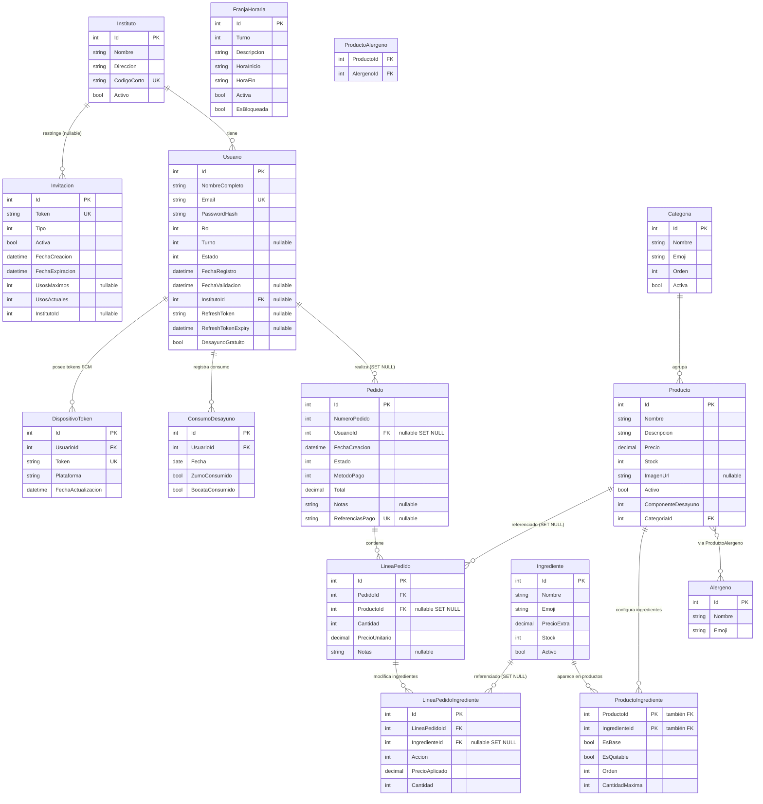

# CaféIES — Sistema de pedidos de cafetería para institutos

> Aplicación móvil + panel de administración web para gestionar pedidos de cafetería en centros educativos.
> Multi-instituto · Desayuno gratuito · Pago real con Stripe · Tiempo real con SignalR · Infraestructura Azure lista para producción.

[](https://dotnet.microsoft.com/)
[](https://learn.microsoft.com/dotnet/maui/)
[](https://learn.microsoft.com/aspnet/core/blazor/)
[](https://stripe.com/)
[](https://azure.microsoft.com/)
[](https://github.com/features/actions)

---

## Tabla de contenidos

- [Resumen ejecutivo](#resumen-ejecutivo)
- [Características destacadas](#características-destacadas)
- [Decisiones técnicas y justificación](#decisiones-técnicas-y-justificación)
- [Flujos principales de usuario](#flujos-principales-de-usuario)
- [Guía de demo rápida](#guía-de-demo-rápida)
- [Arquitectura](#arquitectura)
- [Stack tecnológico](#stack-tecnológico)
- [Estructura del proyecto](#estructura-del-proyecto)
- [Puesta en marcha local](#puesta-en-marcha-local)
- [Despliegue en Azure](#despliegue-en-azure)
- [Flujo de registro de usuarios](#flujo-de-registro-de-usuarios)
- [Lógica de horarios](#lógica-de-horarios)
- [Sistema de desayuno gratuito](#sistema-de-desayuno-gratuito)
- [Pagos con Stripe](#pagos-con-stripe)
- [Tiempo real con SignalR](#tiempo-real-con-signalr)
- [Seguridad](#seguridad)
- [Modelo de datos](#modelo-de-datos)
- [Distribución Android](#distribución-android)
- [Estado actual del proyecto](#estado-actual-del-proyecto)
- [Roadmap](#roadmap)
- [Changelog](#changelog)

---

## Resumen ejecutivo

CaféIES es un sistema completo de gestión de pedidos de cafetería diseñado para institutos de educación secundaria, desarrollado como proyecto académico con tecnologías de producción.

- **App móvil Android** (MAUI) para alumnos y empleados: catálogo, carrito, pago real con Stripe, personalización de ingredientes y seguimiento de pedido en tiempo real.
- **Panel web de administración** (Blazor WASM) para gestión completa: usuarios, productos, pedidos, horarios, reportes Excel/PDF e institutos.
- **API REST** (ASP.NET Core 9) con JWT + BCrypt, rate limiting en 4 políticas, audit trail y SignalR para actualizaciones en vivo.
- **Programa de desayuno gratuito**: alumnos beneficiarios reciben 1 zumo + 1 bocadillo al día sin cargo, con validación concurrente en servidor para evitar dobles consumos.
- **Infraestructura Azure en producción**: App Service F1 + SQL Server + Blob Storage + Static Web Apps, con CI/CD automático vía GitHub Actions.

---

## Características destacadas

### Móvil (MAUI Android)
- Auto-login sin flash de pantalla — fade-in solo si no hay sesión activa
- Skeleton loading animado en catálogo y pedidos mientras cargan los datos
- Personalización de ingredientes: switches on/off y stepper para cantidades múltiples; precio recalculado en tiempo real
- Tema claro/oscuro reactivo — sigue la preferencia del sistema sin reiniciar
- Carrito persistente entre sesiones vía `Preferences`; se recupera si la app se cierra

### Pagos
- Stripe PaymentIntent con total calculado **siempre en servidor** — el cliente nunca envía el importe
- Pantalla de confirmación aparece inmediatamente tras el pago; el pedido se crea en background
- Desayuno gratuito: si el total es 0 €, se salta Stripe por completo
- Webhook como respaldo: si la app falla tras el pago, Stripe crea el pedido igualmente

### Tiempo real
- SignalR con grupos por cafetería y por usuario — el alumno ve el estado de su pedido actualizado en vivo
- Dashboard admin con pedidos nuevos al instante + auto-refresh de respaldo cada 30 s

### Seguridad
- BCrypt workFactor 12, JWT (1 h access / 30 días refresh con rotación), rate limiting en 4 políticas
- Audit trail con prefijo `[AUDIT]` en todos los endpoints admin/empleado
- Transacción `Serializable` para el desayuno gratuito + índice único `(UsuarioId, Fecha)` — previene dobles consumos concurrentes

### Infraestructura y calidad
- 115 tests unitarios (xUnit): HorarioService, AuthService, dominio, validaciones, DesayunoService
- 3 pipelines GitHub Actions: API (~4 min), Admin (~2 min), APK Android (~3 min)
- Health check en `/health`; warmup automático al arrancar para reducir cold starts en F1

---

## Decisiones técnicas y justificación

| Decisión | Alternativa considerada | Por qué se eligió |
|---|---|---|
| **.NET MAUI** para la app móvil | Flutter, React Native | Stack único .NET — se comparte `CafeIES.Shared` con la API sin duplicar modelos ni validaciones |
| **Blazor WASM** para el panel admin | React/Angular | Mismo ecosistema .NET; el panel no necesita SEO y el primer-load de 2 s es aceptable para un panel interno |
| **Stripe** para pagos | PayPal, pasarela bancaria propia | SDK oficial, webhooks fiables, modo test completo sin necesidad de cuenta bancaria real durante el desarrollo |
| **SignalR** para tiempo real | Polling puro, WebSockets manuales | Integrado en ASP.NET Core; reconexión automática y grupos de difusión sin infraestructura adicional |
| **JWT + BCrypt** en lugar de Identity | ASP.NET Core Identity | Control total sobre el flujo de refresh token; workFactor 12 para contraseñas; sin dependencia de tablas Identity |
| **Azure App Service F1** | VPS propio, Railway, Fly.io | Integración directa con GitHub Actions; SSL gratuito; escala sin gestionar servidores |
| **EF Core + SQL Server** | Dapper, PostgreSQL | EF Migrations facilita el historial de esquema; SQL Server gratuito con Azure SQL (5 GB) |
| **AlergenosController separado** | Añadir rol Empleado en AdminController | `AdminController` tiene `[Authorize(Roles="Admin")]` a nivel de clase — no se puede sobreescribir por acción; controlador propio evita tocar la clase |

---

## Flujos principales de usuario

### Alumno — hacer un pedido
1. Abre la app → auto-login (o registro si es la primera vez)
2. Explora el catálogo: filtra por categoría o busca por nombre
3. Toca un producto → personaliza ingredientes → añade al carrito
4. Abre el carrito → ve el banner 🍊 si tiene desayuno disponible hoy
5. Pulsa "Pagar" → Stripe WebView → introduce tarjeta (o 0 € flujo gratuito → sin Stripe)
6. Pantalla de confirmación → muestra número de pedido y estado en tiempo real (SignalR)
7. Puede seguir el estado desde "Mis pedidos" → tap en el pedido → DetallePedidoPage

### Empleado — gestionar el servicio
1. Login → vista "Pedidos del día" (solo los del propio instituto)
2. Ve pedidos Pendiente → pulsa "Preparar" → estado cambia a En preparación (SignalR notifica al alumno)
3. Cuando está listo → pulsa "Listo" → alumno notificado; empleado puede "Entregar" o "Cancelar"
4. Accede a "Productos" → puede crear/editar productos, gestionar stock, toggle activo/inactivo
5. Desde Productos → "Categ." (AdminCategoriasPage) · "Ingred." → AdminIngredientesPage → "Alérgenos"

### Admin — gestión completa
1. Login → Dashboard Blazor o app MAUI (ambos operativos)
2. **Usuarios**: aprobar alumnos pendientes, activar desayuno gratuito 🍊, crear invitaciones QR
3. **Productos**: CRUD completo con imagen (cámara/galería), asignación de ingredientes, ComponenteDesayuno
4. **Pedidos**: filtrar por instituto/fecha/estado; cambiar estado; exportar Excel/PDF
5. **Horarios**: configurar franjas horarias por instituto y turno
6. **Institutos**: alta de nuevos centros; el admin solo puede ver/gestionar su propio instituto

---

## Guía de demo rápida

### Credenciales

| Rol | Email | Contraseña |
|---|---|---|
| Admin | `admin@cafeies.local` | (configurado en Azure App Settings) |
| Empleado | crear desde MAUI Admin → Usuarios → Invitación | — |
| Alumno | registro en la app con instituto seleccionado | — |

### Tarjeta de prueba Stripe

```
Número:   4242 4242 4242 4242
Caducidad: cualquier fecha futura
CVC:       cualquier 3 dígitos
```

### Orden de demo recomendado

1. **Admin (Blazor)**: mostrar Dashboard, crear un producto con imagen, activar desayuno gratuito a un alumno
2. **Admin (MAUI)**: mismo producto desde la app; mostrar panel contextual de usuarios
3. **Alumno**: hacer un pedido con personalización de ingredientes + pago Stripe (o pedido gratuito)
4. **Empleado**: recibir el pedido, cambiar estado a "En preparación" → ver cómo se actualiza en el MAUI del alumno en tiempo real
5. **Blazor**: ver el pedido aparece en tiempo real en el Dashboard; exportar reporte Excel

---

## Arquitectura

```
┌──────────────────┐    HTTPS / JSON     ┌───────────────────────┐
│  CafeIES.MAUI    │◄───────────────────►│   CafeIES.API         │
│  (Android / iOS) │    SignalR WS        │   ASP.NET Core 9      │
│                  │◄───────────────────►│                       │
└──────────────────┘                     │   SQL Server + EF 9   │
                                         │   JWT + BCrypt 12     │
┌──────────────────┐    HTTPS / JSON     │   SignalR Hub         │
│  CafeIES.Admin   │◄───────────────────►│   Stripe SDK          │
│  (Blazor WASM)   │    SignalR WS        │   Azure Blob Storage  │
└──────────────────┘◄───────────────────►└──────────┬────────────┘
                                                     │
                                          ┌──────────▼────────────┐
              ┌───────────────────────────┤   Servicios externos   │
              │                           │   Stripe (Pagos)       │
              ▼                           │   Azure (Hosting)      │
   ┌──────────────────┐                   └───────────────────────┘
   │  CafeIES.Shared  │
   │  DTOs · Entidades│
   │  Enums · Validac.│
   └──────────────────┘
```

---

## Stack tecnológico

| Componente | Tecnología | Versión |
|---|---|---|
| Backend API | ASP.NET Core | .NET 9 |
| Base de datos | SQL Server + Entity Framework Core | EF Core 9 |
| App móvil | .NET MAUI | .NET 9 (Android, iOS) |
| Panel admin | Blazor WebAssembly | .NET 9 |
| Autenticación | JWT Bearer + BCrypt | workFactor 12 |
| Pagos | Stripe PaymentIntent + Webhook | Stripe.net 50.x |
| Tiempo real | ASP.NET Core SignalR | — |
| Almacenamiento imágenes | Azure Blob Storage (prod) / local (dev) | Azure.Storage.Blobs 12.x |
| Hosting API | Azure App Service (F1, Linux, .NET 9) | — |
| Hosting Admin | Azure Static Web Apps (free tier) | — |
| CI/CD | GitHub Actions | — |
| Reportes | ClosedXML (Excel) + QuestPDF (PDF) | — |
| QR invitaciones | QRCoder | — |
| MVVM (MAUI) | CommunityToolkit.Mvvm | 8.3.x |
| UI helpers (MAUI) | CommunityToolkit.Maui | 9.x |

---

## Estructura del proyecto

```
CafeIES/
├── CafeIES.sln
│
├── CafeIES.Shared/                     ← Modelos compartidos por todos los proyectos
│   ├── Models/
│   │   ├── Entities.cs                 Instituto, Usuario, Producto, Pedido, LineaPedido,
│   │   │                               FranjaHoraria, Invitacion, ConsumoDesayuno,
│   │   │                               DispositivoToken, RefreshToken
│   │   ├── DTOs.cs                     DTOs request/response con Data Annotations
│   │   └── Enums.cs                    Turno, RolUsuario, EstadoPedido, MetodoPago,
│   │                                   ComponenteDesayuno (Ninguno/Zumo/Bocata)
│   └── Validation/
│       └── PasswordComplexityAttribute.cs  Mayúscula + número + símbolo obligatorios
│
├── CafeIES.API/                        ← Backend REST (puerto local 50658)
│   ├── Controllers/
│   │   ├── AuthController.cs           Login, registro alumno/invitado, refresh JWT, logout
│   │   ├── ProductosController.cs      CRUD productos + imagen; filtro por categoría/búsqueda
│   │   ├── CategoriasController.cs     CRUD categorías
│   │   ├── PedidosController.cs        Crear/listar/detalle; máquina de estados; desayuno-status
│   │   ├── PagosController.cs          Crear PaymentIntent (con split gratuito), cancelar, webhook
│   │   ├── AdminController.cs          Usuarios, institutos, invitaciones, horarios, reportes,
│   │   │                               desayunos (consumos + gestión beneficiarios)
│   │   ├── AlergenosController.cs      CRUD alérgenos — [Authorize(Roles="Admin,Empleado")]
│   │   ├── NotificacionesController.cs Registro/eliminación tokens FCM (infraestructura)
│   │   └── EmpleadoController.cs       Pedidos en curso para empleados/personal
│   ├── Data/
│   │   ├── AppDbContext.cs             EF Core context; índices en Pedidos.Estado,
│   │   │                               DispositivoTokens.UsuarioId, ConsumoDesayuno(UsuarioId,Fecha)
│   │   ├── DbSeeder.cs                 Admin, institutos de ejemplo, categorías, franjas horarias
│   │   └── Migrations/                 Historial completo de migraciones EF Core
│   ├── Services/
│   │   ├── AuthService.cs              JWT access+refresh, BCrypt hash, rotación de tokens
│   │   ├── HorarioService.cs           Validación de franja horaria antes de crear pedido
│   │   ├── StripeService.cs            PaymentIntent, cancelación, firma de webhooks
│   │   ├── FcmService.cs               FCM HTTP v1 con GoogleCredential cacheado (infraestructura)
│   │   ├── LocalBlobStorageService.cs  Almacenamiento local (dev) con validación path-traversal
│   │   ├── AzureBlobStorageService.cs  Azure Blob Storage (prod)
│   │   ├── ReporteExcelService.cs      Excel con ClosedXML (pedidos, productos, usuarios)
│   │   └── ReportePdfService.cs        PDF con QuestPDF — limitado a 1.000 registros
│   ├── Extensions/
│   │   ├── ClaimsPrincipalExtensions.cs  GetUserId() null-safe
│   │   └── DtoMapperExtensions.cs        ToDto() centralizado para Usuario, Pedido, FranjaHoraria
│   ├── Hubs/
│   │   └── PedidosHub.cs               SignalR hub — grupos cafeteria y user-{id}
│   └── Program.cs                      DI, middleware, rate limiting (4 políticas), CORS, Swagger
│
├── CafeIES.MAUI/                       ← App móvil Android/iOS
│   ├── Views/                          23 páginas XAML
│   │   ├── LoginPage                   Auto-login transparente; fade-in solo si no hay sesión
│   │   ├── RegistroPage                Registro alumno con instituto y turno
│   │   ├── RegistroInvitacionPage      Registro por enlace/QR de invitación
│   │   ├── HomePage                    Catálogo con categorías, búsqueda y filtros; guard IsLoading
│   │   ├── ProductoDetallePage         Detalle de producto con imagen real (fallback emoji); bloqueado si sin stock
│   │   ├── CarritoPage                 Resumen, spinner desayuno, banner 🍊, descuento, TotalEfectivo
│   │   ├── PagamentoWebPage            WebView con Stripe.js
│   │   ├── ConfirmacionPedidoPage      Polling cada 2s; token "gratuito-{num}" sin polling
│   │   ├── PedidosPage                 Historial con chips Hoy/Todo y paginación; tap → detalle
│   │   ├── DetallePedidoPage           Detalle en tiempo real vía SignalR con ingredientes y modificaciones
│   │   ├── PerfilPage                  Datos personales, cambio de contraseña
│   │   ├── AdminPedidosPage            Todos los pedidos: filtro por instituto, fecha y estado; Cargar más paginado
│   │   ├── AdminProductosPage          Gestión de productos con imagen; accesos rápidos a Categorías e Ingredientes
│   │   ├── AdminEditProductoPage       Crear/editar producto con selector ComponenteDesayuno e imagen desde cámara/galería
│   │   ├── AdminUsuariosPage           Panel contextual animado; forzar borrado de usuario con pedidos asociados
│   │   ├── AdminIngredientesPage       Gestión de ingredientes con toggle activo/inactivo y botón eliminar visible
│   │   ├── AdminCategoriasPage         CRUD categorías (crear con emoji + nombre, eliminar)
│   │   ├── AdminAlergenosPage          CRUD alérgenos (crear con emoji + nombre, eliminar)
│   │   ├── AdminInvitacionesPage       Crear/listar invitaciones con QR descargable
│   │   ├── AdminHorariosPage           Gestión de franjas horarias por instituto
│   │   ├── AdminPerfilPage             Perfil del administrador
│   │   ├── EmpleadoPedidosPage         Historial del día: activos (Pendiente/EnPrep) + cerrados (Listo/Entregado/Cancelado)
│   │   └── EmpleadoProductosPage       Catálogo con control de stock, toggle y accesos rápidos a Categorías, Ingredientes (→ Alérgenos) y crear producto
│   ├── ViewModels/                     MVVM con CommunityToolkit.Mvvm
│   ├── Services/
│   │   ├── ApiService.cs               HTTP client (timeout 45s) + SignalR; warmup a /health
│   │   └── TokenService.cs             SecureStorage para access/refresh token
│   ├── Converters/
│   │   └── Converters.cs               ~30 converters: estado pedido, stock, rol, desayuno, chips…
│   └── Resources/Styles/
│       └── AppStyles.xaml              Paleta dark & warm (ámbar/naranja), tipografía Syne+DMSans
│
├── CafeIES.Admin/                      ← Panel administración Blazor WASM
│   ├── Pages/
│   │   ├── Dashboard.razor             Métricas del día, pedidos recientes, SignalR live
│   │   ├── Pedidos.razor               Lista paginada + cambio de estado
│   │   ├── Productos.razor             CRUD con subida de imagen, badges ComponenteDesayuno 🥤🥪
│   │   ├── Categorias.razor            CRUD categorías
│   │   ├── Usuarios.razor              Lista usuarios + toggle desayuno gratuito 🍊
│   │   ├── Desayunos.razor             Beneficiarios (buscar/filtrar/toggle) + consumos del día
│   │   ├── Institutos.razor            CRUD multi-instituto con dirección
│   │   ├── Horarios.razor              Franjas horarias por instituto y turno
│   │   ├── Invitaciones.razor          Crear invitaciones + QR descargable
│   │   └── Reportes.razor              Exportar Excel/PDF (límite 1.000 registros)
│   ├── Services/
│   │   └── AdminApiService.cs          HTTP client (timeout 20s); imagen a bytes antes de retry
│   └── wwwroot/
│       ├── appsettings.json            URL base de la API (configurable sin recompilar)
│       └── css/app.css                 Estilos custom (ahora correctamente en git)
│
├── CafeIES.Tests/                      ← Tests unitarios (xUnit + EF InMemory)
│   └── ...                             96 tests: HorarioService, AuthService, dominio, validaciones
│
└── .github/workflows/
    ├── deploy-api.yml                  Push a main + API/Shared → Azure App Service (~4 min)
    ├── deploy-admin.yml                Push a main + Admin/Shared → Static Web Apps (~2 min)
    └── deploy-android.yml              Push a main + MAUI/Shared → GitHub Releases APK (~3 min)
```

---

## Puesta en marcha local

### Requisitos

- .NET 9 SDK
- SQL Server (Express, Developer o Docker)
- Visual Studio 2022 / Rider / VS Code con extensión C#
- Android SDK (solo para ejecutar la app móvil)

### 1. Configurar la API

```bash
cd CafeIES.API
```

Crear `appsettings.Development.json` (no commitear):

```json
{
  "ConnectionStrings": {
    "DefaultConnection": "Server=(localdb)\\mssqllocaldb;Database=CafeIES;Trusted_Connection=True;"
  },
  "Jwt": {
    "Key": "tu-clave-secreta-de-al-menos-32-caracteres",
    "Issuer": "CafeIES",
    "Audience": "CafeIES"
  },
  "Admin": {
    "Email": "admin@cafeies.local",
    "Password": "Admin1234!"
  },
  "Stripe": {
    "SecretKey": "sk_test_...",
    "PublishableKey": "pk_test_...",
    "WebhookSecret": "whsec_..."
  },
  "BlobStorage": {
    "UseAzure": false
  }
}
```

```bash
dotnet ef database update
dotnet run
```

La API queda en `https://localhost:50658`. Swagger en `/swagger`.

### 2. Configurar el Admin Blazor

```bash
cd CafeIES.Admin
```

Editar `wwwroot/appsettings.json`:

```json
{
  "ApiBaseUrl": "https://localhost:50658"
}
```

```bash
dotnet run
```

Panel en `https://localhost:50660`.

### 3. Ejecutar la app MAUI

En `CafeIES.MAUI/Services/ApiService.cs`, la constante `ApiBaseUrl` cambia según la plataforma:

```csharp
#if ANDROID
    private const string ApiBaseUrl = "https://10.0.2.2:50658"; // Emulador Android
#else
    private const string ApiBaseUrl = "https://localhost:50658"; // iOS simulator / Windows
#endif
```

Para dispositivo físico Android, reemplazar `10.0.2.2` por la IP local de tu máquina.

---

## Despliegue en Azure

### Recursos creados

| Recurso | Tipo | Región |
|---|---|---|
| `cafeies-api` | App Service (F1, Linux, .NET 9) | North Europe |
| `cafeies-sql` | Azure SQL Database | North Europe |
| `cafeies-storage` | Storage Account (Blob) | North Europe |
| `cafeies-admin` | Static Web App (Free) | Global |

### Variables de entorno (Azure App Settings)

```
ConnectionStrings__DefaultConnection = <cadena de conexión SQL>
Jwt__Key                             = <clave secreta producción>
Jwt__Issuer                          = CafeIES
Jwt__Audience                        = CafeIES
Admin__Email                         = <email admin>
Admin__Password                      = <contraseña admin>
Stripe__SecretKey                    = sk_live_...
Stripe__PublishableKey               = pk_live_...
Stripe__WebhookSecret                = whsec_...
BlobStorage__UseAzure                = true
BlobStorage__ConnectionString        = <cadena Azure Storage>
BlobStorage__ContainerName           = productos
```

### CI/CD — GitHub Actions

Los tres workflows se disparan automáticamente al hacer push a `main`:

| Workflow | Trigger (paths) | Destino |
|---|---|---|
| `deploy-api.yml` | `CafeIES.API/**`, `CafeIES.Shared/**` | Azure App Service |
| `deploy-admin.yml` | `CafeIES.Admin/**`, `CafeIES.Shared/**` | Azure Static Web Apps |
| `deploy-android.yml` | `CafeIES.MAUI/**`, `CafeIES.Shared/**` | GitHub Releases (APK) |

El APK se versiona automáticamente como `YYYY.MM.<run_number>` y se publica como **latest release** en [Releases](https://github.com/JoseGlezHerrera/CafeteriaInsti/releases).

---

## Flujo de registro de usuarios

```
Alumno  ──────────────────────────► /api/auth/registro/alumno
                                     Selecciona instituto y turno
                                     Estado inicial: Pendiente
                                     Admin aprueba desde MAUI o Blazor

Profesor/Personal ── QR o enlace ──► /api/auth/registro/invitado
                                     Invitación válida + no caducada
                                     Estado inicial: Pendiente
                                     Admin aprueba

Admin ────────────────────────────► Seeding inicial (DbSeeder.cs)
                                     Email/password configurados en appsettings
```

### Auto-login al arrancar

Al abrir la app, `LoginViewModel.TryAutoLoginAsync` intenta renovar el token guardado en `SecureStorage`. Si tiene éxito, navega directamente a la pantalla principal sin mostrar el formulario de login. El formulario arranca con `Opacity=0` y solo hace `FadeTo(1)` si no hay sesión activa — eliminando el flash de login.

---

## Lógica de horarios

La API valida que el pedido se realice dentro de la franja horaria asignada al turno del alumno antes de crearlo o de generar el PaymentIntent. La franja horaria es configurable por instituto y turno desde el panel admin.

```
Alumno turno Mañana → puede pedir entre 08:00 y 10:30
Alumno turno Tarde  → puede pedir entre 14:00 y 16:00
Alumno turno Noche  → puede pedir entre 18:00 y 20:00
```

- `HorarioService.PuedePedirAhoraAsync` consulta la BD y usa `TimeOnly.TryParse` seguro.
- Si no hay franja configurada para el turno, el pedido se permite (permisivo por defecto).
- Si la franja no está activa, devuelve 400 con mensaje claro.
- Personal e Invitados no tienen restricción horaria.

---

## Sistema de desayuno gratuito

Programa de desayuno escolar gratuito para alumnos de familias desfavorecidas: **1 zumo + 1 bocadillo al día**, sin pasar por Stripe.

### Configuración de productos

Cada producto puede marcarse con `ComponenteDesayuno`:

| Valor | Significado |
|---|---|
| `Ninguno` | Producto normal (no entra en el programa) |
| `Zumo` | Puede ser el zumo gratuito del día |
| `Bocata` | Puede ser el bocadillo gratuito del día |

Se configura desde:
- **MAUI Admin** → Productos → Editar → selector con tres opciones ❌ / 🥤 / 🥪
- **Blazor Admin** → Productos (visible en tabla con badges de color)

> **Importante**: al añadir un producto nuevo o editar uno existente desde MAUI, hay que configurar `ComponenteDesayuno` para que el descuento se aplique. Si se deja en `Ninguno`, el producto no entra en el programa aunque el alumno sea beneficiario.

### Activación por alumno

El admin activa el flag `DesayunoGratuito` en el perfil del alumno desde:
- **Blazor Admin** → página Usuarios (botón 🍊) o página Desayunos → sección Beneficiarios
- **MAUI Admin** → Gestión de usuarios → panel contextual animado → botón 🍊 Desayuno

### Flujo en la app

1. Al abrir el carrito, se bloquea el botón de pago (`IsLoadingDesayuno = true`) y se consulta `GET /api/pedidos/desayuno-status`.
2. Una vez cargado el estado, el botón se desbloquea. Si hay desayuno disponible, aparece el banner 🍊 con los componentes restantes del día.
3. El `TotalEfectivo` se calcula client-side descontando la primera unidad elegible de cada componente.
4. Si el total efectivo es **0 €** → flujo gratuito: `POST /api/pedidos` directo, sin Stripe.
5. Si hay parte de pago → `POST /api/pagos/crear-intent` con el descuento ya aplicado en el PaymentIntent. El metadata incluye líneas con precios divididos (0 € para la unidad gratuita, precio normal para el resto).

### Restricciones de seguridad

- Solo **1 unidad** por componente es gratis al día — las adicionales se cobran a precio normal.
- El precio 0 se valida en servidor en una transacción `Serializable`.
- La tabla `ConsumoDesayuno` tiene índice único `(UsuarioId, Fecha)` — previene dobles consumos concurrentes.
- El webhook de Stripe detecta líneas a 0 € y marca `ConsumoDesayuno` correctamente aunque la app se haya cerrado antes de crear el pedido.

### Reporte diario

`GET /api/admin/desayunos/consumos` devuelve el reporte del día. Visible en Blazor Admin → Desayunos.

---

## Pagos con Stripe

### Flujo completo

```
1. Cliente: POST /api/pagos/crear-intent  →  API crea PaymentIntent con total calculado en servidor
                                              (descuento desayuno aplicado; metadata con precios split)
2. Cliente: abre WebView con Stripe.js    →  Usuario introduce tarjeta
3. Stripe confirma el pago
4. Cliente: navega INMEDIATAMENTE a ConfirmacionPedidoPage (muestra TotalEfectivo)
5. Background: POST /api/pedidos         →  crea el pedido en BD
6. ConfirmacionPedidoPage: sondea GET /api/pedidos/by-intent/{id} cada 2s → muestra número
7. Webhook Stripe:                       →  respaldo: crea el pedido y marca ConsumoDesayuno
                                              si el cliente falló en paso 5
```

Si el total es 0 € (desayuno completamente gratuito), se salta Stripe y se va directamente al paso 5.

### Seguridad

- El total **siempre** lo calcula el servidor — el cliente nunca envía el importe.
- Redondeo correcto a céntimos: `Math.Round(total * 100, MidpointRounding.AwayFromZero)`.
- Rate limiting específico en `POST /api/pagos/crear-intent` (20 req/min/IP).
- La clave pública de Stripe se inyecta desde configuración del servidor — el cliente nunca la maneja ni la expone en la URL.
- El webhook rechaza con 503 si `WebhookSecret` no está configurado.
- `confirmation_method: automatic` (compatible con Stripe.js en WebView).

---

## Tiempo real con SignalR

- **Dashboard admin**: recibe pedidos nuevos al instante (auto-refresh cada 30s como respaldo).
- **App móvil**: el alumno ve el estado de su pedido actualizado en vivo.
- **Grupos**: `cafeteria` (admins/empleados) y `user-{id}` (usuario específico).
- **Reconexión automática**: si el token se renueva (refresh), SignalR se reconecta si estaba desconectado.
- **Sesión expirada**: `ApiService` desconecta SignalR y navega al login con fallback directo.
- **Keepalive**: `KeepAliveInterval = 15s`, `ClientTimeoutInterval = 30s`.
- **Fire-and-forget**: `SendAsync` en creación de pedido no bloquea la respuesta HTTP.

---

## Seguridad

| Mecanismo | Detalle |
|---|---|
| Contraseñas | BCrypt workFactor 12 |
| Complejidad | Mínimo 8 caracteres + mayúscula + número + símbolo |
| JWT access token | Duración 1 hora, HMAC-SHA256 |
| JWT refresh token | Duración 30 días, rotación en cada uso, guardado atómicamente |
| Auto-refresh | Transparente en MAUI (`ApiService`) y Blazor (`AuthAdminService`) |
| Almacenamiento tokens | MAUI: `SecureStorage`. Blazor: accessToken en `sessionStorage`, refreshToken solo en memoria |
| Rate limiting auth | Política "auth" (10 req/min/IP) en endpoints de autenticación |
| Rate limiting general | Política "general" (60 req/min/IP) en el resto de endpoints |
| Rate limiting invitaciones | Política "invitaciones" (5 req/min/IP) en `/api/invitaciones/validar` |
| Rate limiting pagos | Política "pagos" (20 req/min/IP) en `POST /api/pagos/crear-intent` |
| Audit trail | Acciones admin registradas con prefijo `[AUDIT]` en logs del servidor |
| Pagos | Total calculado en servidor — cliente solo recibe el clientSecret |
| Desayuno gratuito | Precio 0 validado en servidor; solo 1 unidad/componente/día; índice único en ConsumoDesayuno |
| Stock | Transacciones `ReadCommitted` + `[ConcurrencyCheck]` para evitar sobreventa |
| Pedidos | Máquina de estados: solo transiciones válidas permitidas |
| Ownership | Usuarios solo acceden a sus propios pedidos |
| Instituto | Admin solo puede mutar usuarios de su propio instituto (cross-institute bloqueado) |
| Personal | Endpoint `/en-curso` filtrado por instituto igual que Empleado |
| XSS | Notas de pedido sanitizadas antes de persistir |
| Path traversal | `LocalBlobStorageService` usa `Path.GetRelativePath` para validar rutas |
| SSL en desarrollo | `ServerCertificateCustomValidationCallback` solo bajo `#if DEBUG` |
| Secretos | Claves reales en `appsettings.Development.json` (gitignored) o Azure App Settings |
| Invitaciones | `DiasValidez` limitado a 1–365 días |
| MetodoPago | Validado con `Enum.IsDefined` en servidor |
| Líneas de pedido | `MaxLength(30)` en `CrearPedidoRequest.Lineas` — previene pedidos abusivos |
| Stock negativo | `NuevoStock < -1` rechazado explícitamente |
| Webhook | Rechaza con 503 si `WebhookSecret` no configurado |

---

## Modelo de datos

La base de datos es **SQL Server** gestionada con **EF Core 9 Code-First**. El esquema tiene **15 tablas** (sin contar la tabla `__EFMigrationsHistory` de EF) y almacena toda la lógica de negocio: multi-tenancy por instituto, catálogo con ingredientes personalizables, pedidos con historial inmutable, desayuno gratuito con protección anti-doble-uso y tokens FCM para notificaciones push.

<details>
<summary><strong>📐 Esquema completo — tablas, columnas, índices, enums y diagramas (abrir)</strong></summary>

---

### Diagrama entidad-relación



---

### Documentación tabla a tabla

#### `Institutos`
Centro educativo que utiliza la plataforma. Punto raíz del modelo multi-tenant.

| Columna | Tipo SQL | Restricciones | Descripción |
|---|---|---|---|
| `Id` | `int` | PK, IDENTITY | Identificador autoincremental |
| `Nombre` | `nvarchar(150)` | NOT NULL | Nombre completo del centro |
| `Direccion` | `nvarchar(300)` | | Dirección postal (opcional) |
| `CodigoCorto` | `nvarchar(20)` | NOT NULL, **UNIQUE** | Identificador corto (ej: `IES-NORTE`) |
| `Activo` | `bit` | NOT NULL, DEFAULT 1 | Permite desactivar un centro sin borrar datos |

**Índices:** `IX_Institutos_CodigoCorto` UNIQUE  
**Relaciones:** 1:N → `Usuarios`, 0:1 → `Invitaciones`  
**Seed:** 3 institutos de demostración (`IES-1`, `IES-2`, `IES-3`)

---

#### `Usuarios`
Tabla central del sistema. Almacena todos los tipos de usuario bajo un único modelo con discriminación por `Rol`.

| Columna | Tipo SQL | Restricciones | Descripción |
|---|---|---|---|
| `Id` | `int` | PK, IDENTITY | |
| `NombreCompleto` | `nvarchar(100)` | NOT NULL | Nombre y apellidos |
| `Email` | `nvarchar(150)` | NOT NULL, **UNIQUE** | Se usa como credencial de login |
| `PasswordHash` | `nvarchar(max)` | NOT NULL | Hash BCrypt (workFactor 12). Nunca texto plano |
| `Rol` | `int` | NOT NULL | Ver enum `RolUsuario` |
| `Turno` | `int` | nullable | Solo Alumno/Profesor/Personal. `NULL` para Admin/Empleado |
| `Estado` | `int` | NOT NULL | Ver enum `EstadoCuenta` |
| `FechaRegistro` | `datetime2` | NOT NULL | UTC, establecido al crear |
| `FechaValidacion` | `datetime2` | nullable | Cuándo el admin aprobó la cuenta |
| `InstitutoId` | `int` | FK nullable, RESTRICT | `NULL` para Admin (gestiona todos los centros) |
| `RefreshToken` | `nvarchar(max)` | nullable | Token de refresco JWT activo (rotación en cada uso) |
| `RefreshTokenExpiry` | `datetime2` | nullable | Expiración del refresh token (30 días) |
| `DesayunoGratuito` | `bit` | NOT NULL, DEFAULT 0 | Beneficiario del programa de desayuno escolar |

**Índices:** `IX_Usuarios_Email` UNIQUE  
**Relaciones:** N:1 → `Institutos` (RESTRICT), 1:N → `Pedidos`, `ConsumoDesayunos`, `DispositivoTokens`  
**Notas de seguridad:** La FK a `Institutos` usa `DeleteBehavior.Restrict` — no se puede borrar un instituto con usuarios. El campo `RefreshToken` se invalida en cada rotación para evitar reuso de tokens robados.

---

#### `FranjasHorarias`
Ventanas temporales en las que un turno puede (o no puede) realizar pedidos. El admin las configura sin necesidad de código.

| Columna | Tipo SQL | Restricciones | Descripción |
|---|---|---|---|
| `Id` | `int` | PK, IDENTITY | |
| `Turno` | `int` | NOT NULL | Ver enum `Turno` |
| `Descripcion` | `nvarchar(60)` | NOT NULL | Etiqueta legible (ej: "Recreo", "Antes de entrar") |
| `HoraInicio` | `nvarchar(5)` | NOT NULL | Formato `HH:mm` (ej: `10:30`) |
| `HoraFin` | `nvarchar(5)` | NOT NULL | Formato `HH:mm`. Soporta cruce de medianoche |
| `Activa` | `bit` | NOT NULL, DEFAULT 1 | Permite desactivar sin borrar |
| `EsBloqueada` | `bit` | NOT NULL, DEFAULT 0 | `true` = franja de clase (bloqueada); `false` = recreo (permitida) |

**Lógica de evaluación:** `HorarioService.PuedePedirAhoraAsync()` itera todas las franjas activas del turno. Una franja bloqueada activa bloquea independientemente de las permitidas. El cruce de medianoche se detecta cuando `HoraInicio > HoraFin`.  
**Seed:** 3 franjas bloqueadas (una por turno: mañana 08-14, tarde 14:30-20:30, noche 21-03)  
**Regla especial:** Sábado bloqueado para alumnos; domingo permite pre-pedido para el lunes.

---

#### `Invitaciones`
Tokens de un solo uso (o multi-uso) que el admin genera para que profesores, personal y empleados se registren con el rol correcto sin intervención manual en cada caso.

| Columna | Tipo SQL | Restricciones | Descripción |
|---|---|---|---|
| `Id` | `int` | PK, IDENTITY | |
| `Token` | `nvarchar(max)` | NOT NULL, **UNIQUE** | UUID sin guiones (`Guid.NewGuid().ToString("N")`) |
| `Tipo` | `int` | NOT NULL | Ver enum `TipoInvitacion` (Profesor / Personal / Empleado) |
| `Activa` | `bit` | NOT NULL, DEFAULT 1 | El admin puede revocarla manualmente |
| `FechaCreacion` | `datetime2` | NOT NULL | UTC |
| `FechaExpiracion` | `datetime2` | NOT NULL | Por defecto +7 días. Máx. 365 días |
| `UsosMaximos` | `int` | nullable | `NULL` = ilimitada mientras esté activa |
| `UsosActuales` | `int` | NOT NULL, DEFAULT 0 | Protegido con `[ConcurrencyCheck]` |
| `InstitutoId` | `int` | nullable | Si tiene valor, el registrante queda fijado a ese instituto |

**Índices:** `IX_Invitaciones_Token` UNIQUE  
**Anti-race-condition:** `UsosActuales` lleva `[ConcurrencyCheck]` — EF Core genera `WHERE UsosActuales = @old` en el UPDATE, lo que hace que dos registros simultáneos con la misma invitación provoquen una `DbUpdateConcurrencyException` en el segundo y se rechace.

---

#### `Categorias`
Agrupación de productos para el catálogo. Tienen emoji y orden de visualización.

| Columna | Tipo SQL | Restricciones | Descripción |
|---|---|---|---|
| `Id` | `int` | PK, IDENTITY | |
| `Nombre` | `nvarchar(80)` | NOT NULL | Ej: "Bocadillos", "Bebidas" |
| `Emoji` | `nvarchar(10)` | | Emoji de representación (ej: `🥖`) |
| `Orden` | `int` | NOT NULL, DEFAULT 0 | Orden de aparición en el catálogo |
| `Activa` | `bit` | NOT NULL, DEFAULT 1 | |

**Relaciones:** 1:N → `Productos` (RESTRICT — no se puede borrar una categoría con productos)  
**Seed:** 5 categorías iniciales: Bocadillos 🥖, Ensaladas 🥗, Bebidas 🥤, Postres 🍰, Café ☕

---

#### `Alergenos`
Los 14 alérgenos de declaración obligatoria según el Reglamento (UE) 1169/2011. Relación M:N con `Productos` a través de `ProductoAlergeno`.

| Columna | Tipo SQL | Restricciones | Descripción |
|---|---|---|---|
| `Id` | `int` | PK, IDENTITY | |
| `Nombre` | `nvarchar(60)` | NOT NULL | Ej: "Gluten", "Lácteos" |
| `Emoji` | `nvarchar(10)` | | Ej: `🌾`, `🥛` |

**Seed:** 14 alérgenos UE: Gluten 🌾, Crustáceos 🦐, Huevo 🥚, Pescado 🐟, Cacahuetes 🥜, Soja 🫘, Lácteos 🥛, Frutos secos 🌰, Apio 🌿, Mostaza 🌻, Sésamo 🌱, Sulfitos 🍷, Altramuces 🌼, Moluscos 🦑

---

#### `Productos`
Artículos del catálogo de la cafetería.

| Columna | Tipo SQL | Restricciones | Descripción |
|---|---|---|---|
| `Id` | `int` | PK, IDENTITY | |
| `Nombre` | `nvarchar(120)` | NOT NULL | |
| `Descripcion` | `nvarchar(300)` | | |
| `Precio` | `decimal(6,2)` | NOT NULL | Precio base. El total real puede variar por extras de ingredientes |
| `Stock` | `int` | NOT NULL, DEFAULT -1 | `-1` = sin control de stock; `0` = agotado; `>0` = unidades disponibles |
| `ImagenUrl` | `nvarchar(500)` | nullable | Ruta relativa (local) o URL absoluta (Azure Blob) |
| `Activo` | `bit` | NOT NULL, DEFAULT 1 | Producto inactivo no aparece en el catálogo |
| `ComponenteDesayuno` | `int` | NOT NULL, DEFAULT 0 | Ver enum `ComponenteDesayuno` |
| `CategoriaId` | `int` | FK NOT NULL, RESTRICT | Categoría a la que pertenece |

**Control de stock:** `[ConcurrencyCheck]` en `Stock`. En la creación del pedido, EF Core genera `WHERE Stock = @expected` para detectar contención concurrente y prevenir sobreventa.  
**Soft-delete:** Los productos se marcan como `Activo = false` en lugar de borrarse. Si se eliminan físicamente, `LineaPedido.ProductoId` pasa a `NULL` mediante `SET NULL` (FK nullable), preservando el historial de pedidos.

---

#### `ProductoAlergeno` *(tabla de unión generada por EF)*
Relación M:N entre `Productos` y `Alergenos`. EF Core la genera automáticamente con `.UsingEntity(j => j.ToTable("ProductoAlergeno"))`.

| Columna | Tipo SQL | Restricciones |
|---|---|---|
| `ProductoId` | `int` | PK compuesto, FK → Productos |
| `AlergenoId` | `int` | PK compuesto, FK → Alergenos |

---

#### `Ingredientes`
Catálogo de ingredientes disponibles en la cafetería. Pueden ser componentes base de un producto (jamón, tomate) o extras que el cliente puede añadir (doble jamón, guacamole).

| Columna | Tipo SQL | Restricciones | Descripción |
|---|---|---|---|
| `Id` | `int` | PK, IDENTITY | |
| `Nombre` | `nvarchar(80)` | NOT NULL | |
| `Emoji` | `nvarchar(10)` | | |
| `PrecioExtra` | `decimal(6,2)` | NOT NULL, DEFAULT 0 | Suplemento de precio al añadir como extra. 0 para ingredientes base |
| `Stock` | `int` | NOT NULL, DEFAULT -1 | Mismo control que `Producto.Stock` |
| `Activo` | `bit` | NOT NULL, DEFAULT 1 | Ingrediente inactivo no aparece en la personalización |

**Índices:** `IX_Ingredientes_Nombre`  
**Notas:** No se puede borrar un ingrediente mientras esté asignado a un producto (`ProductoIngrediente` usa RESTRICT). Si se borra del catálogo, `LineaPedidoIngrediente.IngredienteId` pasa a `NULL` (SET NULL), preservando el historial inmutable del pedido.

---

#### `ProductoIngredientes`
Tabla de configuración que define cómo un ingrediente aparece en la pantalla de personalización de un producto concreto. Clave primaria **compuesta** `(ProductoId, IngredienteId)`.

| Columna | Tipo SQL | Restricciones | Descripción |
|---|---|---|---|
| `ProductoId` | `int` | PK compuesto, FK → Productos (CASCADE) | |
| `IngredienteId` | `int` | PK compuesto, FK → Ingredientes (RESTRICT) | |
| `EsBase` | `bit` | NOT NULL | `true` = viene incluido por defecto (ej: jamón en bocata de jamón) |
| `EsQuitable` | `bit` | NOT NULL | Solo si `EsBase = true`. El cliente puede quitarlo sin coste |
| `Orden` | `int` | NOT NULL | Orden de visualización en la UI |
| `CantidadMaxima` | `int` | NOT NULL, DEFAULT 1 | `1` → switch on/off; `>1` → stepper 0..N (solo para extras) |

**Semántica de las combinaciones:**

| `EsBase` | `EsQuitable` | Comportamiento en la app |
|:---:|:---:|---|
| `true` | `true` | Ingrediente que viene de serie pero se puede quitar (ej: tomate) |
| `true` | `false` | Ingrediente fijo, no modificable (ej: pan) |
| `false` | n/a | Extra opcional que el cliente puede añadir pagando el suplemento |

---

#### `Pedidos`
Núcleo transaccional del sistema. Un pedido se crea atómicamente con todas sus líneas e ingredientes en una sola transacción.

| Columna | Tipo SQL | Restricciones | Descripción |
|---|---|---|---|
| `Id` | `int` | PK, IDENTITY | |
| `NumeroPedido` | `int` | NOT NULL | Número secuencial visible (ej: #042). Generado con `MAX(NumeroPedido) + 1` dentro de la transacción |
| `UsuarioId` | `int` | FK nullable, **SET NULL** | `NULL` si el usuario fue borrado con `forzar=true` — el pedido se conserva para auditoría |
| `FechaCreacion` | `datetime2` | NOT NULL | UTC (`DateTime.UtcNow`). Marcado explícitamente con `SpecifyKind(Utc)` en el mapper |
| `Estado` | `int` | NOT NULL | Ver enum `EstadoPedido`. Sigue una máquina de estados |
| `MetodoPago` | `int` | NOT NULL | Ver enum `MetodoPago` |
| `Total` | `decimal(8,2)` | NOT NULL | Calculado en servidor. El cliente no puede manipularlo |
| `Notas` | `nvarchar(300)` | nullable | Nota libre del usuario para toda la comanda |
| `ReferenciasPago` | `nvarchar(200)` | nullable, **UNIQUE filtrado** | PaymentIntentId de Stripe. El índice único evita pedidos duplicados por webhooks repetidos |

**Índices:**  
- `IX_Pedidos_UsuarioId_FechaCreacion` — búsquedas de historial por usuario  
- `IX_Pedidos_Estado` — filtrado de cola de preparación  
- `IX_Pedidos_ReferenciasPago` UNIQUE `WHERE ReferenciasPago IS NOT NULL` — deduplicación Stripe  

**Máquina de estados:**
```
Pendiente → EnPreparacion → Listo → Entregado
    ↓              ↓          ↓
Cancelado      Cancelado  Cancelado
```

---

#### `LineasPedido`
Cada fila es un producto dentro de un pedido. El `PrecioUnitario` es un **snapshot inmutable** del precio en el momento de la compra — los cambios posteriores al precio del producto no afectan a pedidos pasados.

| Columna | Tipo SQL | Restricciones | Descripción |
|---|---|---|---|
| `Id` | `int` | PK, IDENTITY | |
| `PedidoId` | `int` | FK NOT NULL, **CASCADE** | Al borrar el pedido, se borran sus líneas en cascada |
| `ProductoId` | `int` | FK nullable, **SET NULL** | `NULL` si el producto fue eliminado físicamente del catálogo |
| `Cantidad` | `int` | NOT NULL | Unidades pedidas (1..20 por línea) |
| `PrecioUnitario` | `decimal(6,2)` | NOT NULL | Precio del producto **en el momento del pedido** (snapshot) |
| `Notas` | `nvarchar(200)` | nullable | Nota por línea (ej: "extra picante en este bocata") |

**Columna calculada (no mapeada):** `Subtotal = Cantidad × PrecioUnitario` — calculada en .NET, no almacenada en BD.

---

#### `LineaPedidoIngredientes`
Registro de cada modificación de ingrediente realizada por el cliente en una línea de pedido. Es también un snapshot inmutable — `PrecioAplicado` capta el suplemento del ingrediente en el momento del pedido.

| Columna | Tipo SQL | Restricciones | Descripción |
|---|---|---|---|
| `Id` | `int` | PK, IDENTITY | |
| `LineaPedidoId` | `int` | FK NOT NULL, **CASCADE** | Al borrar la línea, se borran sus modificaciones |
| `IngredienteId` | `int` | FK nullable, **SET NULL** | `NULL` si el ingrediente fue borrado del catálogo (historial preservado) |
| `Accion` | `int` | NOT NULL | Ver enum `AccionIngrediente` (Quitar / Añadir) |
| `PrecioAplicado` | `decimal(6,2)` | NOT NULL | `0` para Quitar; `Ingrediente.PrecioExtra` para Añadir (snapshot) |
| `Cantidad` | `int` | NOT NULL, DEFAULT 1 | Para extras con `CantidadMaxima > 1` |

**Índices:** `IX_LineaPedidoIngredientes_LineaPedidoId` — recuperar modificaciones de una línea eficientemente.

---

#### `ConsumoDesayunos`
Control anti-fraude del programa de desayuno gratuito. Un registro por usuario por día; los campos `ZumoConsumido` y `BocataConsumido` se actualizan atómicamente dentro de la transacción del pedido con nivel de aislamiento **Serializable**.

| Columna | Tipo SQL | Restricciones | Descripción |
|---|---|---|---|
| `Id` | `int` | PK, IDENTITY | |
| `UsuarioId` | `int` | FK NOT NULL, **CASCADE** | |
| `Fecha` | `date` | NOT NULL | Fecha en zona horaria española (no UTC) |
| `ZumoConsumido` | `bit` | NOT NULL, DEFAULT 0 | El beneficiario ya recibió su zumo hoy |
| `BocataConsumido` | `bit` | NOT NULL, DEFAULT 0 | El beneficiario ya recibió su bocadillo hoy |

**Índices:** `IX_ConsumoDesayunos_UsuarioId_Fecha` **UNIQUE** — garantía a nivel de BD de que es imposible tener dos registros para el mismo usuario el mismo día.  
**Doble protección:** El índice único en BD + la transacción Serializable en aplicación constituyen dos capas independientes de protección contra el doble consumo concurrente.

---

#### `DispositivoTokens`
Tokens FCM (Firebase Cloud Messaging) registrados por los dispositivos móviles para recibir notificaciones push (pedido listo, cambio de estado, etc.). Infraestructura preparada para cuando se active FCM.

| Columna | Tipo SQL | Restricciones | Descripción |
|---|---|---|---|
| `Id` | `int` | PK, IDENTITY | |
| `UsuarioId` | `int` | FK NOT NULL, **CASCADE** | Al borrar el usuario, se borran sus tokens |
| `Token` | `nvarchar(512)` | NOT NULL, **UNIQUE** | Token de registro FCM. Único por dispositivo (no por usuario) |
| `Plataforma` | `nvarchar(10)` | NOT NULL | `"android"` / `"ios"` (string para evitar migración futura) |
| `FechaActualizacion` | `datetime2` | NOT NULL | Para expirar tokens inactivos |

**Índices:** `IX_DispositivoTokens_Token` UNIQUE, `IX_DispositivoTokens_UsuarioId`  
**Notas:** Un usuario puede tener múltiples tokens (varios dispositivos). Los tokens se actualizan al iniciar sesión.

---

### Catálogo de índices

| Tabla | Índice | Tipo | Propósito |
|---|---|---|---|
| `Institutos` | `IX_Institutos_CodigoCorto` | UNIQUE | Búsqueda y unicidad de código corto |
| `Usuarios` | `IX_Usuarios_Email` | UNIQUE | Login y unicidad de email |
| `Invitaciones` | `IX_Invitaciones_Token` | UNIQUE | Validación de tokens de registro |
| `Pedidos` | `IX_Pedidos_UsuarioId_FechaCreacion` | Compuesto | Historial de pedidos de un usuario |
| `Pedidos` | `IX_Pedidos_Estado` | Simple | Cola de preparación (filtrar Pendiente/EnPrep) |
| `Pedidos` | `IX_Pedidos_ReferenciasPago` | UNIQUE FILTERED | Deduplicación de webhooks Stripe |
| `ConsumoDesayunos` | `IX_ConsumoDesayunos_UsuarioId_Fecha` | UNIQUE compuesto | Anti-doble-consumo de desayuno gratuito |
| `DispositivoTokens` | `IX_DispositivoTokens_Token` | UNIQUE | Unicidad de token FCM por dispositivo |
| `DispositivoTokens` | `IX_DispositivoTokens_UsuarioId` | Simple | Obtener todos los tokens de un usuario |
| `Ingredientes` | `IX_Ingredientes_Nombre` | Simple | Búsqueda de ingredientes en panel admin |
| `LineaPedidoIngredientes` | `IX_LineaPedidoIngredientes_LineaPedidoId` | Simple | Cargar modificaciones de una línea |

---

### Referencia de enumeraciones

Todos los enums se almacenan como `int` en la BD mediante `.HasConversion<int>()`.

#### `RolUsuario`
| Valor | Entero | Descripción |
|---|:---:|---|
| `Alumno` | 0 | Se registra libremente; requiere validación admin |
| `Profesor` | 1 | Registro mediante invitación |
| `Personal` | 2 | Personal del centro; registro mediante invitación |
| `Empleado` | 3 | Empleado de cafetería; puede gestionar pedidos y catálogo |
| `Admin` | 99 | Acceso total a todos los institutos; creado directamente en BD |

#### `EstadoCuenta`
| Valor | Entero | Descripción |
|---|:---:|---|
| `PendienteValidacion` | 0 | Recién registrado, esperando aprobación del admin |
| `Activa` | 1 | Cuenta operativa, puede hacer pedidos |
| `Suspendida` | 2 | Bloqueada temporalmente por el admin |
| `Rechazada` | 3 | Registro denegado por el admin |

#### `Turno`
| Valor | Entero | Franja bloqueada seed | Descripción |
|---|:---:|---|---|
| `Manana` | 0 | 08:00 – 14:00 | Turno de mañana |
| `Tarde` | 1 | 14:30 – 20:30 | Turno de tarde |
| `Noche` | 2 | 21:00 – 03:00 | Turno de noche (cruza medianoche) |

#### `EstadoPedido`
| Valor | Entero | Quién lo asigna | Descripción |
|---|:---:|---|---|
| `Pendiente` | 0 | Sistema al crear | Pagado, esperando atención de la cafetería |
| `EnPreparacion` | 1 | Empleado / Admin | La cafetería está preparando el pedido |
| `Listo` | 2 | Empleado / Admin | En el mostrador, pendiente de recoger |
| `Entregado` | 3 | Empleado / Admin | Recogido por el alumno |
| `Cancelado` | 4 | Empleado / Admin / Sistema | Pedido anulado |

#### `MetodoPago`
| Valor | Entero | Descripción |
|---|:---:|---|
| `Tarjeta` | 0 | Stripe: tarjeta débito/crédito |
| `GooglePay` | 1 | Stripe: Google Pay |
| `ApplePay` | 2 | Stripe: Apple Pay |
| `Gratuito` | 3 | Desayuno gratuito — sin pasarela de pago |

#### `ComponenteDesayuno`
| Valor | Entero | Descripción |
|---|:---:|---|
| `Ninguno` | 0 | No forma parte del desayuno gratuito |
| `Zumo` | 1 | Zumo / bebida del desayuno (1 por beneficiario/día) |
| `Bocata` | 2 | Bocadillo / sándwich del desayuno (1 por beneficiario/día) |

#### `TipoInvitacion`
| Valor | Entero | Rol resultante |
|---|:---:|---|
| `Profesor` | 1 | `RolUsuario.Profesor` |
| `Personal` | 2 | `RolUsuario.Personal` |
| `Empleado` | 3 | `RolUsuario.Empleado` |

#### `AccionIngrediente`
| Valor | Entero | Coste | Descripción |
|---|:---:|:---:|---|
| `Quitar` | 0 | 0 € | Eliminar un ingrediente base (sin cargo) |
| `Añadir` | 1 | `PrecioExtra` del ingrediente | Añadir un extra |

---

### Flujos clave para diagramas de secuencia

#### Flujo de creación de pedido con Stripe

```
Cliente (MAUI)          API                   Stripe         BD (SQL Server)
     │                   │                      │                 │
     │── POST /pagos/crear-intent ──────────────│                 │
     │                   │── createPaymentIntent─►               │
     │                   │◄── clientSecret ──────│               │
     │◄── clientSecret ──│                      │                 │
     │                   │                      │                 │
     │── confirmPayment() con Stripe.js ─────────►               │
     │◄── paymentIntentId (ok) ──────────────────│               │
     │                   │                      │                 │
     │── POST /pedidos/crear ──────────────────►│                 │
     │   (paymentIntentId + líneas + notas)      │                 │
     │                   │── ValidarPago ──────►│                 │
     │                   │◄── confirmed ─────────│               │
     │                   │─── BEGIN TRANSACTION ───────────────►│
     │                   │─── Stock -= Cantidad ───────────────►│
     │                   │─── INSERT Pedido + Lineas ──────────►│
     │                   │─── INSERT LineaPedidoIngredientes ──►│
     │                   │─── COMMIT ──────────────────────────►│
     │                   │── SignalR.NuevoPedido ──► Admin/Empl │
     │◄── 201 Created ───│                      │                 │
```

#### Flujo de desayuno gratuito (anti-doble-consumo)

```
Cliente (MAUI)          API                              BD
     │                   │                               │
     │── POST /pedidos/crear (Total=0€) ───────────────►│
     │                   │─── BEGIN SERIALIZABLE ───────►│
     │                   │─── SELECT ConsumoDesayuno ───►│
     │                   │◄── (null o parcial) ──────────│
     │                   │─── UPSERT ConsumoDesayuno ───►│
     │                   │─── INSERT Pedido... ─────────►│
     │                   │─── COMMIT ──────────────────►│
     │◄── 201 Created ───│                               │
     │                   │                               │
     │── POST /pedidos/crear (mismo día) ──────────────►│
     │                   │─── BEGIN SERIALIZABLE ───────►│
     │                   │─── SELECT ConsumoDesayuno ───►│
     │                   │◄── (ZumoConsumido=true) ──────│
     │                   │─── ROLLBACK ────────────────►│
     │◄── 400 "Ya has consumido tu desayuno hoy" ────────│
```

#### Ciclo de vida del token JWT

```
App MAUI                API (/auth)              SecureStorage
    │                      │                          │
    │── POST /login ───────►│                         │
    │◄── accessToken (1h) + refreshToken (30d) ───────│
    │── Guardar tokens ────────────────────────────►  │
    │                      │                          │
    │   [55 min después]    │                         │
    │── GET /catalogo ─────►│                         │
    │◄── 401 Unauthorized ──│                         │
    │                       │                         │
    │── POST /auth/refresh ─►│                        │
    │   (refreshToken) ─────►│── Validar + Rotar ───►│
    │◄── nuevo accessToken + nuevo refreshToken ───────│
    │── Guardar nuevos tokens ──────────────────────►  │
    │── (reintenta GET /catalogo) ──────────────────►  │
```

---

### Decisiones de diseño destacadas

| Decisión | Alternativa descartada | Motivo |
|---|---|---|
| `Pedido.UsuarioId` nullable con SET NULL | Borrado en cascada del pedido | Preservar historial de auditoría aunque se elimine el usuario |
| `LineaPedido.PrecioUnitario` snapshot | Calcular en tiempo real desde `Producto.Precio` | Los cambios de precio no deben afectar facturas pasadas |
| `ConsumoDesayuno` Serializable + índice UNIQUE | Solo transacción | Doble capa: la BD rechaza duplicados incluso si la lógica de aplicación falla |
| Enums como `int` en BD | Como `string` | Ahorro de espacio + joins más rápidos; los valores no cambian en producción |
| `RefreshToken` solo en memoria (Blazor) | En `localStorage` | Mitiga ataques XSS — el token más valioso nunca toca el DOM |
| `FranjaHoraria.EsBloqueada` en lugar de "solo permitido" | Lista blanca de horas | Permite modelar tanto horarios de clase (bloqueados) como recreos (permitidos) con una sola tabla |
| `ProductoIngrediente` PK compuesta | PK surrogate + UQ | Garantiza a nivel de BD que un ingrediente solo aparece una vez por producto |
| `ReferenciasPago` índice UNIQUE FILTERED | Sin índice | Evita pedidos duplicados si el webhook de Stripe llega dos veces antes del primer COMMIT |

</details>

---

## Distribución Android

El APK se genera automáticamente en GitHub Actions al hacer push a `main` con cambios en `CafeIES.MAUI/**` o `CafeIES.Shared/**`.

### Descarga e instalación

1. Ve a [Releases](https://github.com/JoseGlezHerrera/CafeteriaInsti/releases)
2. Descarga el último `cafeies-X.X.X.apk`
3. En el móvil: **Ajustes → Seguridad → Instalar apps de fuentes desconocidas** → activar para el navegador
4. Abre el APK e instala

> El APK está firmado con la debug key de Android. Es apto para pruebas internas — para distribución en Play Store se necesita firma con keystore release (ver sección Roadmap).

---

## Estado actual del proyecto

### Funcionalidades implementadas y operativas ✅

**Usuarios y acceso**
- Registro de alumnos con selección de turno e instituto
- Registro de profesores/personal mediante invitación QR o enlace
- Login/logout con JWT + refresh automático y transparente
- Auto-login al arrancar sin flash de login (fade-in solo si no hay sesión activa)
- Panel contextual animado en gestión de usuarios — bottom sheet con ScaleTo + FadeTo overlay + TranslateTo panel

**Catálogo y carrito**
- Catálogo de productos con categorías, filtros y búsqueda
- Skeleton loading animado durante la carga del catálogo (tarjetas placeholder pulsantes)
- Tema claro/oscuro adaptativo — sigue la preferencia del sistema automáticamente
- Carrito persistente entre sesiones (via `Preferences`) — se recupera al volver a la app
- Control de cantidad y stock; productos agotados bloqueados visualmente
- Validación horaria por turno antes de crear el pedido
- **Ingredientes personalizables** — switch para extras (on/off) y stepper para cantidades múltiples en base y extras (ej. ×3 jamón); precio recalculado en tiempo real; edición desde el carrito; acceso a la gestión de ingredientes desde la pantalla de Productos (admin y empleados); empleados pueden crear y gestionar ingredientes

**Desayuno gratuito**
- Spinner de carga del estado de desayuno — bloquea el botón de pago hasta tener el estado real
- Banner 🍊 en el carrito cuando hay desayuno disponible hoy
- Descuento automático: 1 zumo + 1 bocadillo al día para beneficiarios
- Flujo completamente gratuito si el pedido no tiene coste (sin Stripe)
- Consumo único diario validado en servidor con transacción Serializable
- Webhook de Stripe actualiza `ConsumoDesayuno` si la app falla tras el pago
- Configuración de `ComponenteDesayuno` directamente desde el formulario MAUI (❌ / 🥤 / 🥪)
- Gestión de beneficiarios desde MAUI (panel contextual) y Blazor Admin

**Pagos**
- Pago real con Stripe — confirmación inmediata tras pago, pedido en background
- Pantalla de confirmación muestra el `TotalEfectivo` (con descuento) — no el precio bruto
- Pedidos de coste 0 sin pasar por Stripe
- Webhook como respaldo si el cliente falla tras el pago; metadata con precios split correctos

**Pedidos**
- Historial con chips Hoy/Todo en vista usuario y empleado (filtrado client-side)
- Chips Hoy/Semana/Todo en vista admin (filtrado server-side con parámetro `desde`)
- Estado activo visual en todos los chips de fecha y estado (resalte ámbar)
- Botones de acción (Preparar/Listo/Entregar/Cancelar) en forma de píldora con borde semántico y animación de press
- Toast de confirmación tras cada cambio de estado (EmpleadoPedidosPage)
- Detalle de pedido en tiempo real (SignalR)
- Historial completo del día para empleados: chips Listo, Entregado y Cancelado además de los activos
- "Cargar más" paginado en AdminPedidosPage cuando hay más de 20 pedidos (modo Todo)
- Gestión de estado con máquina de estados (transiciones válidas)
- Tap en un pedido del historial → navega a DetallePedidoPage con desglose completo (ingredientes, modificaciones, total)
- **Impresión de tickets desde móvil** — botón 🖨 en cada tarjeta; en Android usa el sistema de impresión nativo (`PrintManager`) vía WebView, compatible con impresoras WiFi, Bluetooth y PDF
- Empleados pueden marcar pedidos como **Entregado** desde su vista por defecto (filtro "En curso" incluye el estado `Listo`)
- **Pre-pedidos del domingo aparecen el lunes** automáticamente — la cafetería ve los pedidos anticipados sin ninguna acción manual

**Panel admin MAUI — 10 páginas**
- Imagen de producto desde cámara o galería (MediaPicker): productos nuevos guardan la foto al crear; edición sube inmediatamente
- Gestión de Categorías — crear con nombre + emoji, eliminar con confirmación
- Gestión de Alérgenos — crear con nombre + emoji, eliminar con confirmación
- Gestión de Ingredientes — botón eliminar visible (sustituyó al SwipeView oculto); toggle activo/inactivo; acceso directo a Alérgenos desde la cabecera
- Forzar borrado de usuario — si el usuario tiene pedidos asociados, se ofrece confirmar el borrado forzoso (los pedidos quedan con `UsuarioId = null`, historial preservado)
- Accesos rápidos desde AdminProductosPage a Categorías e Ingredientes en la cabecera
- Empleados tienen los mismos accesos rápidos que el admin: Categorías / Ingredientes (desde donde se accede a Alérgenos) / + Nuevo producto — mismos permisos en API (AlergenosController, CategoriasController POST/PUT/DELETE, ProductosController POST + imagen)

**Panel admin web (Blazor WASM) — 11 páginas**
- Dashboard con métricas en tiempo real
- Gestión de Productos con imagen, badges ComponenteDesayuno (🥤 Zumo / 🥪 Bocata / —) y asignación de ingredientes personalizables por producto
- Gestión de Ingredientes — catálogo completo con emoji, precio extra, stock, toggle activo/inactivo
- Gestión de Categorías
- Gestión de Usuarios con toggle desayuno gratuito 🍊
- Desayunos: beneficiarios (buscar/filtrar/toggle) + consumos del día
- Gestión de Pedidos con cambio de estado
- Gestión de Institutos con dirección
- Gestión de Horarios por turno
- Sistema de Invitaciones con QR descargable
- Reportes: Excel (3 hojas) y PDF (límite 1.000 registros)

**Catálogo y fotos**
- Fotos reales de productos en las tarjetas del catálogo (con fallback a emoji de categoría si no hay imagen)
- Caché de catálogo invalidada en cada carga explícita — los cambios de foto son visibles de inmediato
- Banner de horario simplificado: solo muestra "Pedidos no disponibles ahora" cuando está fuera de franja

**Infraestructura**
- Multi-instituto — selector en registro, filtros por instituto en admin, claim en JWT
- Subida de imágenes — Admin Blazor y MAUI, local (dev) o Azure Blob (prod); fix: boundary multipart y URLs absolutas corregidas
- Infraestructura Azure operativa — App Service F1 + SQL Server + Blob Storage + Static Web Apps (tier gratuito)
- CI/CD completo — GitHub Actions para API, Admin y APK Android (~3 min); cada APK publicado como latest release
- 115 tests unitarios — HorarioService, AuthService, dominio, validaciones, DesayunoService
- Health check en `/health` para Azure App Service
- Warmup automático al arrancar (ping a `/health` en frío para reducir lag en F1)
- Hard delete de productos con historial conservado (FK nullable `SET NULL`)

---

## Roadmap

| Fase | Estado | Descripción |
|---|---|---|
| MVP — Pedidos y catálogo | ✅ Completada | API REST, JWT, MAUI, catálogo, carrito, horarios |
| Panel admin y SignalR | ✅ Completada | Blazor WASM, 10 páginas, tiempo real, invitaciones QR |
| Seguridad y calidad | ✅ Completada | Rate limiting, audit trail, complejidad de contraseña, timeouts |
| Multi-instituto | ✅ Completada | Entidad Instituto, filtros, claim en JWT |
| Stripe + pagos reales | ✅ Completada | PaymentIntent, WebView con Stripe.js, webhook, flujo instantáneo |
| Reportes e imágenes | ✅ Completada | Excel, PDF, subida de imágenes, tests unitarios |
| Azure + CI/CD | ✅ Completada | App Service, SQL, Blob, Static Web Apps, GitHub Actions |
| Distribución Android | ✅ Completada | APK via GitHub Releases, pipeline automatizado |
| Desayuno gratuito | ✅ Completada | Programa escolar: zumo + bocata/día; flujo gratuito sin Stripe |
| Auto-login + UX pulida | ✅ Completada | Sin flash de login, panel contextual animado, filtros por fecha |
| Desayuno — robustez completa | ✅ Completada | Race condition, webhook, metadata split, ComponenteDesayuno en MAUI |
| Robustez y calidad | ✅ Completada | 96 tests, guards IsLoading, audit logging extendido, validación contraseña client-side, carga paralela |
| Historial staff + imagen detalle | ✅ Completada | Endpoint historial empleados/admin; chips estado completos; imagen real en detalle producto; Cargar más paginado |
| Seguridad pagos + deudas técnicas | ✅ Completada | Stripe pk server-side; transacción RepeatableRead desayuno; CerrarSesionAsync centralizado; tests robustos |
| UX sprint — tema claro, skeleton y accesibilidad | ✅ Completada | Tema claro/oscuro reactivo; skeleton loading; SemanticProperties; animaciones de press; toasts; 108 tests |
| Deuda técnica + Bugs + UX 2ª ronda | ✅ Completada | ApiService partial classes; PedidoCardView; errores servidor en toasts; skeleton en PedidosPage; entrada animada; timer horario |
| Ingredientes personalizables | ✅ Completada | Catálogo de ingredientes; asignación por producto (Base/Quitable/Orden); personalización en MAUI con precio reactivo; snapshot en pedido con SetNull histórico |
| Stepper ingredientes + imágenes | ✅ Completada | Stepper para cantidades múltiples (base y extras); empleados gestionan ingredientes; fix subida de imágenes (multipart boundary); BuildImageUrl soporta Azure Blob |
| UX carrito | ✅ Completada | Fix duplicación visual items; "Editar ingredientes" visible en todos los productos configurables; botones ±  circulares 44×44dp |
| Bugs navegación + UX stepper | ✅ Completada | Fix duplicación PedidosPage (List vs ObservableCollection); ConfirmacionPedidoPage se saca del stack; stepper ingredientes 36×36dp |
| Gestión completa MAUI admin | ✅ Completada | Imagen desde cámara/galería; CRUD categorías y alérgenos; eliminar ingrediente visible; forzar borrado usuario con pedidos; detalle pedido desde historial |
| Permisos Empleado — catálogo completo | ✅ Completada | AlergenosController propio (api/alergenos) con rol Empleado; Categorías y Productos POST/PUT/DELETE+imagen abiertos a Empleado; botones Categ./Ingred./+Nuevo en EmpleadoProductosPage |
| Fotos en catálogo + UX horario | ✅ Completada | Imagen real en tarjetas del catálogo (fallback emoji); invalidación de caché en cada carga; banner horario simplificado |
| Impresión de tickets + horario fin de semana | ✅ Completada | Tickets desde móvil (Android Print Framework: WiFi/BT/PDF); sábado bloqueado; domingo permite pre-pedido para el lunes; pre-pedidos visibles el lunes automáticamente |
| Push Notifications | ⏳ Pendiente | FCM Android + APNs iOS — infraestructura lista, falta activar |
| Google Play Store | ⏳ Pendiente | Requiere cuenta developer (25 USD) + keystore release |
| Paginación completa en API | ⏳ Pendiente | Listados con page/pageSize en todos los endpoints admin |
| Versionado de API | ⏳ Pendiente | Prefijo `/api/v1/...` para migraciones graduales |
| Tests de integración | ⏳ Pendiente | Endpoints contra BD real (actualmente solo unitarios) |

---

## Changelog

### v0.32.0 — Impresión de tickets, pre-pedidos domingo→lunes y fixes empleado (2026-04-12)

#### Backend
- **`HorarioService`**: alumnos bloqueados los sábados; el domingo pueden pedir con anticipación para el lunes (día válido siguiente)
- **`PedidosController.Historial`**: si hoy es lunes, el filtro "Hoy" retrocede al domingo para incluir automáticamente los pre-pedidos anticipados — los trabajadores no tienen que hacer nada manual

#### MAUI
- **`IPrintService` / `AndroidPrintService`** (nuevos): botón 🖨 en cada tarjeta de pedido; en Android invoca `WebView.CreatePrintDocumentAdapter` + `PrintManager.Print` con formato A8 sin márgenes — compatible con impresoras WiFi, Bluetooth y exportar a PDF sin instalar nada extra
- **`TicketHtmlBuilder`** (nuevo): genera HTML del ticket con zona horaria España, desglose de ingredientes modificados y total
- **`EmpleadoPedidosViewModel`**: filtro "En curso" incluye ahora `Listo` además de `Pendiente` y `EnPreparacion` — los empleados ven los pedidos listos y pueden marcarlos como Entregado desde su vista por defecto
- **`AdminPedidosViewModel.DesdeParaFiltro`**: filtro "Hoy" extiende al domingo anterior cuando es lunes, igual que el endpoint de historial
- **`EmpleadoPedidosPage` / `AdminPedidosPage`**: fix duplicación al navegar entre tabs — eliminado `IsRefreshing` binding (en Android `setRefreshing(false)` disparaba `onRefresh()` → segunda carga); `x:Name="PullToRefresh"` con reset manual en code-behind
- **`AdminEditProductoPage`**: texto de ayuda de ingredientes simplificado; eliminada la jerga técnica "1 switch, >1 activa el stepper"

#### Tests
- 7 nuevos tests de día de semana en `HorarioServiceTests`: `Viernes`, `ViernesNoche`, `SabadoMedianoche`, `Sabado`, `Domingo`, `DomingoParaLunes`, `Lunes`
- Total: **115 tests passing**

---

### v0.31.0 — Fotos en catálogo, UX horario y ajustes de empleado (2026-04-08)

#### Backend
- **`ProductosController`** `POST /{id}/imagen`: cambia de `"Admin"` a `"Admin,Empleado"` — el empleado puede subir la foto al crear un producto nuevo (antes recibía 403 al intentar subir la imagen aunque el POST del producto sí funcionaba)

#### MAUI
- **`HomeViewModel.CargarAsync`**: `_cacheTimestamp = DateTime.MinValue` al inicio de cada carga — invalida la caché en cada llamada explícita; los cambios de foto en los productos son visibles de inmediato sin tener que esperar los 60 s de caché
- **`HomePage.xaml`**: añadido `<Image>` superpuesto sobre el emoji de categoría en la tarjeta de producto; visible solo cuando `ImagenUrl` no es nulo/vacío (`StringNotNullOrEmptyConverter`); `Aspect="AspectFill"` para mantener la proporción
- **`HomePage.xaml`**: banner de horario simplificado — eliminada la segunda línea "Próxima ventana: …"; ahora solo muestra "Pedidos no disponibles ahora"
- **`EmpleadoProductosPage.xaml`**: layout de cabecera final con 3 botones (**Categ. / Ingred. / + Nuevo**) — el acceso a Alérgenos queda igual que en AdminProductosPage: a través de Ingredientes → Alérgenos
- **`EmpleadoProductosViewModel`**: añadidos `IrCategoriasCommand` y `NuevoProductoCommand`; `IrIngredientesCommand` ya existía

#### CI/CD
- **`deploy-android.yml`**: `prerelease: false` + `make_latest: true` — cada nuevo APK se publica como latest release en GitHub Releases (antes se marcaba como pre-release)

---

### v0.30.0 — Permisos Empleado: alérgenos, categorías y crear productos (2026-04-08)

#### Backend
- **`AlergenosController`** (nuevo, `api/alergenos`): GET/POST/DELETE con `[Authorize(Roles="Admin,Empleado")]`. El endpoint anterior `api/admin/alergenos` seguía requiriendo rol Admin a nivel de clase; se crea un controlador independiente para poder dar acceso a empleados sin tocar AdminController
- **`CategoriasController`**: POST, PUT y DELETE cambian de `"Admin"` a `"Admin,Empleado"` — el empleado puede crear, renombrar y eliminar categorías
- **`ProductosController`**: POST cambia de `"Admin"` a `"Admin,Empleado"` — el empleado puede crear productos nuevos

#### MAUI
- **`ApiService.Catalog.GetAlergenosAsync`**: URL actualizada de `api/admin/alergenos` a `api/alergenos` — el empleado ya puede cargar la lista (antes recibía 403)
- **`ApiService.Admin.CrearAlergenoAsync` / `EliminarAlergenoAsync`**: misma actualización de URL
- **`EmpleadoProductosViewModel`**: añadidos `IrAlergenosCommand`, `IrCategoriasCommand` y `NuevoProductoCommand` — navegan a `AdminAlergenos`, `AdminCategorias` y `AdminEditProducto?productoId=0`
- **`EmpleadoProductosPage`**: cabecera rediseñada con 4 botones (igual que `AdminProductosPage`): **Alérg. / Categ. / Ingred. / + Nuevo**

---

### v0.29.0 — Gestión de alérgenos desde MAUI (2026-04-06)

#### MAUI
- **`AdminAlergenosPage` + `AdminAlergenosViewModel`** (nuevos): lista de alérgenos con emoji y nombre; `DisplayPromptAsync` para crear (nombre + emoji separados); confirmación antes de eliminar; `[AUDIT]` en API
- **`AdminIngredientesPage`**: botón "Alérgenos" en cabecera → navega directamente a `AdminAlergenosPage`
- **`AppShell`**: ruta `AdminAlergenos` registrada; `AdminAlergenosViewModel` + `AdminAlergenosPage` registrados en DI

#### Backend
- **`AdminController`**: `POST /api/admin/alergenos` y `DELETE /api/admin/alergenos/{id}` con audit logging

---

### v0.28.0 — Detalle pedido, categorías, borrar ingredientes, forzar borrar usuario (2026-04-06)

#### MAUI
- **`PedidosPage`**: tap en un pedido navega a `DetallePedidoPage` — manejador `OnPedidoTapped` en code-behind (evita error XC0045 de compiled bindings con `AncestorType`); `ItemsSource = null` en `OnAppearing` como fix definitivo de duplicación visual
- **`AdminCategoriasPage` + `AdminCategoriasViewModel`** (nuevos): lista con emoji + nombre; crear via `DisplayPromptAsync`; eliminar con confirmación; ruta `AdminCategorias` registrada
- **`AdminIngredientesPage`**: reemplaza `SwipeView` oculto por botón 🗑️ rojo visible; todos los botones del `DataTemplate` usan code-behind (`OnEditarClicked`, `OnToggleActivoClicked`, `OnEliminarClicked`)
- **`AdminUsuariosPage`**: `EliminarAsync` con flujo en dos pasos — si el usuario tiene pedidos, ofrece forzar borrado; segundo intento con `forzar: true`
- **`AdminProductosPage`**: botones "Categ." e "Ingred." en cabecera para acceso rápido

#### Backend
- **`Pedido.UsuarioId`** → `int?` (nullable); relación EF configurada con `DeleteBehavior.SetNull`
- **`AdminController.EliminarUsuario`**: parámetro `[FromQuery] bool forzar`; cuando `forzar=true` actualiza en bulk `UsuarioId = null` en todos sus pedidos antes de borrar
- **Migración `20260405223715_NullableUsuarioIdEnPedidos`**: altera columna + re-crea FK con `ON DELETE SET NULL`
- **`CategoriasController`**: `DELETE /api/categorias/{id}` añadido con comprobación de productos asignados

---

### v0.27.0 — Imagen de producto desde cámara o galería (2026-04-06)

#### MAUI
- **`AdminEditProductoViewModel.SeleccionarImagenAsync`**: action sheet con opciones 📷 Cámara y 🖼️ Galería usando `MediaPicker`; para productos nuevos almacena el `FileResult` y muestra preview local; para productos existentes sube inmediatamente
- **`AdminEditProductoViewModel.GuardarAsync`**: tras crear un producto nuevo, sube la foto pendiente con el id recién devuelto por la API (`CrearProductoAsync` ahora devuelve `int?`)
- **`ApiService.CrearProductoAsync`**: cambia de `Task<bool>` a `Task<int?>` — devuelve el id del producto recién creado para poder subirle la imagen
- **`Platforms/iOS/Info.plist`**: `NSCameraUsageDescription` y `NSPhotoLibraryUsageDescription` añadidos (obligatorio para iOS)

---

### v0.26.0 — Fix duplicación definitivo en PedidosPage (2026-04-05)

#### MAUI
- **`PedidosViewModel`**: reemplaza `ObservableCollection<PedidoDto>` por `List<PedidoDto>` como propiedad observable (`[ObservableProperty]`). `AplicarFiltro` reasigna la referencia completa en lugar de `Clear()` + `Add()`. Al recibir un nuevo objeto como `ItemsSource`, `CollectionView` descarta todo lo renderizado y reconstruye desde cero, eliminando la duplicación visual que ocurría al navegar entre tabs sin refrescar manualmente.
- **`PedidosViewModel.LimpiarPedidos()`**: nuevo método que vacía `_todos`, reasigna `Pedidos = new List<>()` y resetea los flags de paginación. Segunda capa de defensa: se llama desde `OnDisappearing` para que si MAUI mantiene la página en caché, los datos nunca se acumulen entre visitas.
- **`PedidosPage.OnDisappearing`**: llama a `_vm.LimpiarPedidos()` tras `Cleanup()`, garantizando que el estado quede limpio incluso si el mecanismo de `List` reasignada no fuera suficiente por sí solo.

---

### v0.25.0 — Fix persistencia confirmación + stepper ingredientes (2026-04-05)

#### MAUI
- **`ConfirmacionPedidoPage.xaml.cs`**: los botones "Ver mis pedidos" y "Seguir pidiendo" ahora hacen `GoToAsync("..")` antes de cambiar de tab. Esto saca la página del stack de navegación del tab Carrito, de forma que al volver al carrito el usuario ve el carrito vacío en lugar de la pantalla de confirmación otra vez (que permitía pulsar los botones de nuevo generando la sensación de pedido duplicado).
- **`ProductoDetallePage.xaml`**: stepper de personalización de ingredientes rediseñado con botones circulares de 36×36dp — mismo estilo que el carrito, mucho más fáciles de pulsar en móvil.

---

### v0.24.0 — Stepper carrito rediseñado (2026-04-05)

#### MAUI
- **`CarritoPage.xaml`**: controles de cantidad rediseñados como botones circulares de 44×44dp (mínimo recomendado por Apple HIG y Material Design) — botón **−** con borde en AccentColor, botón **+** relleno en AccentColor con icono blanco; cantidad centrada en columna fija de 40dp entre ambos. Elimina el problema de tap impreciso en móvil.

---

### v0.23.0 — Fix duplicación carrito + Editar ingredientes siempre visible (2026-04-05)

#### MAUI
- **`CarritoPage.xaml.cs`**: workaround para bug de MAUI donde `BindableLayout` duplicaba visualmente los items al navegar a la pestaña del carrito. `OnAppearing` reasigna `ItemsSource = null → colección` para forzar un repintado limpio sin afectar los datos del `ObservableCollection`.
- **`ItemCarrito`**: nueva propiedad `TieneConfiguracionIngredientes` — indica si el producto tiene ingredientes configurables, independientemente de si el usuario aplicó alguna modificación. Se propaga desde `producto.Ingredientes?.Count > 0` en `AnadirProducto`, se persiste en `Preferences` y se restaura correctamente.
- **`CarritoPage.xaml`**: el botón "✏️ Editar ingredientes" ahora usa `TieneConfiguracionIngredientes` en lugar de `TieneIngredientes`. Antes solo aparecía si había modificaciones aplicadas; ahora aparece en todos los productos con ingredientes configurables, aunque ninguno se haya modificado.

---

### v0.22.0 — Stepper ingredientes, UX productos y fix imágenes (2026-04-05)

#### Backend
- **`IngredientesController`**: POST, PUT, PATCH/toggle y DELETE ahora permiten rol `Empleado` además de `Admin` — los empleados pueden crear y gestionar ingredientes del catálogo
- **`DtoMapperExtensions`**: `ProductoIngredientes` ordenados alfabéticamente por nombre en lugar del campo `Orden` (que resultaba confuso para los usuarios)
- **Migración `20260404153947_AddCantidadIngredientes`** regenerada con `.Designer.cs` correcto — la versión anterior carecía del atributo `[Migration(...)]` y EF Core 9 nunca la aplicaba; la columna `CantidadMaxima` no existía en producción provocando HTTP 500 en todos los endpoints de productos

#### MAUI
- **`ProductoDetalleViewModel` — stepper base+extras**: `UsaStepper` ahora se activa para ingredientes base Y extras (`CantidadMaxima > 1`); antes solo funcionaba para extras
  - Ingredientes base con stepper arrancan en `Cantidad=1` (1ª unidad gratis); extras con stepper arrancan en `Cantidad=0`
  - `PrecioExtraActivo` correcto: la 1ª unidad base es gratuita, las adicionales tienen precio extra
  - `EsModificado` y construcción del request `IngredienteRequest` corregidos para los 4 casos (base+switch, base+stepper, extra+switch, extra+stepper)
  - Modo edición desde el carrito: `Quitar` en base+stepper → `Cantidad=0`; `Añadir` → `Cantidad = 1 + ir.Cantidad`
- **`ApiService.EnviarConRefreshAsync`**: preserva el `ContentType` completo al convertir a `ByteArrayContent`, incluyendo el parámetro `boundary` de `multipart/form-data`. Sin él, el servidor devolvía 400 y la subida de imagen siempre fallaba
- **`ApiService.BuildImageUrl`**: soporta URLs absolutas (Azure Blob Storage devuelve `https://...` completa) sin prefijárseles dos veces la URL base
- **`AdminEditProductoPage.xaml`**: campo "Orden" eliminado del configurador de ingredientes — solo queda "Máx. unidades"; leyenda actualizada
- **`AdminPerfilPage.xaml`**: tarjeta Ingredientes eliminada del perfil (grid 3→2 columnas); los ingredientes pertenecen a la gestión de productos, no al perfil
- **`AdminProductosPage.xaml` + `AdminProductosViewModel`**: botón "Ingredientes" en cabecera → navega a `AdminIngredientes`
- **`EmpleadoProductosPage.xaml` + `EmpleadoProductosViewModel`**: botón "Ingredientes" en cabecera → misma ruta

#### Blazor Admin
- **`AdminApiService.BuildImageUrl`**: nuevo helper que soporta URLs relativas y absolutas
- **`Productos.razor`**: miniaturas de producto y vista previa del formulario usaban `prod.ImagenUrl` directamente como `src` — la URL relativa `/uploads/...` se resolvía contra el origen del Blazor (no de la API), roto; corregido con `Api.BuildImageUrl()`

---

### v0.21.0 — Ingredientes personalizables end-to-end (2026-04-04)

#### Backend
- **Nuevas entidades**: `Ingrediente` (catálogo), `ProductoIngrediente` (configuración por producto con `EsBase`/`EsQuitable`/`Orden`), `LineaPedidoIngrediente` (snapshot inmutable en el pedido)
- **FK nullable**: `LineaPedidoIngrediente.IngredienteId` es `int?` — EF configura `ON DELETE SET NULL` para preservar el historial aunque se elimine un ingrediente del catálogo
- **Restricción Conflict**: `ON DELETE NO ACTION` en `ProductoIngrediente → Ingrediente`; intentar eliminar un ingrediente asignado devuelve HTTP 409 con mensaje descriptivo
- **`IngredientesController`** (nuevo): CRUD completo — GET (lista + detalle), POST, PUT, PATCH/stock, PATCH/toggle, DELETE con manejo de conflicto; todas las escrituras emiten `[AUDIT]`
- **`ProductosController`**: PUT resincroniza `ProductoIngredientes` al actualizar
- **`PedidosController`**: valida ingredientes contra la config del producto, calcula `extraPorUnidad = Σ PrecioExtra (solo Añadir)`, crea `LineaPedidoIngrediente` por línea; restaura stock de ingredientes al cancelar; desayuno gratuito aplica `PrecioUnitario = 0` incluyendo extras
- **Migración** `20260403183926_AddIngredientesPersonalizables` aplicada

#### MAUI
- **`ProductoDetalleViewModel`**: nuevo `IngredienteSeleccionVm`; switches reactivos; `PrecioConPersonalizacion` se recalcula en tiempo real; `AnadirAlCarritoAsync` pasa las selecciones al carrito
- **`CarritoViewModel`**: `ItemCarrito` con `PrecioExtra`, `Ingredientes`, `IngredientesDescripcion`; `PrecioUnitario = Precio + PrecioExtra`; items con personalización siempre crean nueva entrada; serialización a `Preferences` preserva ingredientes
- **`ProductoDetallePage.xaml`**: sección de ingredientes con Switch por ingrediente, etiqueta de precio extra y recuento reactivo
- **`CarritoPage.xaml`**: muestra `PrecioUnitario` y descripción de modificaciones en cursiva
- **`DetallePedidoPage.xaml`**: `CollectionView` anidado muestra cada modificación (`sin 🥬 Lechuga` / `+ 🧀 Queso extra`) con `AccionIngredienteConverter`
- **Nuevos converters**: `AccionIngredienteConverter` (enum → "sin" / "+") y `ListNotEmptyConverter` registrados en `App.xaml`

#### Blazor Admin
- **Nueva página `/ingredientes`**: tabla con emoji/nombre/precio extra/stock/estado; modal crear/editar; toggle activo/inactivo; eliminar con mensaje de conflicto
- **`Productos.razor`**: sección de ingredientes personalizables en el modal — checkbox de asignación + controles Base/Quitable/Orden por ingrediente; carga en paralelo junto a categorías y alérgenos
- **Sidebar**: enlace 🥬 Ingredientes añadido a la navegación

---

### v0.15.0 – v0.20.0 — Resumen (2026-04-02 / 2026-04-03)

| Versión | Área | Cambios principales |
|---|---|---|
| v0.15.0 | Robustez | `try/finally { IsLoading=false }` en todos los ViewModels; guards anti-doble-clic en Blazor; carga paralela en Dashboard/Pedidos/Usuarios; validación contraseña client-side; 96 tests |
| v0.16.0 | Historial + paginación | Endpoint `GET /api/pedidos/historial` para staff (hasta 200 pedidos en todos los estados); imagen real en `ProductoDetallePage`; "Cargar más" en AdminPedidosPage |
| v0.17.0 | Seguridad pagos | Clave pública Stripe inyectada desde servidor; `RepeatableRead` en crear-intent; `CerrarSesionAsync()` centralizado |
| v0.18.0 | UX sprint | Tema claro/oscuro reactivo; skeleton loading 2×2 placeholders; `SemanticProperties`; recuperación de pago incompleto vía `Preferences`; 108 tests |
| v0.19.0 | Deuda técnica | `ApiService` en 6 clases parciales; `PedidoCardView` reutilizable; animaciones entrada; skeleton en PedidosPage; `PeriodicTimer` horario |
| v0.20.0 | Audit + tema | Skeleton suscrito a `CargarCommand.IsRunning`; botón atrás desbloqueado en ConfirmacionPedidoPage; tab bar reactiva al tema; 20 XAML con `DynamicResource` |

---

### v0.14.0 — Desayuno gratuito: robustez completa + ComponenteDesayuno en MAUI

#### ComponenteDesayuno en el formulario de producto MAUI
- **Nueva UI** en `AdminEditProductoPage`: selector de tres opciones (❌ Ninguno / 🥤 Zumo / 🥪 Bocata) con resalte por color al seleccionar
- El ViewModel carga `prod.ComponenteDesayuno` al editar y lo envía en `CrearProductoRequest` al guardar
- Hasta ahora, guardar un producto desde MAUI reseteaba siempre `ComponenteDesayuno` a `Ninguno` — bug crítico que impedía configurar el zumo como gratuito desde el móvil

#### Corrección del flujo de desayuno gratuito

**Race condition en el carrito**:
- `OnAppearing` lanzaba `CargarDesayunoStatusAsync` de forma fire-and-forget — el usuario podía pulsar "Pagar" antes de saber si tenía desayuno disponible
- Solución: propiedad `IsLoadingDesayuno` que bloquea inmediatamente el botón de pago hasta tener el estado real. `PuedePulsarPagar = !IsLoading && !IsLoadingDesayuno`

**Metadata Stripe con precios incorrectos**:
- `PagosController.CrearIntent` siempre almacenaba `producto.Precio` (precio completo) en la metadata, incluso para la unidad gratuita
- Si la app se cerraba tras pagar, el webhook reconstruía el pedido con precios completos (sin descuento) y no marcaba `ConsumoDesayuno`
- Solución: la metadata ahora almacena líneas divididas — `(ProductoId, 1, 0€)` para la unidad gratuita y `(ProductoId, resto, precio)` para las demás

**Webhook no actualizaba ConsumoDesayuno**:
- `ReconstruirPedidoAsync` no leía ni actualizaba `ConsumoDesayuno` — un usuario podía volver a usar el beneficio gratuito si la app fallaba tras el pago
- Solución: el webhook ahora carga/crea `ConsumoDesayuno` y marca `ZumoConsumido`/`BocataConsumido` cuando detecta una línea con `PrecioUnitario == 0`

**Total incorrecto en pantalla de confirmación (Stripe)**:
- `FinalizarPagoAsync` capturaba `Total` (precio bruto sin descuento) en lugar de `TotalEfectivo` (precio real cobrado)
- La pantalla de confirmación mostraba el precio sin descuento aunque Stripe solo hubiera cobrado el precio con descuento
- Solución: cambiado a `TotalEfectivo` para mostrar el importe real

**`HayDesayunoDisponible` visible con descuento 0**:
- Si los productos del carrito tenían `ComponenteDesayuno.Ninguno`, la fila de descuento mostraba "-0.00 €"
- Solución: `HayDesayunoDisponible` ahora requiere `Descuento > 0`

#### Admin panel Blazor
- Tabla de Productos: columna "Desayuno 🍊" con badges de color: `🥤 Zumo` (azul) / `🥪 Bocata` (verde) / `—`
- Filtro "Solo desayuno" para ver solo productos del programa
- **Fix `.gitignore`**: patrón `wwwroot/` global excluía los CSS del admin — el panel desplegaba sin estilos en producción

#### Carrito persistente
- El carrito se serializa a `Preferences` al modificarse y se restaura al volver a la app
- Incluye `ComponenteDesayuno` de cada item para que el cálculo del descuento sea correcto tras restaurar

---

### v0.13.0 — Desayuno gratuito, UX pulida y auditoría de seguridad

#### Sistema de desayuno gratuito (base)
- Enum `ComponenteDesayuno` (`Ninguno`/`Zumo`/`Bocata`) en entidad `Producto`
- Flag `DesayunoGratuito` en `Usuario`; activable por admin
- Tabla `ConsumoDesayuno` con índice único `(UsuarioId, Fecha)`
- `MetodoPago.Gratuito` para pedidos de coste 0 (sin Stripe)
- `GET /api/pedidos/desayuno-status` — componentes disponibles del día
- `PATCH /api/admin/usuarios/{id}/desayuno-gratuito` — activar/desactivar beneficiario
- Banner 🍊, línea de descuento y `TotalEfectivo` en el carrito
- Nueva página `/desayunos` en Blazor Admin: beneficiarios + consumos del día

#### Panel contextual animado (MAUI)
- Bottom sheet con animación `ScaleTo(1.04)` + `FadeTo` overlay + `TranslateTo` panel
- Botones contextuales según estado: Aprobar/Rechazar/🍊 Desayuno/Suspender/Reactivar/Eliminar
- Guard `_panelAnimando` con `try-finally` evita doble apertura

#### Filtro por fecha en vistas de pedidos
- Chips Hoy/Todo en `PedidosPage` y `EmpleadoPedidosPage` (filtrado client-side)
- Chips Hoy/Semana/Todo en `AdminPedidosPage` (filtrado server-side con `desde`)
- Chips de estado con resalte ámbar para el seleccionado

#### Seguridad corregida
- **CRÍTICO**: precio 0 se aplicaba a todas las unidades — ahora solo a la primera unidad/componente/día
- **ALTO**: Personal filtrado por instituto en `/api/pedidos/en-curso`
- **ALTO**: Rate limiting "pagos" en `POST /api/pagos/crear-intent`
- **ALTO**: Guard de instituto en mutaciones de usuario (cross-institute bloqueado)
- **ALTO**: Webhook rechaza con 503 si `WebhookSecret` no configurado
- **MEDIO**: `MaxLength(30)` en `CrearPedidoRequest.Lineas`

---

### v0.12.0 — Flujo de pago instantáneo + revisión quirúrgica

- Confirmación inmediata tras pago — sin bloquear la UI; pedido creado en background
- Webhook Stripe como respaldo si el cliente no puede crear el pedido
- `GET /api/pedidos/by-intent/{paymentIntentId}` para polling en confirmación
- Hard delete de productos con FK nullable `SET NULL` en historial
- Bugs corregidos: redondeo Stripe, double-submit SQL, `NullReferenceException` con producto eliminado, 9 más

---

### v0.11.0 — Auditoría de seguridad y calidad completa

- 40 problemas corregidos: deadlock `Task.Result`, rate limiting extendido, `ReadCommitted` + `ConcurrencyCheck`, `TryParse` horarios, notas XSS sanitizadas, path-traversal, SignalR keepalive, cache catálogo 60s

---

### v0.10.0 — Pipeline CI/CD Android

- `AndroidManifest.xml`, `network_security_config.xml`, `proguard.cfg`
- `deploy-android.yml`: APK debug versionado `YYYY.MM.<run>` en GitHub Releases
- `infra/generar-keystore.ps1` para keystore release futuro
- `docs/politica-privacidad.html` en GitHub Pages (RGPD)

---

### v0.9.0 — Despliegue Azure + pagos verificados en producción

- Recursos Azure: App Service B1, Azure SQL, Blob Storage, Static Web App
- Stripe webhook registrado en producción; test E2E 1.50 EUR verificado
- CI/CD corregido con `azure/login@v2` + `az webapp deploy --type zip`

---

### v0.4.0 — v0.8.0

- **v0.8.0**: `IBlobStorageService` local/Azure; health check; GitHub Actions API + Admin
- **v0.7.0**: Infraestructura FCM (tokens, FcmService, NotificacionesController)
- **v0.6.0**: 96 tests unitarios; reportes Excel/PDF; subida de imágenes
- **v0.5.0**: Rate limiting auth; audit trail; complejidad contraseña; null-safe claims
- **v0.4.0**: Stripe PaymentIntent + webhook; multi-instituto

---

### v0.1.0 — v0.3.0

- **v0.3.0**: 11 bugs corregidos: máquina de estados, modales, validaciones, paginación
- **v0.2.0**: Panel Blazor WASM (8 páginas); SignalR; invitaciones QR; dashboard
- **v0.1.0**: MVP — API REST, JWT + BCrypt, catálogo, carrito, pedidos, horarios

---

## Licencia

Proyecto privado — uso interno para centros educativos.
