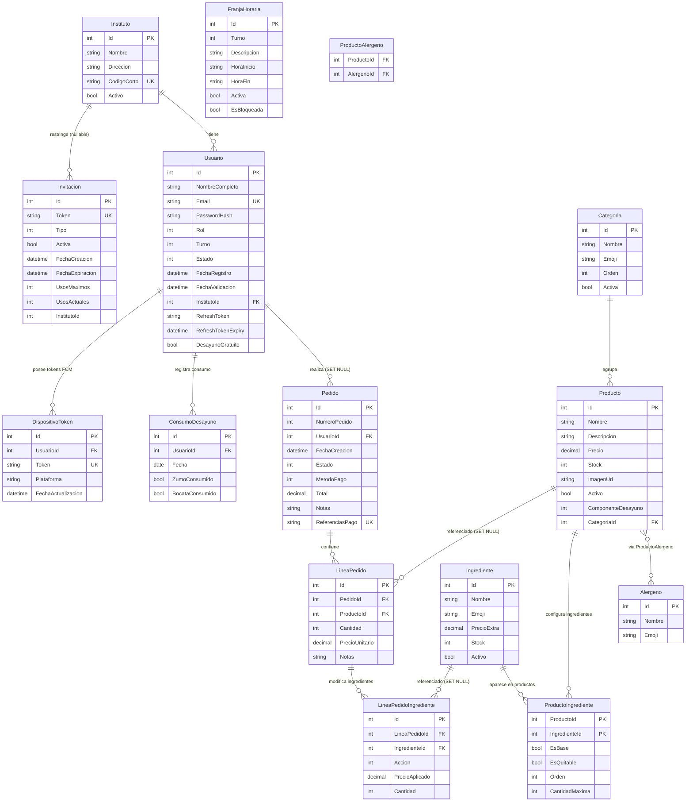

# CaféIES

<div align="center">

**Sistema completo de gestión de pedidos de cafetería para institutos de educación secundaria.**  
App móvil Android · Panel web de administración · API REST en producción.

[](https://dotnet.microsoft.com/)
[](https://learn.microsoft.com/dotnet/maui/)
[](https://learn.microsoft.com/aspnet/core/blazor/)
[](https://stripe.com/)
[](https://azure.microsoft.com/)
[](https://github.com/features/actions)
[](#)
[](LICENSE)

[**APK Android**](https://github.com/JoseGlezHerrera/CafeteriaInsti/releases) · [**Política de privacidad**](https://JoseGlezHerrera.github.io/CafeteriaInsti/politica-privacidad.html) · [**API Swagger**](https://cafeies-api.azurewebsites.net/swagger)

</div>

---

## Resumen

CaféIES es un sistema de gestión de pedidos de cafetería escolar desarrollado como proyecto académico con tecnologías de producción reales:

- **App móvil** (MAUI Android): catálogo, carrito, personalización de ingredientes, pago con Stripe, seguimiento en tiempo real e impresión de tickets.
- **Panel admin web** (Blazor WASM): gestión de usuarios, productos, pedidos, horarios, reportes Excel/PDF e institutos.
- **API REST** (ASP.NET Core 9): JWT + BCrypt, rate limiting en 4 políticas, audit trail, SignalR y webhook Stripe.
- **Programa de desayuno gratuito**: 1 zumo + 1 bocadillo/día para alumnos beneficiarios, con protección anti-doble-consumo mediante transacción Serializable + índice UNIQUE.
- **Infraestructura Azure en producción**: App Service + SQL Server + Blob Storage + Static Web Apps, con CI/CD automático.

---

## Arquitectura

```
┌──────────────────┐   HTTPS / JSON    ┌───────────────────────────┐
│  CafeIES.MAUI    │◄─────────────────►│   CafeIES.API             │
│  Android / iOS   │   SignalR WS       │   ASP.NET Core 9          │
│                  │◄─────────────────►│   EF Core 9 + SQL Server  │
└──────────────────┘                   │   JWT + BCrypt 12         │
                                       │   SignalR Hub             │
┌──────────────────┐   HTTPS / JSON    │   Stripe SDK              │
│  CafeIES.Admin   │◄─────────────────►│   Azure Blob Storage      │
│  Blazor WASM     │   SignalR WS       └──────────┬────────────────┘
└──────────────────┘◄─────────────────►            │
                                        ┌──────────▼────────────┐
         ┌──────────────────────────────┤  Servicios externos   │
         ▼                              │  Stripe (Pagos)       │
┌──────────────────┐                   │  Azure (Hosting)      │
│  CafeIES.Shared  │                   └───────────────────────┘
│  DTOs · Entidades│
│  Enums · Validac.│
└──────────────────┘
```

---

## Stack tecnológico

| Componente | Tecnología | Versión |
|---|---|---|
| Backend API | ASP.NET Core | .NET 9 |
| Base de datos | SQL Server + Entity Framework Core | EF Core 9 |
| App móvil | .NET MAUI | .NET 9 (Android, iOS) |
| Panel admin | Blazor WebAssembly | .NET 9 |
| Autenticación | JWT Bearer + BCrypt | workFactor 12 |
| Pagos | Stripe PaymentIntent + Webhook | Stripe.net 50.x |
| Tiempo real | ASP.NET Core SignalR | — |
| Imágenes | Azure Blob Storage (prod) / local (dev) | Azure.Storage.Blobs 12.x |
| Hosting API | Azure App Service (F1, Linux .NET 9) | — |
| Hosting Admin | Azure Static Web Apps (free) | — |
| CI/CD | GitHub Actions | — |
| Reportes | ClosedXML (Excel) + QuestPDF (PDF) | — |
| QR invitaciones | QRCoder | — |
| MVVM (MAUI) | CommunityToolkit.Mvvm | 8.3.x |

---

## Demo rápida

### Credenciales de prueba

| Rol | Email | Contraseña |
|---|---|---|
| Admin | `admin@cafeies.local` | configurado en Azure App Settings |
| Empleado | crear desde MAUI Admin → Usuarios → Invitación | — |
| Alumno | registro en la app con instituto seleccionado | — |

### Tarjeta Stripe (modo test)

```
Número:    4242 4242 4242 4242
Caducidad: cualquier fecha futura
CVC:       cualquier 3 dígitos
```

### Orden de demo recomendado

1. **Admin (Blazor)** — Dashboard, crear producto con imagen, activar desayuno gratuito a un alumno
2. **Admin (MAUI)** — mismo producto desde la app; panel contextual de usuarios
3. **Alumno** — pedido con personalización de ingredientes + pago Stripe (o flujo gratuito 0 €)
4. **Empleado** — cambiar estado a "En preparación" → ver la actualización en tiempo real en el móvil del alumno
5. **Blazor** — el pedido aparece en el Dashboard en tiempo real; exportar reporte Excel

---

## Distribución Android

El APK se genera automáticamente en GitHub Actions al hacer push a `main` con cambios en `CafeIES.MAUI/**` o `CafeIES.Shared/**`.

**Instalación:**
1. Ve a [Releases](https://github.com/JoseGlezHerrera/CafeteriaInsti/releases) y descarga el último `cafeies-X.X.X.apk`
2. En el móvil: **Ajustes → Seguridad → Instalar apps de fuentes desconocidas** → activar para el navegador
3. Abre el APK e instala

> Firmado con debug key — apto para pruebas internas. Para Play Store se necesita keystore release (ver Roadmap).

---

<details>
<summary><strong>🚀 Puesta en marcha local</strong></summary>

### Requisitos

- .NET 9 SDK
- SQL Server (Express, Developer o Docker)
- Visual Studio 2022 / Rider / VS Code con extensión C#
- Android SDK (solo para la app móvil)

### 1. Configurar la API

Crear `CafeIES.API/appsettings.Development.json` (no commitear):

```json
{
  "ConnectionStrings": {
    "DefaultConnection": "Server=(localdb)\\mssqllocaldb;Database=CafeIES;Trusted_Connection=True;"
  },
  "Jwt": {
    "Key": "tu-clave-secreta-de-al-menos-32-caracteres",
    "Issuer": "CafeIES",
    "Audience": "CafeIES"
  },
  "Admin": {
    "Email": "admin@cafeies.local",
    "Password": "Admin1234!"
  },
  "Stripe": {
    "SecretKey": "sk_test_...",
    "PublishableKey": "pk_test_...",
    "WebhookSecret": "whsec_..."
  },
  "BlobStorage": {
    "UseAzure": false
  }
}
```

```bash
cd CafeIES.API
dotnet ef database update
dotnet run
# → API en https://localhost:50658, Swagger en /swagger
```

### 2. Configurar el Admin Blazor

Editar `CafeIES.Admin/wwwroot/appsettings.json`:

```json
{ "ApiBaseUrl": "https://localhost:50658" }
```

```bash
cd CafeIES.Admin
dotnet run
# → Panel en https://localhost:50660
```

### 3. Ejecutar la app MAUI

La URL de la API se selecciona por plataforma en `ApiService.cs`:

```csharp
#if ANDROID
    private const string ApiBaseUrl = "https://10.0.2.2:50658"; // Emulador Android
#else
    private const string ApiBaseUrl = "https://localhost:50658"; // iOS / Windows
#endif
```

Para dispositivo físico Android, reemplazar `10.0.2.2` por la IP local de tu máquina.

### 4. Ejecutar los tests

```bash
cd CafeIES.Tests
dotnet test
# → 115 tests passing
```

</details>

---

<details>
<summary><strong>☁️ Despliegue en Azure</strong></summary>

### Recursos creados

| Recurso | Tipo | Región |
|---|---|---|
| `cafeies-api` | App Service (F1, Linux, .NET 9) | North Europe |
| `cafeies-sql` | Azure SQL Database | North Europe |
| `cafeies-storage` | Storage Account (Blob) | North Europe |
| `cafeies-admin` | Static Web App (Free) | Global |

### Variables de entorno (Azure App Settings)

```
ConnectionStrings__DefaultConnection = <cadena de conexión SQL>
Jwt__Key                             = <clave secreta producción>
Jwt__Issuer                          = CafeIES
Jwt__Audience                        = CafeIES
Admin__Email                         = <email admin>
Admin__Password                      = <contraseña admin>
Stripe__SecretKey                    = sk_live_...
Stripe__PublishableKey               = pk_live_...
Stripe__WebhookSecret                = whsec_...
BlobStorage__UseAzure                = true
BlobStorage__ConnectionString        = <cadena Azure Storage>
BlobStorage__ContainerName           = productos
```

### CI/CD — GitHub Actions

Los tres workflows se disparan automáticamente al hacer push a `main`:

| Workflow | Trigger (paths) | Destino | Tiempo |
|---|---|---|---|
| `deploy-api.yml` | `CafeIES.API/**`, `CafeIES.Shared/**` | Azure App Service | ~4 min |
| `deploy-admin.yml` | `CafeIES.Admin/**`, `CafeIES.Shared/**` | Azure Static Web Apps | ~2 min |
| `deploy-android.yml` | `CafeIES.MAUI/**`, `CafeIES.Shared/**` | GitHub Releases (APK) | ~3 min |

El APK se versiona como `YYYY.MM.<run_number>` y se publica como **latest release**.

</details>

---

<details>
<summary><strong>📂 Estructura del proyecto</strong></summary>

```
CafeIES/
├── CafeIES.sln
│
├── CafeIES.Shared/                     ← Modelos compartidos por todos los proyectos
│   ├── Models/
│   │   ├── Entities.cs                 Instituto, Usuario, Producto, Pedido, LineaPedido,
│   │   │                               FranjaHoraria, Invitacion, ConsumoDesayuno,
│   │   │                               DispositivoToken, RefreshToken
│   │   ├── DTOs.cs                     DTOs request/response con Data Annotations
│   │   └── Enums.cs                    Turno, RolUsuario, EstadoPedido, MetodoPago,
│   │                                   ComponenteDesayuno (Ninguno/Zumo/Bocata)
│   └── Validation/
│       └── PasswordComplexityAttribute.cs  Mayúscula + número + símbolo obligatorios
│
├── CafeIES.API/                        ← Backend REST (puerto local 50658)
│   ├── Controllers/
│   │   ├── AuthController.cs           Login, registro alumno/invitado, refresh JWT, logout
│   │   ├── ProductosController.cs      CRUD productos + imagen; filtro por categoría/búsqueda
│   │   ├── CategoriasController.cs     CRUD categorías
│   │   ├── PedidosController.cs        Crear/listar/detalle; máquina de estados; desayuno-status
│   │   ├── PagosController.cs          Crear PaymentIntent (con split gratuito), cancelar, webhook
│   │   ├── AdminController.cs          Usuarios, institutos, invitaciones, horarios, reportes,
│   │   │                               desayunos (consumos + gestión beneficiarios)
│   │   ├── AlergenosController.cs      CRUD alérgenos — [Authorize(Roles="Admin,Empleado")]
│   │   ├── NotificacionesController.cs Registro/eliminación tokens FCM (infraestructura)
│   │   └── EmpleadoController.cs       Pedidos en curso para empleados/personal
│   ├── Data/
│   │   ├── AppDbContext.cs             EF Core context; índices en Pedidos.Estado,
│   │   │                               DispositivoTokens.UsuarioId, ConsumoDesayuno(UsuarioId,Fecha)
│   │   ├── DbSeeder.cs                 Admin, institutos de ejemplo, categorías, franjas horarias
│   │   └── Migrations/                 Historial completo de migraciones EF Core
│   ├── Services/
│   │   ├── AuthService.cs              JWT access+refresh, BCrypt hash, rotación de tokens
│   │   ├── HorarioService.cs           Validación de franja horaria antes de crear pedido
│   │   ├── StripeService.cs            PaymentIntent, cancelación, firma de webhooks
│   │   ├── FcmService.cs               FCM HTTP v1 con GoogleCredential cacheado
│   │   ├── LocalBlobStorageService.cs  Almacenamiento local (dev) con validación path-traversal
│   │   ├── AzureBlobStorageService.cs  Azure Blob Storage (prod)
│   │   ├── ReporteExcelService.cs      Excel con ClosedXML (pedidos, productos, usuarios)
│   │   └── ReportePdfService.cs        PDF con QuestPDF — limitado a 1.000 registros
│   ├── Extensions/
│   │   ├── ClaimsPrincipalExtensions.cs  GetUserId() null-safe
│   │   └── DtoMapperExtensions.cs        ToDto() centralizado para Usuario, Pedido, FranjaHoraria
│   ├── Hubs/
│   │   └── PedidosHub.cs               SignalR hub — grupos cafeteria y user-{id}
│   └── Program.cs                      DI, middleware, rate limiting (4 políticas), CORS, Swagger
│
├── CafeIES.MAUI/                       ← App móvil Android/iOS
│   ├── Views/                          23 páginas XAML
│   │   ├── LoginPage                   Auto-login transparente; fade-in solo si no hay sesión
│   │   ├── RegistroPage                Registro alumno con instituto y turno
│   │   ├── RegistroInvitacionPage      Registro por enlace/QR de invitación
│   │   ├── HomePage                    Catálogo con categorías, búsqueda y filtros
│   │   ├── ProductoDetallePage         Detalle con imagen real (fallback emoji); bloqueado si sin stock
│   │   ├── CarritoPage                 Resumen, spinner desayuno, banner 🍊, descuento, TotalEfectivo
│   │   ├── PagamentoWebPage            WebView con Stripe.js
│   │   ├── ConfirmacionPedidoPage      Polling cada 2s; token "gratuito-{num}" sin polling
│   │   ├── PedidosPage                 Historial con chips Hoy/Todo y paginación
│   │   ├── DetallePedidoPage           Detalle en tiempo real vía SignalR con ingredientes y notas
│   │   ├── PerfilPage                  Datos personales, cambio de contraseña
│   │   ├── AdminPedidosPage            Todos los pedidos: filtro por instituto, fecha y estado
│   │   ├── AdminProductosPage          Gestión de productos con imagen
│   │   ├── AdminEditProductoPage       Crear/editar producto con ComponenteDesayuno e imagen
│   │   ├── AdminUsuariosPage           Panel contextual animado; forzar borrado con historial preservado
│   │   ├── AdminIngredientesPage       Gestión de ingredientes con toggle y botón eliminar
│   │   ├── AdminCategoriasPage         CRUD categorías (crear con emoji + nombre, eliminar)
│   │   ├── AdminAlergenosPage          CRUD alérgenos (crear con emoji + nombre, eliminar)
│   │   ├── AdminInvitacionesPage       Crear/listar invitaciones con QR descargable
│   │   ├── AdminHorariosPage           Gestión de franjas horarias por instituto
│   │   ├── AdminPerfilPage             Perfil del administrador
│   │   ├── EmpleadoPedidosPage         Historial del día: activos + cerrados
│   │   └── EmpleadoProductosPage       Catálogo con control de stock y accesos rápidos
│   ├── ViewModels/                     MVVM con CommunityToolkit.Mvvm
│   ├── Services/
│   │   ├── ApiService.cs               HTTP client (timeout 45s) + SignalR; warmup a /health
│   │   ├── TokenService.cs             SecureStorage para access/refresh token
│   │   └── TicketHtmlBuilder.cs        Genera HTML de ticket optimizado para impresión térmica 80 mm
│   ├── Platforms/Android/
│   │   └── AndroidPrintService.cs      WebView + PrintManager para imprimir tickets (WiFi/BT/PDF)
│   ├── Converters/
│   │   └── Converters.cs               ~30 converters: estado pedido, stock, rol, desayuno, chips…
│   └── Resources/Styles/
│       └── AppStyles.xaml              Paleta dark & warm (ámbar/naranja), tipografía Syne+DMSans
│
├── CafeIES.Admin/                      ← Panel administración Blazor WASM
│   ├── Pages/
│   │   ├── Dashboard.razor             Métricas del día, pedidos recientes, SignalR live
│   │   ├── Pedidos.razor               Lista paginada + cambio de estado
│   │   ├── Productos.razor             CRUD con subida de imagen, badges ComponenteDesayuno
│   │   ├── Categorias.razor            CRUD categorías
│   │   ├── Usuarios.razor              Lista usuarios + toggle desayuno gratuito 🍊
│   │   ├── Desayunos.razor             Beneficiarios (buscar/filtrar/toggle) + consumos del día
│   │   ├── Institutos.razor            CRUD multi-instituto con dirección
│   │   ├── Horarios.razor              Franjas horarias por instituto y turno
│   │   ├── Invitaciones.razor          Crear invitaciones + QR descargable
│   │   └── Reportes.razor              Exportar Excel/PDF (límite 1.000 registros)
│   ├── Services/
│   │   └── AdminApiService.cs          HTTP client (timeout 20s)
│   └── wwwroot/
│       ├── appsettings.json            URL base de la API (configurable sin recompilar)
│       └── css/app.css                 Estilos custom
│
├── CafeIES.Tests/                      ← Tests unitarios (xUnit + EF InMemory)
│   └── ...                             115 tests: HorarioService, AuthService, dominio, validaciones
│
└── .github/workflows/
    ├── deploy-api.yml                  Push → Azure App Service (~4 min)
    ├── deploy-admin.yml                Push → Azure Static Web Apps (~2 min)
    └── deploy-android.yml              Push → GitHub Releases APK (~3 min)
```

</details>

---

<details>
<summary><strong>👥 Flujos de usuario</strong></summary>

### Alumno — hacer un pedido

1. Abre la app → auto-login (o registro si es la primera vez)
2. Explora el catálogo: filtra por categoría o busca por nombre
3. Toca un producto → personaliza ingredientes → añade al carrito
4. Abre el carrito → ve el banner 🍊 si tiene desayuno disponible hoy
5. Pulsa "Pagar" → Stripe WebView → introduce tarjeta (o flujo gratuito → sin Stripe)
6. Pantalla de confirmación → número de pedido y estado en tiempo real (SignalR)
7. Seguimiento desde "Mis pedidos" → DetallePedidoPage con desglose de ingredientes y precio

### Empleado — gestionar el servicio

1. Login → vista "Pedidos del día" (solo los del propio instituto)
2. Pendiente → pulsa "Preparar" → estado cambia a En preparación (SignalR notifica al alumno)
3. Cuando está listo → pulsa "Listo"; puede imprimir el ticket 🖨 directamente desde la tarjeta
4. Alumno recoge → "Entregar"; o "Cancelar" en cualquier momento
5. Accede a "Productos" → crear/editar productos, gestionar stock, ingredientes, categorías, alérgenos

### Admin — gestión completa

1. Login → Dashboard Blazor o app MAUI (ambos operativos)
2. **Usuarios**: aprobar alumnos pendientes, activar desayuno gratuito 🍊, crear invitaciones QR
3. **Productos**: CRUD completo con imagen (cámara/galería), asignación de ingredientes, ComponenteDesayuno
4. **Pedidos**: filtrar por instituto/fecha/estado; cambiar estado; exportar Excel/PDF
5. **Horarios**: configurar franjas horarias por instituto y turno
6. **Institutos**: alta de nuevos centros

### Flujo de registro de usuarios

```
Alumno        ──────────────────────► /api/auth/registro/alumno
                                       Selecciona instituto y turno
                                       Estado inicial: PendienteValidacion
                                       Admin aprueba desde MAUI o Blazor

Profe/Personal ── QR o enlace ──────► /api/auth/registro/invitado
                                       Token de invitación + no caducada
                                       Admin aprueba

Admin         ──────────────────────► Seeding inicial (DbSeeder.cs)
                                       Email/password en appsettings
```

**Auto-login:** Al arrancar, `LoginViewModel.TryAutoLoginAsync` intenta renovar el token. Si tiene éxito, navega directamente sin mostrar el formulario. El formulario arranca con `Opacity=0` y solo hace `FadeTo(1)` si no hay sesión activa — sin flash de login.

</details>

---

<details>
<summary><strong>⏰ Lógica de horarios y desayuno gratuito</strong></summary>

### Horarios

La API valida que el pedido se realice dentro de la franja horaria del turno antes de crearlo o generar el PaymentIntent.

```
Alumno turno Mañana → puede pedir entre 08:00 y 10:30
Alumno turno Tarde  → puede pedir entre 14:00 y 16:00
Alumno turno Noche  → puede pedir entre 18:00 y 20:00
```

- `HorarioService.PuedePedirAhoraAsync` consulta la BD con `TimeOnly.TryParse` seguro.
- Si no hay franja configurada → pedido permitido (permisivo por defecto).
- Si la franja no está activa → 400 con mensaje claro.
- Personal e Invitados no tienen restricción horaria.
- **Sábado bloqueado** para alumnos; **domingo permite pre-pedido** para el lunes.
- Si hoy es lunes, el filtro "Hoy" del historial incluye los pedidos del domingo automáticamente.

### Sistema de desayuno gratuito

Programa de desayuno escolar: **1 zumo + 1 bocadillo al día**, sin pasar por Stripe.

**Configuración de productos:**

| `ComponenteDesayuno` | Significado |
|---|---|
| `Ninguno` | Producto normal |
| `Zumo` | Puede ser el zumo gratuito del día |
| `Bocata` | Puede ser el bocadillo gratuito del día |

**Flujo en la app:**
1. Al abrir el carrito → `GET /api/pedidos/desayuno-status` (bloquea el botón hasta cargar)
2. Si hay desayuno disponible → banner 🍊 con componentes restantes del día
3. `TotalEfectivo` se calcula descontando la primera unidad elegible de cada componente
4. Si total = 0 € → flujo gratuito: `POST /api/pedidos` directo, sin Stripe
5. Si hay parte de pago → `POST /api/pagos/crear-intent` con metadata de precios split

**Protección anti-fraude:**
- Solo 1 unidad por componente es gratis/día; las adicionales se cobran a precio normal
- Validado en servidor en una transacción **Serializable**
- `ConsumoDesayuno` con índice UNIQUE `(UsuarioId, Fecha)` — imposible doble consumo concurrente
- Webhook Stripe detecta líneas a 0 € y marca `ConsumoDesayuno` aunque la app se cierre tras el pago

</details>

---

<details>
<summary><strong>💳 Pagos con Stripe</strong></summary>

### Flujo completo

```
1. Cliente:  POST /api/pagos/crear-intent
             → API crea PaymentIntent con total calculado en servidor
               (descuento desayuno aplicado; metadata con precios split)

2. Cliente:  abre WebView con Stripe.js
             → Usuario introduce tarjeta

3. Stripe:   confirma el pago

4. Cliente:  navega INMEDIATAMENTE a ConfirmacionPedidoPage (muestra TotalEfectivo)

5. Background: POST /api/pedidos → crea el pedido en BD

6. Polling:  GET /api/pedidos/by-intent/{id} cada 2s → muestra número de pedido

7. Webhook:  Stripe crea el pedido y marca ConsumoDesayuno
             si el cliente falló en el paso 5
```

Si el total es 0 € → se salta Stripe y va directamente al paso 5.

### Seguridad

- El total **siempre** lo calcula el servidor — el cliente nunca envía el importe
- Redondeo correcto: `Math.Round(total * 100, MidpointRounding.AwayFromZero)`
- Rate limiting en `POST /api/pagos/crear-intent` (20 req/min/IP)
- La clave pública de Stripe se inyecta desde el servidor — el cliente no la maneja
- Webhook rechaza con 503 si `WebhookSecret` no está configurado
- `confirmation_method: automatic` (compatible con Stripe.js en WebView)

</details>

---

<details>
<summary><strong>⚡ Tiempo real con SignalR y seguridad</strong></summary>

### SignalR

- **Dashboard admin**: recibe pedidos nuevos al instante (auto-refresh cada 30 s como respaldo)
- **App móvil**: el alumno ve el estado de su pedido actualizado en vivo
- **Grupos**: `cafeteria` (admins/empleados) y `user-{id}` (usuario específico)
- **Reconexión automática**: si el token se renueva (refresh), SignalR se reconecta si estaba desconectado
- **Sesión expirada**: `ApiService` desconecta SignalR y navega al login
- **Keepalive**: `KeepAliveInterval = 15 s`, `ClientTimeoutInterval = 30 s`

### Seguridad

| Mecanismo | Detalle |
|---|---|
| Contraseñas | BCrypt workFactor 12 |
| Complejidad | Mínimo 8 caracteres + mayúscula + número + símbolo |
| JWT access token | 1 hora, HMAC-SHA256 |
| JWT refresh token | 30 días, rotación en cada uso |
| Almacenamiento tokens | MAUI: `SecureStorage`. Blazor: accessToken en `sessionStorage`, refreshToken solo en memoria |
| Rate limiting auth | 10 req/min/IP en endpoints de autenticación |
| Rate limiting general | 60 req/min/IP |
| Rate limiting invitaciones | 5 req/min/IP |
| Rate limiting pagos | 20 req/min/IP en `POST /api/pagos/crear-intent` |
| Audit trail | Acciones admin registradas con prefijo `[AUDIT]` en logs del servidor |
| Pagos | Total calculado en servidor — cliente solo recibe el clientSecret |
| Desayuno gratuito | Precio 0 validado en servidor; 1 unidad/componente/día; índice UNIQUE en ConsumoDesayuno |
| Stock | Transacciones `ReadCommitted` + `[ConcurrencyCheck]` para evitar sobreventa |
| Pedidos | Máquina de estados — solo transiciones válidas permitidas |
| Ownership | Usuarios solo acceden a sus propios pedidos |
| Instituto | Admin solo puede mutar usuarios de su propio instituto |
| XSS | Notas de pedido sanitizadas antes de persistir |
| Path traversal | `LocalBlobStorageService` usa `Path.GetRelativePath` para validar rutas |
| SSL en desarrollo | `ServerCertificateCustomValidationCallback` solo bajo `#if DEBUG` |
| Invitaciones | `DiasValidez` limitado a 1–365 días |
| Líneas de pedido | `MaxLength(30)` en `CrearPedidoRequest.Lineas` — previene pedidos abusivos |

</details>

---

<details>
<summary><strong>📐 Modelo de datos — tablas, índices, enums y diagramas</strong></summary>

La base de datos es **SQL Server** gestionada con **EF Core 9 Code-First**. El esquema tiene **15 tablas** y almacena toda la lógica de negocio: multi-tenancy por instituto, catálogo con ingredientes personalizables, pedidos con historial inmutable, desayuno gratuito con protección anti-doble-uso y tokens FCM para notificaciones push.

### Diagrama entidad-relación



---

### Documentación tabla a tabla

<details>
<summary>Institutos, Usuarios, FranjasHorarias, Invitaciones</summary>

#### `Institutos`
Centro educativo. Punto raíz del modelo multi-tenant.

| Columna | Tipo SQL | Restricciones | Descripción |
|---|---|---|---|
| `Id` | `int` | PK, IDENTITY | |
| `Nombre` | `nvarchar(150)` | NOT NULL | Nombre completo del centro |
| `Direccion` | `nvarchar(300)` | | Dirección postal (opcional) |
| `CodigoCorto` | `nvarchar(20)` | NOT NULL, **UNIQUE** | Identificador corto (ej: `IES-NORTE`) |
| `Activo` | `bit` | NOT NULL, DEFAULT 1 | Permite desactivar sin borrar datos |

**Índices:** `IX_Institutos_CodigoCorto` UNIQUE  
**Seed:** 3 institutos de demostración (`IES-1`, `IES-2`, `IES-3`)

---

#### `Usuarios`
Tabla central. Almacena todos los tipos de usuario bajo un único modelo con discriminación por `Rol`.

| Columna | Tipo SQL | Restricciones | Descripción |
|---|---|---|---|
| `Id` | `int` | PK, IDENTITY | |
| `NombreCompleto` | `nvarchar(100)` | NOT NULL | |
| `Email` | `nvarchar(150)` | NOT NULL, **UNIQUE** | Credencial de login |
| `PasswordHash` | `nvarchar(max)` | NOT NULL | Hash BCrypt (workFactor 12) |
| `Rol` | `int` | NOT NULL | Ver enum `RolUsuario` |
| `Turno` | `int` | nullable | Solo Alumno/Profesor/Personal |
| `Estado` | `int` | NOT NULL | Ver enum `EstadoCuenta` |
| `FechaRegistro` | `datetime2` | NOT NULL | UTC |
| `FechaValidacion` | `datetime2` | nullable | Cuándo el admin aprobó la cuenta |
| `InstitutoId` | `int` | FK nullable, RESTRICT | `NULL` para Admin |
| `RefreshToken` | `nvarchar(max)` | nullable | Token de refresco JWT activo |
| `RefreshTokenExpiry` | `datetime2` | nullable | Expiración del refresh token (30 días) |
| `DesayunoGratuito` | `bit` | NOT NULL, DEFAULT 0 | Beneficiario del programa de desayuno escolar |

**Índices:** `IX_Usuarios_Email` UNIQUE  
**Seguridad:** `RefreshToken` se invalida en cada rotación para evitar reuso de tokens robados.

---

#### `FranjasHorarias`
Ventanas temporales en las que un turno puede (o no) realizar pedidos.

| Columna | Tipo SQL | Restricciones | Descripción |
|---|---|---|---|
| `Id` | `int` | PK, IDENTITY | |
| `Turno` | `int` | NOT NULL | Ver enum `Turno` |
| `Descripcion` | `nvarchar(60)` | NOT NULL | Ej: "Recreo", "Antes de entrar" |
| `HoraInicio` | `nvarchar(5)` | NOT NULL | Formato `HH:mm` |
| `HoraFin` | `nvarchar(5)` | NOT NULL | Soporta cruce de medianoche |
| `Activa` | `bit` | NOT NULL, DEFAULT 1 | |
| `EsBloqueada` | `bit` | NOT NULL, DEFAULT 0 | `true` = franja de clase; `false` = recreo (permitida) |

**Seed:** 3 franjas bloqueadas (mañana 08-14, tarde 14:30-20:30, noche 21-03)

---

#### `Invitaciones`
Tokens de un solo uso (o multi-uso) para registrar profesores, personal y empleados.

| Columna | Tipo SQL | Restricciones | Descripción |
|---|---|---|---|
| `Id` | `int` | PK, IDENTITY | |
| `Token` | `nvarchar(max)` | NOT NULL, **UNIQUE** | UUID sin guiones (`Guid.NewGuid().ToString("N")`) |
| `Tipo` | `int` | NOT NULL | Ver enum `TipoInvitacion` |
| `Activa` | `bit` | NOT NULL, DEFAULT 1 | El admin puede revocarla manualmente |
| `FechaCreacion` | `datetime2` | NOT NULL | UTC |
| `FechaExpiracion` | `datetime2` | NOT NULL | Por defecto +7 días. Máx. 365 días |
| `UsosMaximos` | `int` | nullable | `NULL` = ilimitada |
| `UsosActuales` | `int` | NOT NULL, DEFAULT 0 | Con `[ConcurrencyCheck]` anti-race-condition |
| `InstitutoId` | `int` | nullable | Si tiene valor, fija el instituto del registrante |

</details>

<details>
<summary>Categorías, Alérgenos, Productos, Ingredientes, ProductoIngredientes</summary>

#### `Categorias`

| Columna | Tipo SQL | Restricciones | Descripción |
|---|---|---|---|
| `Id` | `int` | PK, IDENTITY | |
| `Nombre` | `nvarchar(80)` | NOT NULL | Ej: "Bocadillos", "Bebidas" |
| `Emoji` | `nvarchar(10)` | | |
| `Orden` | `int` | NOT NULL, DEFAULT 0 | Orden de aparición en el catálogo |
| `Activa` | `bit` | NOT NULL, DEFAULT 1 | |

**Seed:** 5 categorías: Bocadillos 🥖, Ensaladas 🥗, Bebidas 🥤, Postres 🍰, Café ☕

---

#### `Alergenos`
Los 14 alérgenos de declaración obligatoria según el Reglamento (UE) 1169/2011.

| Columna | Tipo SQL | Restricciones |
|---|---|---|
| `Id` | `int` | PK, IDENTITY |
| `Nombre` | `nvarchar(60)` | NOT NULL |
| `Emoji` | `nvarchar(10)` | |

**Seed:** Gluten 🌾, Crustáceos 🦐, Huevo 🥚, Pescado 🐟, Cacahuetes 🥜, Soja 🫘, Lácteos 🥛, Frutos secos 🌰, Apio 🌿, Mostaza 🌻, Sésamo 🌱, Sulfitos 🍷, Altramuces 🌼, Moluscos 🦑

---

#### `Productos`

| Columna | Tipo SQL | Restricciones | Descripción |
|---|---|---|---|
| `Id` | `int` | PK, IDENTITY | |
| `Nombre` | `nvarchar(120)` | NOT NULL | |
| `Descripcion` | `nvarchar(300)` | | |
| `Precio` | `decimal(6,2)` | NOT NULL | Precio base; el total real varía por extras de ingredientes |
| `Stock` | `int` | NOT NULL, DEFAULT -1 | `-1` = sin control; `0` = agotado; `>0` = disponibles |
| `ImagenUrl` | `nvarchar(500)` | nullable | Ruta relativa (local) o URL absoluta (Azure Blob) |
| `Activo` | `bit` | NOT NULL, DEFAULT 1 | Inactivo → no aparece en catálogo |
| `ComponenteDesayuno` | `int` | NOT NULL, DEFAULT 0 | Ver enum |
| `CategoriaId` | `int` | FK NOT NULL, RESTRICT | |

**Control de stock:** `[ConcurrencyCheck]` en `Stock` — previene sobreventa.  
**Soft-delete:** `Activo = false` en lugar de borrarse; si se elimina físicamente, `LineaPedido.ProductoId` pasa a `NULL` (historial preservado).

---

#### `Ingredientes`

| Columna | Tipo SQL | Restricciones | Descripción |
|---|---|---|---|
| `Id` | `int` | PK, IDENTITY | |
| `Nombre` | `nvarchar(80)` | NOT NULL | |
| `Emoji` | `nvarchar(10)` | | |
| `PrecioExtra` | `decimal(6,2)` | NOT NULL, DEFAULT 0 | Suplemento al añadir como extra; 0 para base |
| `Stock` | `int` | NOT NULL, DEFAULT -1 | Mismo control que `Producto.Stock` |
| `Activo` | `bit` | NOT NULL, DEFAULT 1 | |

---

#### `ProductoIngredientes`
Configura cómo un ingrediente aparece en la personalización de un producto concreto.

| Columna | Tipo SQL | Restricciones | Descripción |
|---|---|---|---|
| `ProductoId` | `int` | PK compuesto, FK (CASCADE) | |
| `IngredienteId` | `int` | PK compuesto, FK (RESTRICT) | |
| `EsBase` | `bit` | NOT NULL | `true` = viene incluido por defecto |
| `EsQuitable` | `bit` | NOT NULL | Solo si `EsBase`. El cliente puede quitarlo sin coste |
| `Orden` | `int` | NOT NULL | Orden en la UI |
| `CantidadMaxima` | `int` | NOT NULL, DEFAULT 1 | `1` → switch on/off; `>1` → stepper 0..N |

| `EsBase` | `EsQuitable` | Comportamiento |
|:---:|:---:|---|
| `true` | `true` | Ingrediente base quitablo (ej: tomate) |
| `true` | `false` | Ingrediente fijo, no modificable (ej: pan) |
| `false` | n/a | Extra opcional con suplemento de precio |

</details>

<details>
<summary>Pedidos, LineasPedido, LineaPedidoIngredientes, ConsumoDesayunos, DispositivoTokens</summary>

#### `Pedidos`

| Columna | Tipo SQL | Restricciones | Descripción |
|---|---|---|---|
| `Id` | `int` | PK, IDENTITY | |
| `NumeroPedido` | `int` | NOT NULL | Número visible (ej: #042). `MAX + 1` en transacción |
| `UsuarioId` | `int` | FK nullable, **SET NULL** | `NULL` si el usuario fue borrado — pedido conservado para auditoría |
| `FechaCreacion` | `datetime2` | NOT NULL | UTC |
| `Estado` | `int` | NOT NULL | Máquina de estados |
| `MetodoPago` | `int` | NOT NULL | |
| `Total` | `decimal(8,2)` | NOT NULL | Calculado en servidor |
| `Notas` | `nvarchar(300)` | nullable | Nota libre del usuario para toda la comanda |
| `ReferenciasPago` | `nvarchar(200)` | nullable, **UNIQUE filtrado** | PaymentIntentId de Stripe — evita pedidos duplicados por webhooks |

**Máquina de estados:**
```
Pendiente → EnPreparacion → Listo → Entregado
    ↓              ↓          ↓
Cancelado      Cancelado  Cancelado
```

---

#### `LineasPedido`
Cada fila es un producto dentro de un pedido. `PrecioUnitario` es un snapshot inmutable.

| Columna | Tipo SQL | Restricciones | Descripción |
|---|---|---|---|
| `Id` | `int` | PK, IDENTITY | |
| `PedidoId` | `int` | FK NOT NULL, **CASCADE** | |
| `ProductoId` | `int` | FK nullable, **SET NULL** | `NULL` si el producto fue eliminado |
| `Cantidad` | `int` | NOT NULL | Unidades pedidas |
| `PrecioUnitario` | `decimal(6,2)` | NOT NULL | Precio en el momento del pedido (snapshot, incluye extras) |
| `Notas` | `nvarchar(200)` | nullable | Nota por línea |

**Columna calculada:** `Subtotal = Cantidad × PrecioUnitario` — calculada en .NET, no almacenada.

---

#### `LineaPedidoIngredientes`
Modificación de ingrediente realizada por el cliente. También es un snapshot inmutable.

| Columna | Tipo SQL | Restricciones | Descripción |
|---|---|---|---|
| `Id` | `int` | PK, IDENTITY | |
| `LineaPedidoId` | `int` | FK NOT NULL, **CASCADE** | |
| `IngredienteId` | `int` | FK nullable, **SET NULL** | `NULL` si el ingrediente fue borrado |
| `Accion` | `int` | NOT NULL | `Quitar` (0) / `Añadir` (1) |
| `PrecioAplicado` | `decimal(6,2)` | NOT NULL | `0` para Quitar; snapshot de `PrecioExtra` para Añadir |
| `Cantidad` | `int` | NOT NULL, DEFAULT 1 | Para extras con `CantidadMaxima > 1` |

---

#### `ConsumoDesayunos`
Control anti-fraude del programa de desayuno gratuito.

| Columna | Tipo SQL | Restricciones | Descripción |
|---|---|---|---|
| `Id` | `int` | PK, IDENTITY | |
| `UsuarioId` | `int` | FK NOT NULL, **CASCADE** | |
| `Fecha` | `date` | NOT NULL | Fecha en zona horaria española (no UTC) |
| `ZumoConsumido` | `bit` | NOT NULL, DEFAULT 0 | |
| `BocataConsumido` | `bit` | NOT NULL, DEFAULT 0 | |

**Índice:** `IX_ConsumoDesayunos_UsuarioId_Fecha` **UNIQUE** — garantía de BD de que es imposible tener dos registros para el mismo usuario el mismo día. Doble protección junto con la transacción Serializable en aplicación.

---

#### `DispositivoTokens`
Tokens FCM para notificaciones push (infraestructura preparada).

| Columna | Tipo SQL | Restricciones | Descripción |
|---|---|---|---|
| `Id` | `int` | PK, IDENTITY | |
| `UsuarioId` | `int` | FK NOT NULL, **CASCADE** | |
| `Token` | `nvarchar(512)` | NOT NULL, **UNIQUE** | Token de registro FCM; único por dispositivo |
| `Plataforma` | `nvarchar(10)` | NOT NULL | `"android"` / `"ios"` |
| `FechaActualizacion` | `datetime2` | NOT NULL | Para expirar tokens inactivos |

</details>

---

### Catálogo de índices

| Tabla | Índice | Tipo | Propósito |
|---|---|---|---|
| `Institutos` | `IX_Institutos_CodigoCorto` | UNIQUE | Búsqueda y unicidad de código corto |
| `Usuarios` | `IX_Usuarios_Email` | UNIQUE | Login y unicidad de email |
| `Invitaciones` | `IX_Invitaciones_Token` | UNIQUE | Validación de tokens de registro |
| `Pedidos` | `IX_Pedidos_UsuarioId_FechaCreacion` | Compuesto | Historial de pedidos de un usuario |
| `Pedidos` | `IX_Pedidos_Estado` | Simple | Cola de preparación |
| `Pedidos` | `IX_Pedidos_ReferenciasPago` | UNIQUE FILTERED | Deduplicación de webhooks Stripe |
| `ConsumoDesayunos` | `IX_ConsumoDesayunos_UsuarioId_Fecha` | UNIQUE compuesto | Anti-doble-consumo |
| `DispositivoTokens` | `IX_DispositivoTokens_Token` | UNIQUE | Unicidad de token FCM por dispositivo |
| `DispositivoTokens` | `IX_DispositivoTokens_UsuarioId` | Simple | Obtener todos los tokens de un usuario |
| `Ingredientes` | `IX_Ingredientes_Nombre` | Simple | Búsqueda en panel admin |
| `LineaPedidoIngredientes` | `IX_LineaPedidoIngredientes_LineaPedidoId` | Simple | Cargar modificaciones de una línea |

---

### Referencia de enumeraciones

Todos los enums se almacenan como `int` mediante `.HasConversion<int>()`.

| Enum | Valores |
|---|---|
| `RolUsuario` | `Alumno`(0), `Profesor`(1), `Personal`(2), `Empleado`(3), `Admin`(99) |
| `EstadoCuenta` | `PendienteValidacion`(0), `Activa`(1), `Suspendida`(2), `Rechazada`(3) |
| `Turno` | `Manana`(0), `Tarde`(1), `Noche`(2) |
| `EstadoPedido` | `Pendiente`(0), `EnPreparacion`(1), `Listo`(2), `Entregado`(3), `Cancelado`(4) |
| `MetodoPago` | `Tarjeta`(0), `GooglePay`(1), `ApplePay`(2), `Gratuito`(3) |
| `ComponenteDesayuno` | `Ninguno`(0), `Zumo`(1), `Bocata`(2) |
| `TipoInvitacion` | `Profesor`(1), `Personal`(2), `Empleado`(3) |
| `AccionIngrediente` | `Quitar`(0), `Añadir`(1) |

---

### Diagramas de secuencia

<details>
<summary>Flujo Stripe, desayuno gratuito y ciclo de vida JWT</summary>

#### Creación de pedido con Stripe

```
Cliente (MAUI)          API                   Stripe         BD
     │── POST /pagos/crear-intent ────────────►               │
     │                   │── createPaymentIntent ─────────►  │
     │◄── clientSecret ──│◄─ clientSecret ────────────────   │
     │── confirmPayment() con Stripe.js ─────────────────►   │
     │◄── paymentIntentId (ok) ──────────────────────────    │
     │── POST /pedidos ───────────────────────────────────►  │
     │                   │── ValidarPago ──────────────────►  │
     │                   │── BEGIN TRANSACTION ───────────►  │
     │                   │── Stock -= Cantidad ────────────►  │
     │                   │── INSERT Pedido + Lineas ───────►  │
     │                   │── INSERT LineaPedidoIngredientes►  │
     │                   │── COMMIT ───────────────────────►  │
     │                   │── SignalR.NuevoPedido → Admin   │  │
     │◄── 201 Created ───│                                 │  │
```

#### Anti-doble-consumo de desayuno gratuito

```
Cliente (MAUI)          API                              BD
     │── POST /pedidos/crear (Total=0€) ───────────────►│
     │                   │── BEGIN SERIALIZABLE ─────►  │
     │                   │── SELECT ConsumoDesayuno ─►  │
     │                   │◄── (null o parcial) ─────    │
     │                   │── UPSERT ConsumoDesayuno ─►  │
     │                   │── INSERT Pedido... ────────►  │
     │                   │── COMMIT ─────────────────►  │
     │◄── 201 Created ───│                              │
     │                              [mismo día]         │
     │── POST /pedidos/crear ────────────────────────►  │
     │                   │── BEGIN SERIALIZABLE ─────►  │
     │                   │── SELECT ConsumoDesayuno ─►  │
     │                   │◄── (ZumoConsumido=true) ──   │
     │                   │── ROLLBACK ───────────────►  │
     │◄── 400 "Ya has consumido tu desayuno hoy" ─────  │
```

#### Ciclo de vida del token JWT

```
App MAUI                API (/auth)
    │── POST /login ─────────────────►
    │◄── accessToken (1h) + refreshToken (30d)
    │
    │   [55 min después]
    │── GET /catalogo ───────────────►
    │◄── 401 Unauthorized ────────────
    │
    │── POST /auth/refresh ─────────►
    │   (refreshToken)               │── Validar + Rotar
    │◄── nuevo accessToken + nuevo refreshToken
    │── (reintenta GET /catalogo) ──►
```

</details>

---

### Decisiones de diseño

| Decisión | Alternativa descartada | Motivo |
|---|---|---|
| `Pedido.UsuarioId` nullable con SET NULL | Borrado en cascada del pedido | Preservar historial de auditoría aunque se elimine el usuario |
| `LineaPedido.PrecioUnitario` snapshot | Calcular en tiempo real | Los cambios de precio no deben afectar facturas pasadas |
| `ConsumoDesayuno` Serializable + UNIQUE | Solo transacción | Doble capa: la BD rechaza duplicados incluso si la lógica de app falla |
| Enums como `int` | Como `string` | Ahorro de espacio + joins más rápidos; los valores no cambian |
| `RefreshToken` solo en memoria (Blazor) | En `localStorage` | Mitiga ataques XSS |
| `FranjaHoraria.EsBloqueada` | Lista blanca de horas | Modela tanto horarios de clase como recreos con una sola tabla |
| PK compuesta en `ProductoIngrediente` | PK surrogate + UQ | Garantiza que un ingrediente solo aparece una vez por producto |
| `ReferenciasPago` UNIQUE FILTERED | Sin índice | Evita pedidos duplicados si el webhook llega dos veces |

</details>

---

<details>
<summary><strong>🎯 Decisiones técnicas y justificación</strong></summary>

| Decisión | Alternativa considerada | Por qué se eligió |
|---|---|---|
| **.NET MAUI** para la app móvil | Flutter, React Native | Stack único .NET — `CafeIES.Shared` se comparte con la API sin duplicar modelos ni validaciones |
| **Blazor WASM** para el panel admin | React/Angular | Mismo ecosistema .NET; primer-load de ~2 s aceptable para un panel interno |
| **Stripe** para pagos | PayPal, pasarela bancaria propia | SDK oficial, webhooks fiables, modo test completo sin cuenta bancaria real |
| **SignalR** para tiempo real | Polling puro, WebSockets manuales | Integrado en ASP.NET Core; reconexión automática y grupos de difusión sin infraestructura adicional |
| **JWT + BCrypt** en lugar de Identity | ASP.NET Core Identity | Control total sobre el flujo de refresh token; workFactor 12; sin tablas Identity extra |
| **Azure App Service F1** | VPS propio, Railway, Fly.io | Integración directa con GitHub Actions; SSL gratuito |
| **EF Core + SQL Server** | Dapper, PostgreSQL | EF Migrations facilita el historial de esquema; SQL Server gratuito con Azure SQL (5 GB) |
| **`AlergenosController` separado** | Añadir rol Empleado en AdminController | `AdminController` tiene `[Authorize(Roles="Admin")]` a nivel de clase; controlador propio evita tocar la clase |
| **`BindableLayout`** para ingredientes en XAML | `CollectionView` anidado | Android: RecyclerView anidado no renderiza su contenido. BindableLayout funciona correctamente en DataTemplates |
| **`PrintAttributes.MediaSize` custom** | Tamaño predefinido (IsoA5) | A5 es 148×210 mm — 2× más ancho que un rollo térmico de 80 mm; el tamaño personalizado genera el PDF correcto |

</details>

---

<details>
<summary><strong>✅ Estado actual — funcionalidades implementadas</strong></summary>

### Usuarios y acceso
- Registro de alumnos con selección de turno e instituto
- Registro de profesores/personal mediante invitación QR o enlace
- Login/logout con JWT + refresh automático y transparente
- Auto-login al arrancar sin flash de login (fade-in solo si no hay sesión)
- Panel contextual animado en gestión de usuarios (bottom sheet con animaciones)

### Catálogo y carrito
- Catálogo con categorías, filtros y búsqueda
- Skeleton loading animado durante la carga del catálogo
- Tema claro/oscuro adaptativo (sigue la preferencia del sistema)
- Carrito persistente entre sesiones (via `Preferences`)
- Control de cantidad y stock; productos agotados bloqueados visualmente
- Validación horaria por turno antes de crear el pedido
- **Ingredientes personalizables** — switch on/off y stepper para cantidades múltiples; precio recalculado en tiempo real

### Desayuno gratuito
- Spinner de carga del estado → bloquea el botón de pago hasta tener el estado real
- Banner 🍊 en el carrito cuando hay desayuno disponible hoy
- Descuento automático: 1 zumo + 1 bocadillo al día para beneficiarios
- Flujo completamente gratuito si el pedido no tiene coste (sin Stripe)
- Consumo único diario validado en servidor con transacción Serializable
- Webhook de Stripe actualiza `ConsumoDesayuno` si la app falla tras el pago

### Pagos
- Pago real con Stripe — confirmación inmediata, pedido en background
- Pantalla de confirmación muestra el `TotalEfectivo` (con descuento aplicado)
- Pedidos de coste 0 € sin pasar por Stripe
- Webhook como respaldo si el cliente falla tras el pago

### Pedidos
- Historial con chips Hoy/Todo (alumno/empleado) y Hoy/Semana/Todo (admin, server-side)
- Detalle de pedido en tiempo real (SignalR) con desglose de ingredientes y precios
- Precio base por línea mostrado por separado de los extras de ingredientes
- Botones de acción (Preparar/Listo/Entregar/Cancelar) con animación de press
- Toast de confirmación tras cada cambio de estado
- "Cargar más" paginado en AdminPedidosPage (>20 pedidos en modo Todo)
- **Impresión de tickets** 🖨 desde el móvil — Android PrintManager + WebView; compatible con impresoras WiFi, Bluetooth y exportar a PDF; ticket térmico 80 mm con ingredientes y notas

### Panel admin MAUI — 10 páginas
- Imagen de producto desde cámara o galería (MediaPicker)
- Gestión de Categorías — crear con nombre + emoji, eliminar con confirmación
- Gestión de Alérgenos — crear con nombre + emoji, eliminar con confirmación
- Gestión de Ingredientes — toggle activo/inactivo; botón eliminar visible; acceso a Alérgenos desde la cabecera
- Forzar borrado de usuario — si tiene pedidos, se conserva historial con `UsuarioId = null`
- Accesos rápidos desde AdminProductosPage a Categorías e Ingredientes
- Empleados con los mismos permisos: Categorías, Ingredientes, Alérgenos, crear productos

### Panel admin web (Blazor WASM) — 11 páginas
- Dashboard con métricas en tiempo real
- Productos con imagen, badges ComponenteDesayuno (🥤 / 🥪) y asignación de ingredientes
- Usuarios con toggle desayuno gratuito 🍊
- Desayunos: beneficiarios (buscar/filtrar/toggle) + consumos del día
- Pedidos con cambio de estado, filtros y exportar Excel/PDF

### Infraestructura
- Multi-instituto — selector en registro, filtros por instituto en admin, claim en JWT
- Subida de imágenes — MAUI y Blazor, local (dev) o Azure Blob (prod)
- CI/CD completo — 3 pipelines GitHub Actions; cada APK publicado como latest release
- **115 tests unitarios** — HorarioService, AuthService, dominio, validaciones, DesayunoService, días de semana
- Health check en `/health`; warmup automático al arrancar

</details>

---

<details>
<summary><strong>🗺️ Roadmap</strong></summary>

| Fase | Estado | Descripción |
|---|---|---|
| MVP — Pedidos y catálogo | ✅ | API REST, JWT, MAUI, catálogo, carrito, horarios |
| Panel admin y SignalR | ✅ | Blazor WASM, 10 páginas, tiempo real, invitaciones QR |
| Seguridad y calidad | ✅ | Rate limiting, audit trail, complejidad contraseña, timeouts |
| Multi-instituto | ✅ | Entidad Instituto, filtros, claim en JWT |
| Stripe + pagos reales | ✅ | PaymentIntent, WebView con Stripe.js, webhook, flujo instantáneo |
| Reportes e imágenes | ✅ | Excel, PDF, subida de imágenes, tests unitarios |
| Azure + CI/CD | ✅ | App Service, SQL, Blob, Static Web Apps, GitHub Actions |
| Distribución Android | ✅ | APK via GitHub Releases, pipeline automatizado |
| Desayuno gratuito | ✅ | Programa escolar: zumo + bocata/día; flujo gratuito sin Stripe |
| Auto-login + UX pulida | ✅ | Sin flash de login, panel contextual animado, filtros por fecha |
| Robustez y calidad | ✅ | 115 tests, guards IsLoading, audit logging extendido, carga paralela |
| Ingredientes personalizables | ✅ | Catálogo de ingredientes; personalización en MAUI con precio reactivo; snapshot en pedido |
| Stepper ingredientes + imágenes | ✅ | Stepper cantidades múltiples; fix subida imágenes multipart |
| Gestión completa MAUI admin | ✅ | Imagen desde cámara/galería; CRUD categorías, alérgenos; detalle pedido desde historial |
| Permisos Empleado | ✅ | AlergenosController propio; Categorías y Productos abiertos a Empleado |
| Fotos en catálogo + UX horario | ✅ | Imagen real en tarjetas (fallback emoji); banner horario simplificado |
| Impresión tickets + fin de semana | ✅ | Android Print Framework; sábado bloqueado; pre-pedidos domingo→lunes |
| DetallePedido: ingredientes + precio | ✅ | BindableLayout fix (RecyclerView anidado); precio base separado de extras |
| Push Notifications | ⏳ Pendiente | FCM Android + APNs iOS — infraestructura lista, falta activar |
| Google Play Store | ⏳ Pendiente | Requiere cuenta developer (25 USD) + keystore release |
| Paginación completa en API | ⏳ Pendiente | `page`/`pageSize` en todos los endpoints admin |
| Versionado de API | ⏳ Pendiente | Prefijo `/api/v1/...` para migraciones graduales |
| Tests de integración | ⏳ Pendiente | Endpoints contra BD real (actualmente solo unitarios) |

</details>

---

<details>
<summary><strong>📋 Changelog</strong></summary>

### v0.33.0 — DetallePedido: ingredientes visibles y precio base (2026-04-14)

#### MAUI
- **`DetallePedidoPage.xaml`**: reemplaza `CollectionView` anidado por `VerticalStackLayout` + `BindableLayout.ItemsSource` para mostrar ingredientes — fix del bug de RecyclerView anidado en Android donde el inner CollectionView no renderizaba su contenido
- **`DetallePedidoPage.xaml`**: muestra nota global del pedido (`PedidoNotas`) en una tarjeta separada si existe
- **`DetallePedidoViewModel`**: añadida propiedad `PedidoNotas` poblada en `CargarAsync`
- **`Converters.cs`**: nuevo `PrecioBaseLineaConverter` — calcula el precio base por unidad restando los extras de ingredientes, mostrando `1 × 5,00€` en vez de `1 × 5,50€` cuando hay ingredientes de pago
- **`App.xaml`**: registrado `PrecioBaseLineaConverter`

---

### v0.32.0 — Ticket térmico 80 mm, pre-pedidos domingo→lunes y fixes empleado (2026-04-12)

#### Backend
- **`HorarioService`**: alumnos bloqueados los sábados; el domingo pueden pedir con anticipación para el lunes
- **`PedidosController.Historial`**: si hoy es lunes, el filtro "Hoy" incluye automáticamente los pre-pedidos del domingo

#### MAUI
- **`AndroidPrintService`**: `PrintAttributes.MediaSize` personalizado — 80 mm (3150 mils) × 297 mm; margen 0; fix del ticket sobredimensionado con IsoA5 (148 mm)
- **`TicketHtmlBuilder`**: CSS migrado a `pt`/`mm`; `@page { size: 80mm auto; }` para rollo térmico real
- **`EmpleadoPedidosViewModel`**: filtro "En curso" incluye `Listo` — los empleados ven y pueden entregar los pedidos listos
- Fix duplicación en `EmpleadoPedidosPage` / `AdminPedidosPage` — eliminado `IsRefreshing` binding

#### Tests
- 7 nuevos tests de día de semana — Total: **115 tests**

---

### v0.31.0 — Fotos en catálogo y accesos de empleado (2026-04-08)
- Imagen real en tarjetas del catálogo (fallback emoji de categoría); caché invalidada en cada carga
- Banner de horario simplificado — solo muestra "Pedidos no disponibles ahora"
- Empleados: botones Categ. / Ingred. / + Nuevo en `EmpleadoProductosPage`
- `deploy-android.yml`: APK publicado como `latest` en GitHub Releases

---

### v0.30.0 — Permisos de Empleado sobre catálogo (2026-04-08)
- `AlergenosController` nuevo (`api/alergenos`) con `[Authorize(Roles="Admin,Empleado")]`
- `CategoriasController` y `ProductosController` POST/PUT/DELETE abiertos a Empleado
- URLs de alérgenos actualizadas en `ApiService` de `api/admin/alergenos` a `api/alergenos`

---

### v0.29.0 — Alérgenos desde MAUI y gestión completa admin (2026-04-06)
- `AdminAlergenosPage` + `AdminAlergenosViewModel` (nuevos)
- Forzar borrado de usuario — historial de pedidos preservado con `UsuarioId = null`
- `AdminCategoriasPage` + `AdminCategoriasViewModel` (nuevos)
- Botón eliminar visible en `AdminIngredientesPage` (sustituyó al SwipeView oculto)
- Tap en pedido desde historial → navega a `DetallePedidoPage`
- `Pedido.UsuarioId` → `int?` (nullable); relación EF con `DeleteBehavior.SetNull`

---

### v0.28.0 — Imagen desde cámara/galería (2026-04-06)
- `AdminEditProductoViewModel.SeleccionarImagenAsync`: action sheet 📷 Cámara / 🖼️ Galería
- Para productos nuevos: almacena `FileResult` y sube tras crear con el id devuelto
- `ApiService.CrearProductoAsync` → `Task<int?>` para devolver el id del producto creado

---

### v0.26.0 — Fix duplicación definitivo en PedidosPage (2026-04-05)
- `PedidosViewModel`: `List<PedidoDto>` en lugar de `ObservableCollection`; reasignación completa de referencia en `AplicarFiltro` para evitar acumulación al navegar entre tabs

<details>
<summary>Versiones anteriores (v0.25 y anteriores)</summary>

### v0.25.0 — UX sprint: tema claro, skeleton loading y accesibilidad
- Tema claro/oscuro reactivo; skeleton loading animado; `SemanticProperties`; animaciones de press; toasts; 108 tests

### v0.24.0 — Seguridad pagos y deudas técnicas
- Stripe publishableKey inyectado desde servidor; transacción `RepeatableRead` para desayuno; `CerrarSesionAsync` centralizado

### v0.23.0 — Historial staff, imagen en detalle de producto, paginación
- Endpoint historial empleados/admin; chips estado completos (Listo/Entregado/Cancelado); imagen real en detalle producto; Cargar más paginado

### v0.22.0 — Robustez y calidad (96 tests)
- Guards IsLoading en todos los VMs; audit logging extendido; validación contraseña client-side; carga paralela

### v0.21.0 — Desayuno gratuito (robustez completa)
- Race condition; webhook Stripe; metadata split; `ComponenteDesayuno` en formulario MAUI; test E2E pago real

### v0.20.0 — Auto-login + UX pulida
- Sin flash de login; panel contextual animado; chips de fecha con acento activo

### v0.19.0 — Desayuno gratuito (MVP)
- Programa escolar zumo + bocata; flujo gratuito sin Stripe; ConsumoDesayuno con Serializable + UNIQUE

### v0.18.0 — Azure CI/CD y distribución Android
- App Service F1 + SQL Server + Blob Storage + Static Web Apps; 3 pipelines GitHub Actions; APK via GitHub Releases

### v0.17.0 — Pagos reales con Stripe
- PaymentIntent; WebView con Stripe.js; webhook como respaldo; flujo de confirmación instantánea

### v0.16.0 — Reportes e imágenes
- Excel (ClosedXML, 3 hojas) + PDF (QuestPDF, límite 1.000); subida de imágenes MAUI y Blazor

### v0.15.0 — Multi-instituto
- Entidad Instituto; filtros por instituto en admin; claim en JWT; selector en registro

### v0.14.0 — Seguridad y calidad
- Rate limiting 4 políticas; audit trail [AUDIT]; complejidad contraseña; timeouts 15 s/20 s

### v0.13.0 — Panel admin y SignalR
- Blazor WASM 10 páginas; tiempo real SignalR; invitaciones QR; exportar reportes

### v0.10.0 — MVP
- API REST, JWT + BCrypt, MAUI Android, catálogo, carrito, horarios, registro/login

</details>

</details>

---

<div align="center">

Desarrollado con .NET 9 · MAUI · Blazor · Azure · Stripe

</div>
