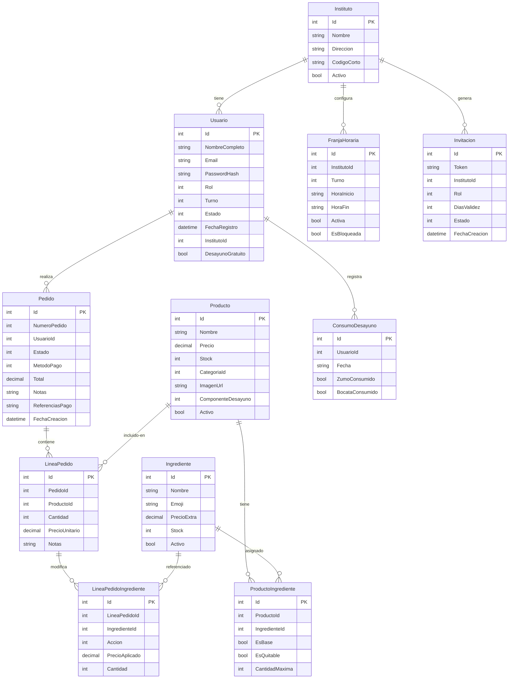

<div align="center">

# CaféIES

**Sistema integral de gestión de pedidos para cafeterías de institutos de educación secundaria.**

App Android nativa · Panel web de administración · API REST en producción · Pagos reales con Stripe

[](https://dotnet.microsoft.com/)
[](https://learn.microsoft.com/dotnet/maui/)
[](https://learn.microsoft.com/aspnet/core/blazor/)
[](https://stripe.com/)
[](https://azure.microsoft.com/)
[](https://github.com/features/actions)
[](#tests)
[](LICENSE)

[**Descargar APK**](https://github.com/JoseGlezHerrera/CafeteriaInsti/releases/latest) · [**Panel Admin**](https://cafeies-admin.azurestaticapps.net) · [**API Swagger**](https://cafeies-api.azurewebsites.net/swagger) · [**Política de privacidad**](https://JoseGlezHerrera.github.io/CafeteriaInsti/politica-privacidad.html)

</div>

---

## Índice

1. [Descripción del proyecto](#descripción-del-proyecto)
2. [Arquitectura del sistema](#arquitectura-del-sistema)
3. [Stack tecnológico](#stack-tecnológico)
4. [Funcionalidades](#funcionalidades)
5. [Modelo de datos](#modelo-de-datos)
6. [Seguridad](#seguridad)
7. [Pagos con Stripe](#pagos-con-stripe)
8. [Tiempo real con SignalR](#tiempo-real-con-signalr)
9. [Sistema de desayuno gratuito](#sistema-de-desayuno-gratuito)
10. [Flujos de usuario](#flujos-de-usuario)
11. [Tests](#tests)
12. [Puesta en marcha local](#puesta-en-marcha-local)
13. [Despliegue en Azure](#despliegue-en-azure)
14. [Estructura del proyecto](#estructura-del-proyecto)
15. [Decisiones de diseño](#decisiones-de-diseño)
16. [Roadmap](#roadmap)

---

## Descripción del proyecto

CaféIES es un sistema de gestión de pedidos desarrollado para cafeterías de institutos de educación secundaria. El proyecto cubre el ciclo completo: el alumno realiza un pedido desde su móvil, lo paga con tarjeta (Stripe), el empleado de cafetería lo prepara y le notifica cuando está listo, y el administrador supervisa todo desde un panel web con reportes en tiempo real.

El proyecto está desarrollado con **tecnologías de producción reales**, incluyendo CI/CD automático, despliegue en Azure, pagos reales con Stripe y autenticación JWT con refresh tokens. No es una simulación — la aplicación está en producción y funciona con datos reales.

### Qué incluye

| Componente | Descripción |
|---|---|
| **App móvil** (MAUI Android) | Catálogo interactivo, personalización de ingredientes, carrito, pago con Stripe, seguimiento de pedidos en tiempo real e impresión de tickets térmicos |
| **Panel admin web** (Blazor WASM) | Gestión completa de usuarios, productos, pedidos, horarios, desayunos y exportación de reportes Excel/PDF |
| **API REST** (ASP.NET Core 9) | Backend completo con JWT, rate limiting, audit trail, SignalR y webhook de Stripe |
| **Base de datos** (SQL Server) | 15 tablas con multi-tenancy por instituto, ingredientes personalizables y control de stock |
| **Desayuno gratuito** | Programa de 1 zumo + 1 bocadillo/día para alumnos beneficiarios, con protección anti-doble-consumo |

---

## Arquitectura del sistema

```
┌───────────────────────────────────────────────────────────────────┐
│                         CLIENTES                                  │
│                                                                   │
│   ┌────────────────┐              ┌────────────────────────────┐  │
│   │  CafeIES.MAUI  │              │     CafeIES.Admin          │  │
│   │  Android (APK) │              │     Blazor WebAssembly     │  │
│   │                │              │     Azure Static Web Apps  │  │
│   └───────┬────────┘              └────────────┬───────────────┘  │
└───────────┼────────────────────────────────────┼──────────────────┘
            │  HTTPS + JSON                      │  HTTPS + JSON
            │  SignalR WebSocket                 │  SignalR WebSocket
            ▼                                    ▼
┌───────────────────────────────────────────────────────────────────┐
│                    CafeIES.API  (ASP.NET Core 9)                  │
│                    Azure App Service · Linux · .NET 9             │
│                                                                   │
│   AuthController       PedidosController    PagosController       │
│   ProductosController  AdminController      EmpleadoController    │
│   ─────────────────────────────────────────────────────────────   │
│   AuthService    HorarioService    StripeService    FcmService    │
│   ReporteExcelService              ReportePdfService              │
│   ─────────────────────────────────────────────────────────────   │
│   EF Core 9 (Code-First)   SignalR Hub   Rate Limiting (4 pol.)   │
└──────────────┬───────────────────────┬───────────────────────────┘
               │                       │
       ┌───────▼──────┐     ┌──────────▼──────────┐
       │  SQL Server  │     │   Servicios externos │
       │  Azure SQL   │     │   ─────────────────  │
       │  15 tablas   │     │   Stripe (pagos)     │
       └──────────────┘     │   Azure Blob Storage │
                            │   FCM (notificacion) │
                            └─────────────────────┘
            ▲
            │  Shared DTOs, Entidades, Enums, Validaciones
            │
┌───────────┴──────────┐
│   CafeIES.Shared     │
│   Biblioteca común   │
└──────────────────────┘
```

**Flujo de comunicación:**
- Clientes ↔ API: HTTPS/JSON para peticiones REST; WebSocket (SignalR) para actualizaciones en tiempo real
- Stripe → API: webhook firmado con HMAC para confirmar pagos y reconstruir pedidos huérfanos
- API → Azure Blob: almacenamiento de imágenes de productos
- API → FCM: notificaciones push (infraestructura disponible; envío opcional)

---

## Stack tecnológico

| Capa | Tecnología | Versión | Justificación |
|---|---|---|---|
| **Backend** | ASP.NET Core | .NET 9 | Framework maduro, alto rendimiento, soporte nativo para SignalR y Minimal APIs |
| **ORM** | Entity Framework Core | 9.0 | Code-First con migraciones; LINQ type-safe; integración directa con SQL Server |
| **Base de datos** | SQL Server (Azure SQL) | — | ACID, transacciones Serializable para proteger el desayuno gratuito |
| **App móvil** | .NET MAUI | .NET 9 | Código C# compartido con el resto del proyecto; Android e iOS desde una sola base |
| **Panel admin** | Blazor WebAssembly | .NET 9 | SPA en C# sin JavaScript adicional; compartición de DTOs con la API |
| **Autenticación** | JWT Bearer + BCrypt | — | Access token (1h) + refresh token (30d) rotativo; BCrypt workFactor 12 |
| **Pagos** | Stripe PaymentIntent | Stripe.net 50.x | El importe lo calcula el servidor; el cliente solo recibe el `clientSecret` |
| **Tiempo real** | SignalR | — | Actualización del estado del pedido sin polling; reconexión automática |
| **Imágenes** | Azure Blob Storage | 12.x | Escalable; URL pública directa; local en desarrollo |
| **Hosting API** | Azure App Service | F1 Linux .NET 9 | Despliegue con un push; soporte WebSocket nativo |
| **Hosting Admin** | Azure Static Web Apps | Free tier | CDN global; integración con GitHub Actions |
| **CI/CD** | GitHub Actions | — | 3 workflows: API → Azure, Admin → Azure, MAUI → GitHub Releases |
| **Reportes** | ClosedXML + QuestPDF | — | Excel con múltiples hojas; PDF con plantilla personalizada |
| **MVVM (MAUI)** | CommunityToolkit.Mvvm | 8.3.x | Source generators; ObservableProperty, RelayCommand sin boilerplate |
| **QR** | QRCoder | — | Generación de QR de invitaciones en PNG |
| **Tests** | xUnit + EF InMemory | — | 115 tests unitarios de servicios, dominio y validaciones |

---

## Funcionalidades

### Alumno

- Registro con selección de instituto y turno; validación pendiente por el administrador
- Auto-login transparente al reabrir la app (sin flash de login)
- Catálogo de productos con imagen real, búsqueda por nombre y filtros por categoría
- Personalización de ingredientes por producto (añadir extras, quitar componentes base)
- Visualización de alérgenos con iconos
- Carrito con control de stock en tiempo real
- Banner de desayuno gratuito con componentes disponibles del día
- Pago con tarjeta mediante Stripe (WebView con Stripe.js) o flujo gratuito (0 €)
- Seguimiento del estado del pedido en tiempo real (SignalR): Recibido → En preparación → Listo → Recogido
- Historial de pedidos con desglose de ingredientes, precios y notas
- Perfil con cambio de contraseña (validación de complejidad)

### Empleado / Personal

- Vista de pedidos del día filtrada por instituto
- Cambio de estado de pedidos con un toque (barra de progreso en tiempo real)
- Impresión de tickets térmicos por WiFi, Bluetooth o exportación a PDF
- Gestión de productos: crear, editar, controlar stock
- Gestión de ingredientes, categorías y alérgenos

### Administrador

- Dashboard Blazor con métricas del día e historial de pedidos en tiempo real
- Gestión de usuarios: aprobar alumnos, asignar rol, activar desayuno gratuito
- Creación de invitaciones para profesores/personal con QR descargable
- CRUD completo de productos con imagen (cámara o galería)
- Asignación de ingredientes personalizables a productos con precio extra
- Gestión de horarios de pedidos por instituto y turno
- Alta de nuevos institutos (multi-tenancy)
- Exportación de reportes en Excel (pedidos, usuarios, productos) y PDF
- Acceso a las mismas funciones de empleado desde la app MAUI

### Sistema

- Multi-tenancy: cada instituto tiene sus propios productos, usuarios y horarios
- Rate limiting en 4 niveles (auth, general, invitaciones, pagos)
- Audit trail de todas las acciones de escritura de administradores en los logs
- Webhook de Stripe con reconstrucción automática de pedidos huérfanos
- Control de stock con transacciones `ReadCommitted` y `[ConcurrencyCheck]`

---

## Modelo de datos

La base de datos es **SQL Server** gestionada con **EF Core 9 Code-First**. El esquema tiene **15 tablas** con multi-tenancy por instituto.

### Diagrama entidad-relación



### Índices relevantes

| Tabla | Índice | Tipo | Propósito |
|---|---|---|---|
| `Pedidos` | `IX_Pedidos_Estado` | Normal | Filtrado rápido por estado en el dashboard |
| `Pedidos` | `IX_Pedidos_ReferenciasPago` | UNIQUE | Previene pedidos duplicados desde el webhook de Stripe |
| `ConsumoDesayuno` | `IX_Consumo_UsuarioId_Fecha` | UNIQUE | Impide doble consumo de desayuno el mismo día |
| `DispositivoTokens` | `IX_Dispositivos_UsuarioId` | Normal | Lookup de tokens FCM por usuario |
| `Usuarios` | `IX_Usuarios_Email` | UNIQUE | Login por email |

---

## Seguridad

| Mecanismo | Implementación |
|---|---|
| **Contraseñas** | BCrypt workFactor 12 — hash adaptativo resistente a fuerza bruta |
| **Complejidad** | Mínimo 8 caracteres + mayúscula + número + símbolo (`PasswordComplexityAttribute`) |
| **JWT access token** | HMAC-SHA256, expiración 1 hora |
| **JWT refresh token** | 30 días, rotación en cada renovación, almacenado solo en `SecureStorage` (MAUI) o en memoria (Blazor) |
| **Rate limiting** | 4 políticas: auth (10 req/min/IP), general (60 req/min/IP), invitaciones (5 req/min/IP), pagos (20 req/min/IP) |
| **Audit trail** | Todas las acciones de escritura del administrador se registran con prefijo `[AUDIT]` en los logs de Azure |
| **Total de pago** | Calculado siempre en el servidor — el cliente solo recibe el `clientSecret`; los extras de ingredientes se calculan en servidor |
| **Webhook Stripe** | Rechazado con 503 si `WebhookSecret` no está configurado; firma HMAC verificada antes de procesar |
| **Stock** | `ReadCommitted` + `[ConcurrencyCheck]` en `Producto.Stock` para prevenir sobreventa concurrente |
| **Desayuno** | Transacción `RepeatableRead` al crear el PaymentIntent; transacción `Serializable` al crear el pedido; índice UNIQUE en `(UsuarioId, Fecha)` |
| **Ownership** | Usuarios solo acceden a sus propios pedidos; admins solo pueden mutar usuarios de su instituto |
| **Máquina de estados** | Solo transiciones válidas permitidas en `EstadoPedido` |
| **XSS** | Notas de pedido sanitizadas antes de persistir (`<`, `>`, `&` escapados) |
| **Path traversal** | `LocalBlobStorageService` valida con `Path.GetRelativePath` antes de servir ficheros |
| **SSL en desarrollo** | `ServerCertificateCustomValidationCallback` solo bajo `#if DEBUG` |
| **Invitaciones** | `DiasValidez` limitado a 1–365 días; token opaco UUID |

---

## Pagos con Stripe

### Flujo de pago

```
1. App          POST /api/pagos/crear-intent
                ↳ API valida usuario, horario y stock
                ↳ Calcula total en servidor (base + extras de ingredientes + descuento desayuno)
                ↳ Crea PaymentIntent con metadata: userId, lineas (con ingredientes), notas

2. App          Abre WebView → stripe-form?cs={clientSecret}
                ↳ Stripe.js recoge datos de tarjeta de forma segura

3. Stripe       Confirma el pago

4. App          Navega inmediatamente a ConfirmacionPedidoPage

5. Background   POST /api/pedidos  (fire-and-forget)
                ↳ Crea el pedido en BD con ingredientes y precio correcto

6. Polling      GET /api/pedidos/by-intent/{id}  cada 2 s
                ↳ Muestra número de pedido al alumno

7. Webhook      POST /api/pagos/webhook (Stripe → API)
                ↳ Si el pedido no existe → lo reconstruye desde la metadata del PaymentIntent
                   (ingredientes + precios incluidos en la metadata desde el paso 1)
```

Si el total es **0 €** (desayuno completamente gratuito) → se omiten los pasos 1-4 y se va directamente al paso 5.

### Garantías

- **Idempotencia**: índice UNIQUE en `Pedidos.ReferenciasPago` — el webhook nunca genera pedidos duplicados
- **Consistencia de precio**: el servidor recalcula el total incluyendo extras; el cliente no puede manipularlo
- **Resiliencia**: si la app se cierra tras el pago, el webhook reconstruye el pedido completo (incluidos ingredientes)
- **Split de líneas**: las unidades gratuitas y las de pago se separan en líneas distintas para facilitar la contabilidad

---

## Tiempo real con SignalR

Los clientes se conectan al hub `/hubs/cafeteria` al iniciar sesión y reciben actualizaciones sin polling.

| Grupo SignalR | Receptores | Eventos |
|---|---|---|
| `cafeteria-{institutoId}` | Empleados y admins del instituto | `NuevoPedido`, `PedidoActualizado` |
| `cafeteria-global` | Admins sin instituto específico | `NuevoPedido`, `PedidoActualizado` |
| `user-{userId}` | El alumno propietario del pedido | `PedidoActualizado` |

**Reconexión automática**: si el access token expira durante una sesión larga, `ApiService` renueva el token y reconecta SignalR automáticamente sin que el usuario lo note.

**Configuración**: `KeepAliveInterval = 15 s`, `ClientTimeoutInterval = 30 s`.

---

## Sistema de desayuno gratuito

El programa de desayuno escolar permite a alumnos beneficiarios obtener **1 zumo + 1 bocadillo al día** sin coste.

### Configuración de productos

Cada producto tiene un campo `ComponenteDesayuno`:

| Valor | Significado |
|---|---|
| `Ninguno` | Producto de pago normal |
| `Zumo` | Puede ser el zumo gratuito del día |
| `Bocata` | Puede ser el bocadillo gratuito del día |

### Flujo en la app

1. Al abrir el carrito → `GET /api/pedidos/desayuno-status` (bloquea el botón "Pagar" mientras carga)
2. Si hay desayuno disponible → banner 🍊 con los componentes restantes del día
3. `TotalEfectivo` descuenta automáticamente la primera unidad elegible de cada componente
4. Si total = 0 € → flujo gratuito: `POST /api/pedidos` directo, sin Stripe
5. Si hay parte de pago → `POST /api/pagos/crear-intent` con metadata de precios split

### Protección anti-doble-consumo

- Transacción **RepeatableRead** en `CrearIntent` para evitar que dos requests concurrentes lean "zumo disponible" al mismo tiempo
- Transacción **Serializable** en `CrearPedido` para la verificación definitiva
- Índice **UNIQUE** en `ConsumoDesayuno(UsuarioId, Fecha)` — garantía a nivel de base de datos
- El webhook de Stripe detecta líneas a 0 € y marca el `ConsumoDesayuno` aunque la app se cierre tras el pago

---

## Flujos de usuario

### Alumno — pedido completo

```
Abrir app → Auto-login (SecureStorage)
    → Catálogo: filtrar por categoría / buscar
    → Producto → personalizar ingredientes → añadir al carrito
    → Carrito: ver banner 🍊 si hay desayuno disponible
    → "Pagar" → Stripe WebView → introducir tarjeta
    → ConfirmacionPedidoPage: polling cada 2 s hasta obtener número de pedido
    → "Mis pedidos" → DetallePedidoPage: estado en tiempo real (SignalR)
```

### Empleado — gestión del servicio

```
Login → Pedidos del día (filtrado por instituto)
    → "Preparar" → estado cambia a En preparación (SignalR notifica al alumno)
    → "Listo" → imprimir ticket 🖨 (WiFi / BT / PDF)
    → "Entregar" (o "Cancelar")
    → Gestión de productos y stock
```

### Administrador — gestión completa

```
Dashboard Blazor: métricas del día + pedidos en curso (SignalR)
    → Usuarios: aprobar pendientes, activar desayuno 🍊, crear invitaciones QR
    → Productos: CRUD con imagen, ingredientes personalizables, ComponenteDesayuno
    → Reportes: exportar Excel (pedidos/usuarios/productos) o PDF
    → Horarios: configurar franjas por instituto y turno
    → Institutos: alta de nuevos centros
```

### Registro de usuarios

```
Alumno     ──────────────────► POST /api/auth/registro/alumno
                                Estado inicial: PendienteValidacion
                                Admin aprueba desde MAUI o Blazor

Profe/     ── QR o enlace ───► POST /api/auth/registro/invitado
Personal                        Token de invitación válido y no caducado

Admin      ─────────────────►  Seeding inicial (DbSeeder.cs)
                                Credenciales en Azure App Settings
```

---

## Tests

El proyecto incluye **115 tests unitarios** con xUnit y EF Core InMemory:

| Suite | Qué cubre |
|---|---|
| `HorarioServiceTests` | Validación de franjas horarias: turno mañana/tarde/noche, sábado bloqueado, domingo pre-pedido para lunes, sin franja configurada |
| `AuthServiceTests` | Login, refresh token, BCrypt, expiración |
| `DomainTests` | Máquina de estados de `EstadoPedido`, cálculo de subtotales con ingredientes |
| `ValidationTests` | `PasswordComplexityAttribute`, Data Annotations de los DTOs |
| `DesayunoServiceTests` | Lógica de componentes gratuitos, protección anti-doble-consumo |

```bash
cd CafeIES.Tests
dotnet test
# → 115 tests passing, 0 failed
```

---

## Puesta en marcha local

<details>
<summary><strong>Requisitos previos</strong></summary>

- .NET 9 SDK
- SQL Server (Express, Developer o Docker: `docker run -e ACCEPT_EULA=Y -e SA_PASSWORD=Dev1234! -p 1433:1433 mcr.microsoft.com/mssql/server:2022-latest`)
- Visual Studio 2022 17.8+ / JetBrains Rider / VS Code con extensión C#
- Android SDK + MAUI Workload (solo para la app móvil): `dotnet workload install maui`
- Cuenta Stripe en modo test (gratuita)

</details>

### 1. Configurar la API

Crear `CafeIES.API/appsettings.Development.json` (no incluir en git):

```json
{
  "ConnectionStrings": {
    "DefaultConnection": "Server=(localdb)\\mssqllocaldb;Database=CafeIES;Trusted_Connection=True;"
  },
  "Jwt": {
    "Key": "clave-secreta-de-minimo-32-caracteres-aqui",
    "Issuer": "CafeIES",
    "Audience": "CafeIES"
  },
  "Admin": {
    "Email": "admin@cafeies.local",
    "Password": "Admin1234!"
  },
  "Stripe": {
    "SecretKey": "sk_test_...",
    "PublishableKey": "pk_test_...",
    "WebhookSecret": "whsec_..."
  },
  "BlobStorage": {
    "UseAzure": false
  }
}
```

```bash
cd CafeIES.API
dotnet ef database update    # aplica migraciones y ejecuta DbSeeder
dotnet run
# API disponible en https://localhost:50658
# Swagger UI en https://localhost:50658/swagger
```

### 2. Configurar el panel admin

```bash
# Editar CafeIES.Admin/wwwroot/appsettings.json:
# { "ApiBaseUrl": "https://localhost:50658" }

cd CafeIES.Admin
dotnet run
# Panel disponible en https://localhost:50660
```

### 3. Ejecutar la app MAUI (Android)

La URL de la API se selecciona por compilación en `ApiService.cs`:

```csharp
#if ANDROID
    private const string ApiBaseUrl = "https://10.0.2.2:50658"; // Emulador
#else
    private const string ApiBaseUrl = "https://localhost:50658"; // iOS / Windows
#endif
```

Para **dispositivo físico Android**: reemplazar `10.0.2.2` por la IP local del PC en la red.

Para recibir eventos del **webhook de Stripe** en local: usar [Stripe CLI](https://stripe.com/docs/stripe-cli):

```bash
stripe listen --forward-to https://localhost:50658/api/pagos/webhook
```

### 4. Credenciales de prueba

| Rol | Email | Contraseña |
|---|---|---|
| Admin | `admin@cafeies.local` | configurado en appsettings |
| Empleado | crear invitación desde Admin → Usuarios → Nueva invitación | — |
| Alumno | registro en la app seleccionando instituto | — |

**Tarjeta Stripe (modo test):**
```
Número:    4242 4242 4242 4242
Caducidad: cualquier fecha futura (ej: 12/29)
CVC:       cualquier 3 dígitos
```

---

## Despliegue en Azure

### Recursos en producción

| Recurso | Tipo | Región |
|---|---|---|
| `cafeies-api` | App Service (F1, Linux, .NET 9) | North Europe |
| `cafeies-sql` | Azure SQL Database (Basic) | North Europe |
| `cafeies-storage` | Storage Account (Blob, LRS) | North Europe |
| `cafeies-admin` | Static Web App (Free) | Global (CDN) |

### Variables de entorno (Azure App Settings)

```
ConnectionStrings__DefaultConnection  = <cadena de conexión SQL>
Jwt__Key                              = <clave secreta de producción, ≥ 32 chars>
Jwt__Issuer                           = CafeIES
Jwt__Audience                         = CafeIES
Admin__Email                          = <email del administrador>
Admin__Password                       = <contraseña segura>
Stripe__SecretKey                     = sk_live_...
Stripe__PublishableKey                = pk_live_...
Stripe__WebhookSecret                 = whsec_...
BlobStorage__UseAzure                 = true
BlobStorage__ConnectionString         = <cadena Azure Storage>
BlobStorage__ContainerName            = productos
```

### CI/CD — GitHub Actions

Los tres workflows se disparan automáticamente al hacer push a `main` según los paths modificados:

| Workflow | Paths | Destino | Tiempo aprox. |
|---|---|---|---|
| `deploy-api.yml` | `CafeIES.API/**`, `CafeIES.Shared/**` | Azure App Service | ~4 min |
| `deploy-admin.yml` | `CafeIES.Admin/**`, `CafeIES.Shared/**` | Azure Static Web Apps | ~2 min |
| `deploy-android.yml` | `CafeIES.MAUI/**`, `CafeIES.Shared/**` | GitHub Releases (APK) | ~3 min |

El APK se versiona como `YYYY.MM.<run_number>` y se publica automáticamente como **latest release** en GitHub.

### Instalación del APK

1. Ve a [Releases](https://github.com/JoseGlezHerrera/CafeteriaInsti/releases/latest) y descarga `cafeies-X.X.X.apk`
2. En el móvil: **Ajustes → Seguridad → Instalar apps de fuentes desconocidas** → activar para el navegador
3. Abre el APK e instala

> Firmado con debug keystore — apto para pruebas internas. Para publicación en Play Store se necesita keystore de producción y cuenta de desarrollador Google.

---

## Estructura del proyecto

```
CafeIES/
├── CafeIES.sln
│
├── CafeIES.Shared/                     ← Modelos compartidos (compilado en todos los proyectos)
│   ├── Models/
│   │   ├── Entities.cs                 Instituto, Usuario, Producto, Ingrediente,
│   │   │                               Pedido, LineaPedido, LineaPedidoIngrediente,
│   │   │                               FranjaHoraria, Invitacion, ConsumoDesayuno,
│   │   │                               DispositivoToken, RefreshToken
│   │   ├── DTOs.cs                     Requests y responses con Data Annotations
│   │   └── Enums.cs                    RolUsuario, EstadoPedido, MetodoPago,
│   │                                   AccionIngrediente, ComponenteDesayuno, Turno
│   └── Validation/
│       └── PasswordComplexityAttribute.cs
│
├── CafeIES.API/                        ← Backend REST (puerto local 50658)
│   ├── Controllers/
│   │   ├── AuthController.cs           Login, registro, refresh JWT, logout
│   │   ├── ProductosController.cs      CRUD + imagen + ingredientes
│   │   ├── PedidosController.cs        Crear/listar/detalle; máquina de estados
│   │   ├── PagosController.cs          PaymentIntent (con split gratuito + ingredientes), webhook
│   │   ├── AdminController.cs          Usuarios, institutos, invitaciones, horarios, reportes
│   │   ├── EmpleadoController.cs       Pedidos activos para empleados
│   │   ├── AlergenosController.cs      CRUD alérgenos
│   │   └── NotificacionesController.cs Tokens FCM
│   ├── Data/
│   │   ├── AppDbContext.cs             EF Core context con índices y relaciones
│   │   ├── DbSeeder.cs                 Datos iniciales: admin, institutos, categorías, horarios
│   │   └── Migrations/                 Historial completo de migraciones EF Core
│   ├── Services/
│   │   ├── AuthService.cs              JWT access+refresh, BCrypt, rotación de tokens
│   │   ├── HorarioService.cs           Validación de franja horaria antes de crear pedido
│   │   ├── DesayunoService.cs          Lógica del programa de desayuno gratuito
│   │   ├── StripeService.cs            PaymentIntent, cancelación, firma de webhooks
│   │   ├── FcmService.cs               FCM HTTP v1 con GoogleCredential cacheado
│   │   ├── LocalBlobStorageService.cs  Almacenamiento local (dev) con validación path-traversal
│   │   ├── AzureBlobStorageService.cs  Azure Blob Storage (prod)
│   │   ├── ReporteExcelService.cs      Excel con ClosedXML
│   │   └── ReportePdfService.cs        PDF con QuestPDF (límite 1.000 registros)
│   ├── Extensions/
│   │   ├── ClaimsPrincipalExtensions.cs  GetUserId() null-safe
│   │   └── DtoMapperExtensions.cs        ToDto() centralizado para entidades principales
│   ├── Hubs/
│   │   └── CafeteriaHub.cs             SignalR hub con grupos por instituto y por usuario
│   └── Program.cs                      DI, middleware, rate limiting (4 políticas), CORS, Swagger
│
├── CafeIES.MAUI/                       ← App móvil Android/iOS (.NET 9)
│   ├── Views/                          23 páginas XAML
│   ├── ViewModels/                     MVVM con CommunityToolkit.Mvvm (source generators)
│   ├── Services/
│   │   ├── ApiService.cs               HTTP client (timeout 45s) + SignalR
│   │   ├── TokenService.cs             SecureStorage para access/refresh token
│   │   └── TicketHtmlBuilder.cs        HTML de ticket térmico 80 mm
│   ├── Platforms/Android/
│   │   └── AndroidPrintService.cs      WebView + PrintManager (WiFi/BT/PDF)
│   ├── Converters/
│   │   └── Converters.cs               ~30 converters XAML: estado, stock, rol, desayuno, chips
│   └── Resources/Styles/
│       └── AppStyles.xaml              Paleta dark & warm (ámbar/naranja), tipografía Syne+DMSans
│
├── CafeIES.Admin/                      ← Panel administración Blazor WASM
│   ├── Pages/
│   │   ├── Dashboard.razor             Métricas del día + pedidos en tiempo real (SignalR)
│   │   ├── Pedidos.razor               Lista paginada + cambio de estado
│   │   ├── Productos.razor             CRUD con imagen y badge ComponenteDesayuno
│   │   ├── Usuarios.razor              Lista + toggle desayuno gratuito 🍊
│   │   ├── Desayunos.razor             Beneficiarios y consumos del día
│   │   ├── Institutos.razor            CRUD multi-instituto
│   │   ├── Horarios.razor              Franjas horarias por instituto y turno
│   │   ├── Invitaciones.razor          Crear invitaciones + QR descargable
│   │   └── Reportes.razor              Exportar Excel/PDF
│   ├── Services/
│   │   └── AdminApiService.cs          HTTP client con refresh automático de token
│   └── wwwroot/
│       └── appsettings.json            URL base de la API (configurable sin recompilar)
│
├── CafeIES.Tests/                      ← 115 tests unitarios (xUnit + EF InMemory)
│
└── .github/workflows/
    ├── deploy-api.yml                  API → Azure App Service
    ├── deploy-admin.yml                Admin → Azure Static Web Apps
    └── deploy-android.yml              MAUI → GitHub Releases (APK versionado)
```

---

## Decisiones de diseño

Esta sección documenta las decisiones técnicas más relevantes y la justificación detrás de ellas, útil para comprensión del sistema o documentación académica.

### Arquitectura en capas sin Repository Pattern

Se optó por una arquitectura de **Controller → Service → DbContext** directo, sin capa de repositorio intermedia. La justificación: EF Core ya implementa el patrón Unit of Work y el contexto es inherentemente testeable con `InMemoryDatabase`. Añadir una capa de repositorio en un proyecto de este tamaño solo añade indirección sin beneficio real.

### Shared library para DTOs y entidades

`CafeIES.Shared` es compilado por los cuatro proyectos. Esto garantiza que los DTOs que envía la API son exactamente los mismos que deserializa el cliente MAUI o Blazor, eliminando la posibilidad de desajustes de contratos. Las validaciones `DataAnnotations` se definen una vez y se aplican en todos los puntos de entrada.

### Cálculo de precios siempre en el servidor

El cliente nunca envía el importe a Stripe — solo envía la lista de productos con cantidades e ingredientes. El servidor recalcula el precio completo (base + extras de ingredientes + descuento desayuno) antes de crear el `PaymentIntent`. Esto hace imposible la manipulación del precio desde el cliente.

### Metadata de Stripe con ingredientes

El `PaymentIntent` incluye en su metadata las líneas completas del pedido (con ingredientes y precios ya calculados). Esto permite que el webhook reconstruya el pedido exacto si la app se cierra tras el pago — sin necesidad de consultar la base de datos ni recalcular nada.

### Split de líneas para el desayuno gratuito

Cuando un producto tiene componente de desayuno gratuito y el usuario tiene crédito, la línea se divide en dos: una unidad a 0 € y el resto al precio normal. Esto simplifica la contabilidad (el ticket refleja claramente qué fue gratuito) y la lógica del webhook.

### WebView adjunto al DecorView para impresión

`WebView.createPrintDocumentAdapter()` en Android requiere que el WebView esté adjunto a una ventana activa para inicializar el motor de renderizado. Si el WebView no está en el árbol de vistas, el ticket sale en blanco. La solución: adjuntar el WebView al `DecorView` con tamaño 1×1 (invisible al usuario) antes de cargar el HTML, y retirarlo una vez que el `PrintManager` ha capturado el documento.

### BindableLayout en lugar de CollectionView anidado

En `DetallePedidoPage`, los ingredientes de cada línea de pedido se renderizan con `BindableLayout.ItemsSource` en lugar de un `CollectionView` anidado. En Android, `RecyclerView` anidado dentro de otro `RecyclerView` no renderiza su contenido correctamente (el inner `CollectionView` queda vacío). `BindableLayout` es el workaround oficial de MAUI.

### Transacciones por niveles de aislamiento

Se usan tres niveles distintos según el caso de uso:
- **ReadCommitted** (por defecto): operaciones normales de lectura/escritura
- **RepeatableRead**: verificación del estado del desayuno al crear el `PaymentIntent` (evita que dos requests concurrentes lean "zumo disponible" simultáneamente)
- **Serializable**: creación del pedido y asignación del número correlativo del día (evita gaps o duplicados)

---

## Roadmap

- [ ] Publicación en Google Play Store (requiere cuenta de desarrollador y keystore de producción)
- [ ] Notificaciones push FCM (infraestructura implementada; falta integración con servidor Firebase)
- [ ] Soporte iOS (base MAUI preparada; requiere Mac con Xcode para compilar y cuenta Apple Developer)
- [ ] Método de pago Google Pay / Apple Pay (Stripe lo soporta; requiere dominio verificado)
- [ ] Pantalla de estadísticas con gráficas (ventas por día, productos más pedidos)
- [ ] Modo offline en la app (caché de catálogo para consulta sin conexión)

---

<div align="center">

Desarrollado con .NET 9, MAUI, Blazor, EF Core, Stripe y Azure.

</div>
