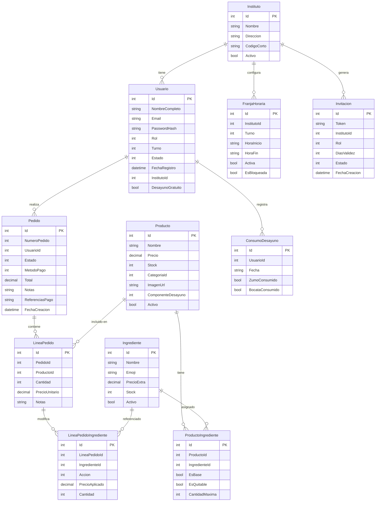

<div align="center">

# ☕ PikUp

**Sistema integral de gestión de pedidos para cafeterías de institutos de educación secundaria.**

*App Android nativa · API REST en producción · Pagos reales con Stripe*

<br>

[](https://dotnet.microsoft.com/)
[](https://learn.microsoft.com/dotnet/maui/)
[](https://stripe.com/)
[](https://www.proxmox.com/)
[](https://github.com/features/actions)
[](#-tests)
[](LICENSE)

<br>

[**📲 Descargar APK**](https://github.com/JoseGlezHerrera/CafeteriaInsti/releases/latest) &nbsp;·&nbsp;
[**📖 API Swagger**](http://proyectos2dam.duckdns.org:5000/swagger) &nbsp;·&nbsp;
[**🔒 Política de privacidad**](https://JoseGlezHerrera.github.io/CafeteriaInsti/politica-privacidad.html)

</div>

---

PikUp (antes CaféIES) cubre el ciclo completo de una cafetería escolar: el alumno pide desde el móvil y paga con tarjeta (Stripe), el empleado prepara y cambia el estado del pedido, el alumno recibe la notificación en tiempo real, y el administrador gestiona todo desde la propia app MAUI. Está desarrollado con **tecnologías de producción reales** — CI/CD, despliegue en contenedor LXC sobre Proxmox, JWT con refresh tokens, SignalR y webhook de Stripe. No es una simulación.

<br>

| Componente | Tecnología | Descripción |
|---|---|---|
| **App móvil (PikUp)** | .NET MAUI Android | Catálogo, personalización de ingredientes, carrito, Stripe, seguimiento en tiempo real, impresión de tickets, panel admin y empleado integrados |
| **API REST** | ASP.NET Core 9 | JWT, rate limiting (4 políticas), audit trail, SignalR y webhook de Stripe |
| **Base de datos** | SQL Server 2022 (Docker) | 15 tablas, multi-tenancy por instituto, ingredientes personalizables, control de stock |
| **Almacenamiento** | Disco local (wwwroot) | Imágenes de productos servidas directamente desde la API |
| **Desayuno gratuito** | — | 1 zumo + 1 bocadillo/día para beneficiarios, con protección anti-doble-consumo por triple barrera |

---

<details>
<summary><b>🏗️ Arquitectura del sistema</b></summary>
<br>

```
┌───────────────────────────────────────────────────────────────────┐
│                         CLIENTES                                  │
│                                                                   │
│   ┌────────────────────────────────────────────────────────────┐  │
│   │  CafeIES.MAUI  (Android APK)                               │  │
│   │  Alumno · Empleado · Administrador (mismo binario, por rol) │  │
│   └───────────────────────────┬────────────────────────────────┘  │
└───────────────────────────────┼───────────────────────────────────┘
                                │  HTTP + JSON
                                │  SignalR WebSocket
                                ▼
┌───────────────────────────────────────────────────────────────────┐
│              CafeIES.API  (ASP.NET Core 9)                        │
│              Contenedor LXC · Debian 13 · Proxmox                 │
│              http://proyectos2dam.duckdns.org:5000                │
│                                                                   │
│   AuthController       PedidosController    PagosController       │
│   ProductosController  AdminController      EmpleadoController    │
│   ─────────────────────────────────────────────────────────────   │
│   AuthService    HorarioService    StripeService    FcmService    │
│   ReporteExcelService              ReportePdfService              │
│   ─────────────────────────────────────────────────────────────   │
│   EF Core 9 (Code-First)   SignalR Hub   Rate Limiting (4 pol.)   │
└──────────────┬───────────────────────┬───────────────────────────┘
               │                       │
       ┌───────▼──────┐     ┌──────────▼──────────┐
       │  SQL Server  │     │   Servicios externos │
       │  Docker      │     │   ─────────────────  │
       │  15 tablas   │     │   Stripe (pagos)     │
       └──────────────┘     │   FCM (notificacion) │
                            └─────────────────────┘
            ▲
            │  Shared DTOs, Entidades, Enums, Validaciones
            │
┌───────────┴──────────┐
│   CafeIES.Shared     │
│   Biblioteca común   │
└──────────────────────┘
```

**Flujo de comunicación:**
- Clientes ↔ API: HTTP/JSON para peticiones REST; WebSocket (SignalR) para actualizaciones en tiempo real
- Stripe → API: webhook firmado con HMAC para confirmar pagos y reconstruir pedidos huérfanos
- API → disco local: almacenamiento de imágenes de productos en `wwwroot/productos/`
- API → FCM: notificaciones push (infraestructura disponible; envío opcional)

</details>

---

<details>
<summary><b>📦 Stack tecnológico</b></summary>
<br>

| Capa | Tecnología | Versión | Justificación |
|---|---|---|---|
| **Backend** | ASP.NET Core | .NET 9 | Framework maduro, alto rendimiento, soporte nativo para SignalR |
| **ORM** | Entity Framework Core | 9.0 | Code-First con migraciones; LINQ type-safe; integración directa con SQL Server |
| **Base de datos** | SQL Server 2022 (Docker) | — | ACID, transacciones Serializable para proteger el desayuno gratuito |
| **App móvil** | .NET MAUI | .NET 9 | Código C# compartido con el resto del proyecto; Android e iOS desde una sola base |
| **Autenticación** | JWT Bearer + BCrypt | — | Access token (1h) + refresh token (30d) rotativo; BCrypt workFactor 12 |
| **Pagos** | Stripe PaymentIntent | Stripe.net 50.x | El importe lo calcula el servidor; el cliente solo recibe el `clientSecret` |
| **Tiempo real** | SignalR | — | Actualización del estado del pedido sin polling; reconexión automática |
| **Imágenes** | Disco local (wwwroot) | — | Servidas directamente desde la API; sin dependencias externas |
| **Hosting** | Contenedor LXC (Proxmox) | Debian 13 | Despliegue en infraestructura del centro educativo, sin coste adicional |
| **CI/CD** | GitHub Actions | — | 2 workflows: API → servidor, MAUI → GitHub Releases |
| **Reportes** | ClosedXML + QuestPDF | — | Excel con múltiples hojas; PDF con plantilla personalizada |
| **MVVM (MAUI)** | CommunityToolkit.Mvvm | 8.3.x | Source generators; ObservableProperty, RelayCommand sin boilerplate |
| **QR** | QRCoder | — | Generación de QR de invitaciones en PNG |
| **Tests** | xUnit + EF InMemory | — | 115 tests unitarios de servicios, dominio y validaciones |

</details>

---

<details>
<summary><b>✨ Funcionalidades</b></summary>
<br>

#### 👨‍🎓 Alumno

- Registro con selección de instituto y turno; validación pendiente por el administrador
- Auto-login transparente al reabrir la app (sin flash de login)
- Catálogo de productos con imagen real, búsqueda por nombre y filtros por categoría
- Personalización de ingredientes por producto (añadir extras, quitar componentes base)
- Visualización de alérgenos con iconos
- Carrito con control de stock en tiempo real
- Banner de desayuno gratuito 🍊 con componentes disponibles del día
- Pago con tarjeta mediante Stripe (WebView con Stripe.js) o flujo gratuito (0 €)
- Seguimiento del estado del pedido en tiempo real (SignalR): Recibido → En preparación → Listo → Recogido
- Historial de pedidos con desglose de ingredientes, precios y notas
- Perfil con cambio de contraseña (validación de complejidad)

#### 👷 Empleado / Personal

- Vista de pedidos del día filtrada por instituto
- Cambio de estado de pedidos con un toque (barra de progreso en tiempo real)
- Impresión de tickets térmicos por WiFi/Bluetooth/PDF o ESC/POS directo por red (TCP), con alérgenos en texto
- Gestión de productos: crear, editar, controlar stock
- Gestión de ingredientes, categorías y alérgenos

#### 🛠️ Administrador

- Dashboard con métricas del día e historial de pedidos en tiempo real (SignalR), integrado en la app MAUI
- Gestión de usuarios: aprobar alumnos, asignar rol, activar desayuno gratuito
- Creación de invitaciones para profesores/personal con QR descargable
- CRUD completo de productos con imagen (cámara o galería)
- Asignación de ingredientes personalizables a productos con precio extra
- Gestión de horarios de pedidos por instituto y turno
- Alta de nuevos institutos (multi-tenancy)
- Exportación de reportes en Excel (pedidos, usuarios, productos) y PDF
- Acceso a las mismas funciones de empleado desde la app MAUI

#### ⚙️ Sistema

- Multi-tenancy: cada instituto tiene sus propios productos, usuarios y horarios
- Rate limiting en 4 niveles (auth, general, invitaciones, pagos)
- Audit trail de todas las acciones de escritura de administradores en los logs
- Webhook de Stripe con reconstrucción automática de pedidos huérfanos
- Control de stock con transacciones `ReadCommitted` y `[ConcurrencyCheck]`

</details>

---

<details>
<summary><b>🗄️ Modelo de datos</b></summary>
<br>

La base de datos es **SQL Server 2022** gestionada con **EF Core 9 Code-First**. El esquema tiene **15 tablas** con multi-tenancy por instituto.

#### Diagrama entidad-relación



#### Índices relevantes

| Tabla | Índice | Tipo | Propósito |
|---|---|---|---|
| `Pedidos` | `IX_Pedidos_Estado` | Normal | Filtrado rápido por estado en el dashboard |
| `Pedidos` | `IX_Pedidos_ReferenciasPago` | UNIQUE | Previene pedidos duplicados desde el webhook de Stripe |
| `ConsumoDesayuno` | `IX_Consumo_UsuarioId_Fecha` | UNIQUE | Impide doble consumo de desayuno el mismo día |
| `DispositivoTokens` | `IX_Dispositivos_UsuarioId` | Normal | Lookup de tokens FCM por usuario |
| `Usuarios` | `IX_Usuarios_Email` | UNIQUE | Login por email |

</details>

---

<details>
<summary><b>🔐 Seguridad</b></summary>
<br>

| Mecanismo | Implementación |
|---|---|
| **Contraseñas** | BCrypt workFactor 12 — hash adaptativo resistente a fuerza bruta |
| **Complejidad** | Mínimo 8 caracteres + mayúscula + número + símbolo (`PasswordComplexityAttribute`) |
| **JWT access token** | HMAC-SHA256, expiración 1 hora |
| **JWT refresh token** | 30 días, rotación en cada renovación, almacenado solo en `SecureStorage` (MAUI) |
| **Rate limiting** | 4 políticas: auth (10 req/min/IP), general (60 req/min/IP), invitaciones (5 req/min/IP), pagos (20 req/min/IP) |
| **Audit trail** | Todas las acciones de escritura del administrador se registran con prefijo `[AUDIT]` en los logs |
| **Total de pago** | Calculado siempre en el servidor — el cliente solo recibe el `clientSecret`; los extras de ingredientes se calculan en servidor |
| **Webhook Stripe** | Rechazado con 503 si `WebhookSecret` no está configurado; firma HMAC verificada antes de procesar |
| **Stock** | `ReadCommitted` + `[ConcurrencyCheck]` en `Producto.Stock` para prevenir sobreventa concurrente |
| **Desayuno** | Transacción `RepeatableRead` al crear el PaymentIntent; transacción `Serializable` al crear el pedido; índice UNIQUE en `(UsuarioId, Fecha)` |
| **Ownership** | Usuarios solo acceden a sus propios pedidos; admins solo pueden mutar usuarios de su instituto |
| **Máquina de estados** | Solo transiciones válidas permitidas en `EstadoPedido` |
| **XSS** | Notas de pedido sanitizadas antes de persistir (`<`, `>`, `&` escapados) |
| **Path traversal** | `LocalBlobStorageService` valida con `Path.GetRelativePath` antes de servir ficheros |
| **SSL en desarrollo** | `ServerCertificateCustomValidationCallback` solo bajo `#if DEBUG` |
| **Invitaciones** | `DiasValidez` limitado a 1–365 días; token opaco UUID |

</details>

---

<details>
<summary><b>💳 Pagos con Stripe</b></summary>
<br>

#### Flujo de pago

```
1. App          POST /api/pagos/crear-intent
                ↳ API valida usuario, horario y stock
                ↳ Calcula total en servidor (base + extras de ingredientes + descuento desayuno)
                ↳ Crea PaymentIntent con metadata: userId, lineas (con ingredientes y notas), notas globales

2. App          Abre WebView → stripe-form?cs={clientSecret}
                ↳ Stripe.js recoge datos de tarjeta de forma segura

3. Stripe       Confirma el pago

4. App          Navega inmediatamente a ConfirmacionPedidoPage

5. Background   POST /api/pedidos  (fire-and-forget)
                ↳ Crea el pedido en BD con ingredientes, notas y precio correcto

6. Polling      GET /api/pedidos/by-intent/{id}  cada 2 s
                ↳ Muestra número de pedido al alumno

7. Webhook      POST /api/pagos/webhook (Stripe → API)
                ↳ Si el pedido no existe → lo reconstruye desde la metadata del PaymentIntent
                   (ingredientes + precios + notas incluidos en la metadata desde el paso 1)
```

Si el total es **0 €** (desayuno completamente gratuito) → se omiten los pasos 1-4 y se va directamente al paso 5.

#### Garantías

| Garantía | Mecanismo |
|---|---|
| **Idempotencia** | Índice UNIQUE en `Pedidos.ReferenciasPago` — el webhook nunca genera pedidos duplicados |
| **Consistencia de precio** | El servidor recalcula el total incluyendo extras; el cliente no puede manipularlo |
| **Resiliencia** | Si la app se cierra tras el pago, el webhook reconstruye el pedido completo (incluidos ingredientes y notas) |
| **Split de líneas** | Las unidades gratuitas y las de pago se separan en líneas distintas para facilitar la contabilidad |

</details>

---

<details>
<summary><b>⚡ Tiempo real con SignalR</b></summary>
<br>

Los clientes se conectan al hub `/hubs/cafeteria` al iniciar sesión y reciben actualizaciones sin polling.

| Grupo SignalR | Receptores | Eventos |
|---|---|---|
| `cafeteria-{institutoId}` | Empleados y admins del instituto | `NuevoPedido`, `PedidoActualizado` |
| `cafeteria-global` | Admins sin instituto específico | `NuevoPedido`, `PedidoActualizado` |
| `user-{userId}` | El alumno propietario del pedido | `PedidoActualizado` |

**Reconexión automática:** si el access token expira durante una sesión larga, `ApiService` renueva el token y reconecta SignalR automáticamente sin que el usuario lo note.

**Configuración:** `KeepAliveInterval = 15 s`, `ClientTimeoutInterval = 30 s`.

</details>

---

<details>
<summary><b>🍊 Sistema de desayuno gratuito</b></summary>
<br>

El programa de desayuno escolar permite a alumnos beneficiarios obtener **1 zumo + 1 bocadillo al día** sin coste.

#### Configuración de productos

Cada producto tiene un campo `ComponenteDesayuno`:

| Valor | Significado |
|---|---|
| `Ninguno` | Producto de pago normal |
| `Zumo` | Puede ser el zumo gratuito del día |
| `Bocata` | Puede ser el bocadillo gratuito del día |

#### Flujo en la app

1. Al abrir el carrito → `GET /api/pedidos/desayuno-status` (bloquea el botón "Pagar" mientras carga)
2. Si hay desayuno disponible → banner 🍊 con los componentes restantes del día
3. `TotalEfectivo` descuenta automáticamente la primera unidad elegible de cada componente
4. Si total = 0 € → flujo gratuito: `POST /api/pedidos` directo, sin Stripe
5. Si hay parte de pago → `POST /api/pagos/crear-intent` con metadata de precios split

#### Protección anti-doble-consumo (triple barrera)

1. **Transacción RepeatableRead** en `CrearIntent` — evita que dos requests concurrentes lean "zumo disponible" al mismo tiempo
2. **Transacción Serializable** en `CrearPedido` — verificación definitiva antes de persistir
3. **Índice UNIQUE** en `ConsumoDesayuno(UsuarioId, Fecha)` — garantía a nivel de base de datos

El webhook de Stripe detecta líneas a 0 € y marca el `ConsumoDesayuno` aunque la app se cierre tras el pago.

</details>

---

<details>
<summary><b>🗺️ Flujos de usuario</b></summary>
<br>

#### 👨‍🎓 Alumno — pedido completo

```
Abrir app → Auto-login (SecureStorage)
    → Catálogo: filtrar por categoría / buscar
    → Producto → personalizar ingredientes → añadir al carrito
    → Carrito: ver banner 🍊 si hay desayuno disponible
    → "Pagar" → Stripe WebView → introducir tarjeta
    → ConfirmacionPedidoPage: polling cada 2 s hasta obtener número de pedido
    → "Mis pedidos" → DetallePedidoPage: estado en tiempo real (SignalR)
```

#### 👷 Empleado — gestión del servicio

```
Login → Pedidos del día (filtrado por instituto)
    → "Preparar" → estado cambia a En preparación (SignalR notifica al alumno)
    → "Listo" → imprimir ticket 🖨 (WiFi / BT / PDF / ESC/POS)
    → "Entregar" (o "Cancelar")
    → Gestión de productos y stock
```

#### 🛠️ Administrador — gestión completa

```
Dashboard MAUI: métricas del día + pedidos en curso (SignalR)
    → Usuarios: aprobar pendientes, activar desayuno 🍊, crear invitaciones QR
    → Productos: CRUD con imagen, ingredientes personalizables, ComponenteDesayuno
    → Reportes: exportar Excel (pedidos/usuarios/productos) o PDF
    → Horarios: configurar franjas por instituto y turno
    → Institutos: alta de nuevos centros
```

#### Registro de usuarios

```
Alumno     ──────────────────► POST /api/auth/registro/alumno
                                Estado inicial: PendienteValidacion
                                Admin aprueba desde la app MAUI

Profe/     ── QR o enlace ───► POST /api/auth/registro/invitado
Personal                        Token de invitación válido y no caducado

Admin      ─────────────────►  Seeding inicial (DbSeeder.cs)
                                Credenciales en appsettings.Production.json
```

</details>

---

<details>
<summary><b>🧪 Tests</b></summary>
<br>

El proyecto incluye **115 tests unitarios** con xUnit y EF Core InMemory:

| Suite | Qué cubre |
|---|---|
| `HorarioServiceTests` | Validación de franjas horarias: turno mañana/tarde/noche, sábado bloqueado, domingo pre-pedido para lunes, sin franja configurada |
| `AuthServiceTests` | Login, refresh token, BCrypt, expiración |
| `DomainTests` | Máquina de estados de `EstadoPedido`, cálculo de subtotales con ingredientes |
| `ValidationTests` | `PasswordComplexityAttribute`, Data Annotations de los DTOs |
| `DesayunoServiceTests` | Lógica de componentes gratuitos, protección anti-doble-consumo |

```bash
cd CafeIES.Tests
dotnet test
# → 115 tests passing, 0 failed
```

</details>

---

<details>
<summary><b>🚀 Puesta en marcha local</b></summary>
<br>

<details>
<summary>Requisitos previos</summary>

- .NET 9 SDK
- SQL Server (Express, Developer o Docker):
  ```bash
  docker run -e ACCEPT_EULA=Y -e MSSQL_SA_PASSWORD=Dev1234! -p 1433:1433 mcr.microsoft.com/mssql/server:2022-latest
  ```
- Visual Studio 2022 17.8+ / JetBrains Rider / VS Code con extensión C#
- Android SDK + MAUI Workload (solo para la app móvil): `dotnet workload install maui-android`
- Cuenta Stripe en modo test (gratuita)

</details>

#### 1. Configurar la API

Crear `CafeIES.API/appsettings.Development.json` (no incluir en git):

```json
{
  "ConnectionStrings": {
    "DefaultConnection": "Server=(localdb)\\mssqllocaldb;Database=CafeIES;Trusted_Connection=True;"
  },
  "Jwt": {
    "Key": "clave-secreta-de-minimo-32-caracteres-aqui",
    "Issuer": "CafeIES.API",
    "Audience": "CafeIES.App"
  },
  "Admin": {
    "Email": "admin@cafeies.local",
    "Password": "Admin1234!"
  },
  "Stripe": {
    "SecretKey": "sk_test_...",
    "PublishableKey": "pk_test_...",
    "WebhookSecret": "whsec_..."
  }
}
```

```bash
cd CafeIES.API
dotnet ef database update    # aplica migraciones y ejecuta DbSeeder
dotnet run
# API disponible en https://localhost:50658
# Swagger UI en https://localhost:50658/swagger
```

#### 2. Ejecutar la app MAUI (Android)

La URL de la API se selecciona por directiva de compilación en `MauiProgram.cs`:

```csharp
#if DEBUG
#if ANDROID
    var apiBase = "https://10.0.2.2:50658/";  // Emulador Android
#else
    var apiBase = "https://localhost:50658/";   // iOS / Windows
#endif
#else
    var apiBase = "http://proyectos2dam.duckdns.org:5000/";  // Producción
#endif
```

Para **dispositivo físico Android**: reemplazar `10.0.2.2` por la IP local del PC en la red.

Para recibir eventos del **webhook de Stripe** en local:

```bash
stripe listen --forward-to https://localhost:50658/api/pagos/webhook
```

#### 3. Credenciales de prueba

| Rol | Email | Contraseña |
|---|---|---|
| Admin | `admin@cafeies.local` | configurado en appsettings |
| Empleado | crear invitación desde Admin → Usuarios → Nueva invitación | — |
| Alumno | registro en la app seleccionando instituto | — |

**Tarjeta Stripe (modo test):**
```
Número:    4242 4242 4242 4242
Caducidad: cualquier fecha futura (ej: 12/29)
CVC:       cualquier 3 dígitos
```

</details>

---

<details>
<summary><b>🖥️ Despliegue en producción (Proxmox LXC)</b></summary>
<br>

El sistema está desplegado en un contenedor LXC Debian 13 sobre Proxmox, accesible en `http://proyectos2dam.duckdns.org:5000`.

#### Servicios en producción

| Servicio | Tecnología | Puerto |
|---|---|---|
| API REST | ASP.NET Core 9 (systemd) | 5000 |
| Base de datos | SQL Server 2022 (Docker) | 1433 (interno) |
| Imágenes | wwwroot/productos/ (disco local) | — |

#### CI/CD — GitHub Actions

Los workflows se disparan automáticamente al hacer push a `main`:

| Workflow | Paths que lo disparan | Destino | Tiempo aprox. |
|---|---|---|---|
| `deploy-android.yml` | `CafeIES.MAUI/**`, `CafeIES.Shared/**` | GitHub Releases (APK) | ~3 min |

El APK se versiona como `YYYY.MM.<run_number>` y se publica automáticamente como **latest release** en GitHub.

#### Instalación del APK

1. Ve a [Releases](https://github.com/JoseGlezHerrera/CafeteriaInsti/releases/latest) y descarga `cafeies-X.X.X.apk`
2. En el móvil: **Ajustes → Seguridad → Instalar apps de fuentes desconocidas** → activar para el navegador
3. Abre el APK e instala

> Firmado con debug keystore — apto para pruebas internas. Para publicación en Play Store se necesita keystore de producción y cuenta de desarrollador Google.

</details>

---

<details>
<summary><b>📁 Estructura del proyecto</b></summary>
<br>

```
CafeIES/
├── CafeIES.sln
│
├── CafeIES.Shared/                     ← Modelos compartidos (compilado en todos los proyectos)
│   ├── Models/
│   │   ├── Entities.cs                 Instituto, Usuario, Producto, Ingrediente,
│   │   │                               Pedido, LineaPedido, LineaPedidoIngrediente,
│   │   │                               FranjaHoraria, Invitacion, ConsumoDesayuno,
│   │   │                               DispositivoToken, RefreshToken
│   │   ├── DTOs.cs                     Requests y responses con Data Annotations
│   │   └── Enums.cs                    RolUsuario, EstadoPedido, MetodoPago,
│   │                                   AccionIngrediente, ComponenteDesayuno, Turno
│   └── Validation/
│       └── PasswordComplexityAttribute.cs
│
├── CafeIES.API/                        ← Backend REST (puerto 5000 en producción)
│   ├── Controllers/
│   │   ├── AuthController.cs           Login, registro, refresh JWT, logout
│   │   ├── ProductosController.cs      CRUD + imagen + ingredientes
│   │   ├── PedidosController.cs        Crear/listar/detalle; máquina de estados
│   │   ├── PagosController.cs          PaymentIntent (con split gratuito + ingredientes), webhook
│   │   ├── AdminController.cs          Usuarios, institutos, invitaciones, horarios, reportes
│   │   ├── EmpleadoController.cs       Pedidos activos para empleados
│   │   ├── AlergenosController.cs      CRUD alérgenos
│   │   └── NotificacionesController.cs Tokens FCM
│   ├── Data/
│   │   ├── AppDbContext.cs             EF Core context con índices y relaciones
│   │   ├── DbSeeder.cs                 Datos iniciales: admin, institutos, categorías, horarios
│   │   └── Migrations/                 Historial completo de migraciones EF Core
│   ├── Services/
│   │   ├── AuthService.cs              JWT access+refresh, BCrypt, rotación de tokens
│   │   ├── HorarioService.cs           Validación de franja horaria antes de crear pedido
│   │   ├── DesayunoService.cs          Lógica del programa de desayuno gratuito
│   │   ├── StripeService.cs            PaymentIntent, cancelación, firma de webhooks
│   │   ├── FcmService.cs               FCM HTTP v1 con GoogleCredential cacheado
│   │   ├── LocalBlobStorageService.cs  Almacenamiento local en wwwroot/productos/
│   │   ├── AzureBlobStorageService.cs  Azure Blob Storage (alternativa cloud)
│   │   ├── ReporteExcelService.cs      Excel con ClosedXML
│   │   └── ReportePdfService.cs        PDF con QuestPDF (límite 1.000 registros)
│   ├── Extensions/
│   │   ├── ClaimsPrincipalExtensions.cs  GetUserId() null-safe
│   │   └── DtoMapperExtensions.cs        ToDto() centralizado para entidades principales
│   ├── Hubs/
│   │   └── CafeteriaHub.cs             SignalR hub con grupos por instituto y por usuario
│   └── Program.cs                      DI, middleware, rate limiting (4 políticas), CORS, Swagger
│
├── CafeIES.MAUI/                       ← App móvil Android/iOS (.NET 9)
│   ├── Views/                          23 páginas XAML
│   ├── ViewModels/                     MVVM con CommunityToolkit.Mvvm (source generators)
│   ├── Services/
│   │   ├── ApiService.cs               HTTP client (timeout 45s) + SignalR
│   │   ├── TokenService.cs             SecureStorage para access/refresh token
│   │   ├── TicketHtmlBuilder.cs        HTML de ticket térmico compacto (max-width 300px, con alérgenos)
│   │   └── EscPosPrinterService.cs     Impresión ESC/POS directa por red (TCP)
│   ├── Platforms/Android/
│   │   └── AndroidPrintService.cs      WebView + PrintManager (WiFi/BT/PDF)
│   ├── Converters/
│   │   └── Converters.cs               ~30 converters XAML: estado, stock, rol, desayuno, chips
│   └── Resources/Styles/
│       └── AppStyles.xaml              Paleta dark & warm (ámbar/naranja), tipografía Syne+DMSans
│
├── CafeIES.Tests/                      ← 115 tests unitarios (xUnit + EF InMemory)
│
└── .github/workflows/
    └── deploy-android.yml              MAUI → GitHub Releases (APK versionado)
```

</details>

---

<details>
<summary><b>🧠 Decisiones de diseño</b></summary>
<br>

#### Arquitectura en capas sin Repository Pattern

Se optó por una arquitectura de **Controller → Service → DbContext** directo, sin capa de repositorio intermedia. La justificación: EF Core ya implementa el patrón Unit of Work y el contexto es inherentemente testeable con `InMemoryDatabase`. Añadir una capa de repositorio en un proyecto de este tamaño solo añade indirección sin beneficio real.

#### Shared library para DTOs y entidades

`CafeIES.Shared` es compilado por los tres proyectos. Esto garantiza que los DTOs que envía la API son exactamente los mismos que deserializa el cliente MAUI, eliminando la posibilidad de desajustes de contratos. Las validaciones `DataAnnotations` se definen una vez y se aplican en todos los puntos de entrada.

#### Cálculo de precios siempre en el servidor

El cliente nunca envía el importe a Stripe — solo envía la lista de productos con cantidades e ingredientes. El servidor recalcula el precio completo (base + extras de ingredientes + descuento desayuno) antes de crear el `PaymentIntent`. Esto hace imposible la manipulación del precio desde el cliente.

#### Metadata de Stripe con ingredientes y notas

El `PaymentIntent` incluye en su metadata las líneas completas del pedido (con ingredientes, precios ya calculados y notas de línea). Esto permite que el webhook reconstruya el pedido exacto si la app se cierra tras el pago — sin necesidad de consultar la base de datos ni recalcular nada.

#### Split de líneas para el desayuno gratuito

Cuando un producto tiene componente de desayuno gratuito y el usuario tiene crédito, la línea se divide en dos: una unidad a 0 € y el resto al precio normal. Esto simplifica la contabilidad (el ticket refleja claramente qué fue gratuito) y la lógica del webhook.

#### WebView adjunto al DecorView para impresión

`WebView.createPrintDocumentAdapter()` en Android requiere que el WebView esté adjunto a una ventana activa para inicializar el motor de renderizado. Si el WebView no está en el árbol de vistas, el ticket sale en blanco. La solución: adjuntar el WebView al `DecorView` con tamaño 1×1 (invisible al usuario) antes de cargar el HTML, y retirarlo una vez que el `PrintManager` ha capturado el documento.

#### Impresión ESC/POS directa por red (TCP)

Para impresoras térmicas con Ethernet (p. ej. AVPos TC300), se añadió un flujo ESC/POS directo que envía bytes al puerto 9100 sin pasar por el `PrintManager` de Android. Esto evita diálogos del sistema y ofrece una impresión más rápida y controlada cuando la impresora está en la misma red.

#### BindableLayout en lugar de CollectionView anidado

En `DetallePedidoPage`, los ingredientes de cada línea de pedido se renderizan con `BindableLayout.ItemsSource` en lugar de un `CollectionView` anidado. En Android, `RecyclerView` anidado dentro de otro `RecyclerView` no renderiza su contenido correctamente (el inner `CollectionView` queda vacío). `BindableLayout` es el workaround oficial de MAUI.

#### Almacenamiento local de imágenes

Las imágenes de productos se guardan en `wwwroot/productos/` y se sirven directamente desde la API en el puerto 5000. Si `AzureStorage:ConnectionString` está configurado, el sistema usa Azure Blob Storage automáticamente. Esto permite desplegar sin dependencias externas de pago.

#### Transacciones por niveles de aislamiento

Se usan tres niveles distintos según el caso de uso:

| Nivel | Dónde se usa | Motivo |
|---|---|---|
| `ReadCommitted` | Operaciones normales | Por defecto — rendimiento óptimo |
| `RepeatableRead` | Verificación del desayuno al crear el `PaymentIntent` | Evita que dos requests concurrentes lean "zumo disponible" al mismo tiempo |
| `Serializable` | Creación del pedido y asignación del número correlativo del día | Evita gaps o duplicados en el número de pedido |

</details>

---

<details>
<summary><b>🗓️ Roadmap</b></summary>
<br>

- [ ] Publicación en Google Play Store (requiere cuenta de desarrollador y keystore de producción)
- [ ] Notificaciones push FCM (infraestructura implementada; falta integración con servidor Firebase)
- [ ] Soporte iOS (base MAUI preparada; requiere Mac con Xcode para compilar y cuenta Apple Developer)
- [ ] Método de pago Google Pay / Apple Pay (Stripe lo soporta; requiere dominio verificado)
- [ ] Pantalla de estadísticas con gráficas (ventas por día, productos más pedidos)
- [ ] Modo offline en la app (caché de catálogo para consulta sin conexión)

</details>

---

<div align="center">

Desarrollado con .NET 9 · MAUI · EF Core · Stripe · Proxmox

</div>
